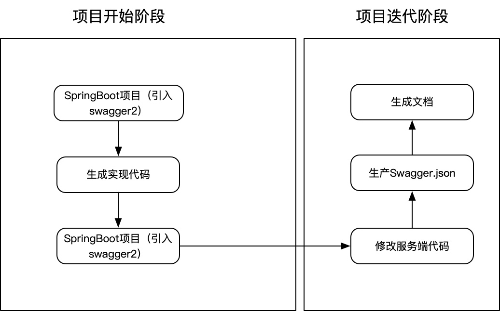
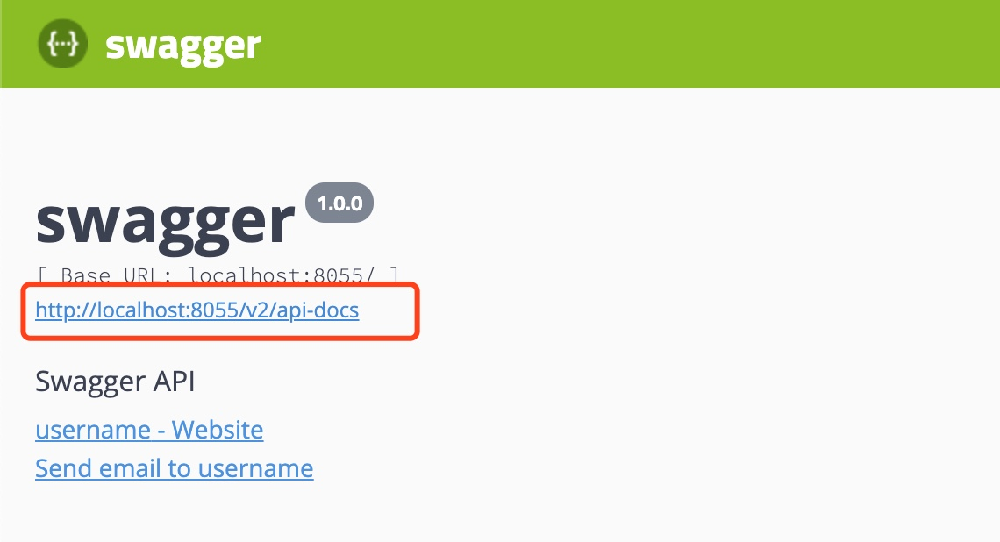

1\. 引言
------

Swagger介绍

是一套功能强大但易于使用的API开发人员工具，适用于团队和个人，支持跨整个API生命周期的开发，从设计和文档，到测试和部署，提供开源，免费和商业三种模式，是一个整套的生态。

Swagger2介绍

其实是对springfox-swagger2的一个简称，是我们现在通常使用到的最多，其实它的实现也只是Swagger生态的一部分。

2\. 应用场景
--------

1\. 前后台分离

2.实现模拟访问接口

3\. 实现模式
--------

应用Swagger2主要有下面2种方式

第一种模式

类似于现在目前的状况，先由后端编写接口文档与前端交流，但现在是以写swagger.json，然后生产服务端的代码（或者自己安装json手写）。



第二张模式

先编写实体类和control代码，并以注释的形式编写api，然后生产接口文档。


两种方式都是第二种相对灵活，需要开发人员将写接口文档的时候，进行开发代码，进而节约一部分时间，同时相对于生成代码更加灵活。

4\. 文档与Mock
-----------

接口信息前后端同步、文档的自动生成和Mock 是引入Swagger2的主要目的，有利于避免由于前后端信息不同步而出现的额外工作量，而且Mock的实现可以使前端可以无需依赖后端进行开发，减少联调时间。

由于目前Swagger原生的组件不是特别友好，所以目前主流的方式就是 swagger2 + 第三方开源工具（可导出文档和实现mock功能）

目前主要应用的2个第三方开源如下：

1\. YApi —— 由去哪儿网开源，功能完备，目前还算活跃。

2\. swagger-bootstrap-ui —— 市面上比较流行，简洁。

上边2个具体使用方式就不具体说了网上一大堆，如果有需要可以整理一下哈😄。

5\. 使用Swagger2
--------------

1\. pom.xml中引入包

```java
<!-- springfox-swagger2 用于JSON API文档的生成 -->
<dependency>
    <groupId>io.springfox</groupId>
    <artifactId>springfox-swagger2</artifactId>
    <version>2.9.2</version>
</dependency>

<!-- springfox-swagger-ui 用于文档界面展示 -->
<dependency>
    <groupId>io.springfox</groupId>
    <artifactId>springfox-swagger-ui</artifactId>
    <version>2.9.2</version>
</dependency>

<!-- 导出文档点jar，如果后端接第三方开源API管理系统可不添加 -->
<dependency>
    <groupId>io.github.swagger2markup</groupId>
    <artifactId>swagger2markup</artifactId>
    <version>1.3.3</version>
</dependency>

```

2\. 添加配置类

```java
import org.springframework.context.annotation.Bean;
import org.springframework.context.annotation.Configuration;
import org.springframework.http.ResponseEntity;
import springfox.documentation.builders.ApiInfoBuilder;
import springfox.documentation.builders.PathSelectors;
import springfox.documentation.builders.RequestHandlerSelectors;
import springfox.documentation.service.ApiInfo;
import springfox.documentation.service.Contact;
import springfox.documentation.spi.DocumentationType;
import springfox.documentation.spring.web.plugins.Docket;
import springfox.documentation.swagger2.annotations.EnableSwagger2;

@Configuration
@EnableSwagger2
// 生产环境需要屏蔽Swagger 设置 false
@ConditionalOnExpression("${swagger.enable:true}")
public class Swagger2Config {

    @Bean
    public Docket createRestApi() {
        return new Docket(DocumentationType.SWAGGER_2)
                .genericModelSubstitutes(ResponseEntity.class)
                .useDefaultResponseMessages(false)
                .apiInfo(apiInfo())
                .select()
                .apis(RequestHandlerSelectors.basePackage("com.xxx.xxx.controller"))
                .paths(PathSelectors.any())
                .build();
    }

    private ApiInfo apiInfo() {
        return new ApiInfoBuilder().title("swagger")
                .description("Swagger API")
                .contact(new Contact("username", "http://www.baidu.com", "username@mail.com"))
                .version("1.0.0")
                .build();
    }
}
```

3\. Control和model

```java
import io.swagger.annotations.Api;
import io.swagger.annotations.ApiImplicitParam;
import io.swagger.annotations.ApiOperation;
import org.springframework.web.bind.annotation.RequestMapping;
import org.springframework.web.bind.annotation.RequestMethod;
import org.springframework.web.bind.annotation.RestController;

/**
 * Created by Daniel on 2020/3/12.
 */
@RestController
@RequestMapping("/test")
@Api(tags = "测试")
public class TestController {

        @ApiOperation(value = "打招呼", notes = "测试方法")
        @ApiImplicitParam(name = "name", value = "姓名")
        @RequestMapping(value = "/sayhi", method = RequestMethod.POST)
        public String sayHi(String name) {
            return "Hello," + name;
        }

        @ApiOperation(value = "获取所有用户", notes = "查询分页数据")
        @RequestMapping(value = "/getall", method = RequestMethod.POST)
        public User getAll() {
            return new User();
        }

}
```

```java
import io.swagger.annotations.ApiModel;
import io.swagger.annotations.ApiModelProperty;
import lombok.Data;

/**
 * Created by Daniel on 2020/3/12.
 */
@ApiModel(value = "com.zhitu.tboss.controller.User", description = "User返回结果结构")
@Data
public class User {

    @ApiModelProperty(value = "用户名称")
    private String name;
    @ApiModelProperty(value = "年龄")
    private Integer age;

}

```

4\. 启动服务

输入：[http://ip:port/swagger-ui.html](http://localhost:8055/swagger-ui.html)


5\. 查看swagger.json



6\. 常用API注释

作用范围	| API	| 使用位置
-|-|-
对象属性	| @ApiModelProperty	| 用在出入参数对象的字段上
协议集描述	| @Api	| 用于controller类上
协议描述	| @ApiOperation	| 用在controller的方法上
Response集	| @ApiResponses	| 用在controller的方法上
Response	| @ApiResponse	| 用在 @ApiResponses里边
非对象参数集	| @ApiImplicitParams	| 用在controller的方法上
非对象参数描述	| @ApiImplicitParam	用在	| @ApiImplicitParams的方法里边
描述返回对象的意义	| @ApiModel	| 用在返回对象类上

**@Api：**

 tags="说明该类的作用"

 value="该参数没什么意义，所以不需要配置"

```java
@Api(tags = "测试")
public class TestController {}
```


**@ApiOperation：**

 value="说明方法的作用"

 notes="方法的备注说明"

```java
 @ApiOperation(value = "打招呼", notes = "测试方法")
 @RequestMapping(value = "/sayhi", method = RequestMethod.POST)
 public String sayHi(String name) {
       return "Hello," + name;
 }
```


**@ApiImplicitParams：**

 @ApiImplicitParam：用在 @ApiImplicitParams 注解中，指定一个请求参数的配置信息 

 name：参数名

 value：参数的汉字说明、解释

 required：参数是否必须传

 paramType：参数放在哪个地方

 · header --\> 请求参数的获取：@RequestHeader

 · query --\> 请求参数的获取：@RequestParam

 · path（用于restful接口）--\> 请求参数的获取：@PathVariable

 · body（不常用）

 · form（不常用） 

 dataType：参数类型，默认String，其它值dataType="Integer" 

 defaultValue：参数的默认值

```java
@ApiImplicitParams({
    @ApiImplicitParam(name="mobile",value="手机号",required=true,paramType="form"),
    @ApiImplicitParam(name="password",value="密码",required=true,paramType="form"),
    @ApiImplicitParam(name="age",value="年龄",required=true,paramType="form",dataType="Integer")
})
public String sayHi(String name) {
     return "Hello," + name;
}
```


**@ApiResponses：**

 @ApiResponse：用在@ApiResponses中，一般用于表达一个错误的响应信息

 code：数字，例如400

 message：信息，例如"请求参数没填好"

 response：抛出异常的类

```java
@ApiOperation(value = "select1请求",notes = "多个参数，多种的查询参数类型")
@ApiResponses({
    @ApiResponse(code=400,message="请求参数没填好"),
    @ApiResponse(code=404,message="请求路径没有或页面跳转路径不对")
})
public String sayHi(String name) {
     return "Hello," + name;
}
```


**@ApiModel：**

 （这种一般用在post创建的时候，使用@RequestBody这样的场景，

 请求参数无法使用@ApiImplicitParam注解进行描述的时候）

 @ApiModelProperty：用在属性上，描述响应类的属性

```java
@ApiModel(value = "com.xxx.xxx.User", description = "User返回结果结构")
@Data
public class User {
    @ApiModelProperty(value = "用户名称")
    private String name;
    @ApiModelProperty(value = "年龄")
    private Integer age;

}
```

