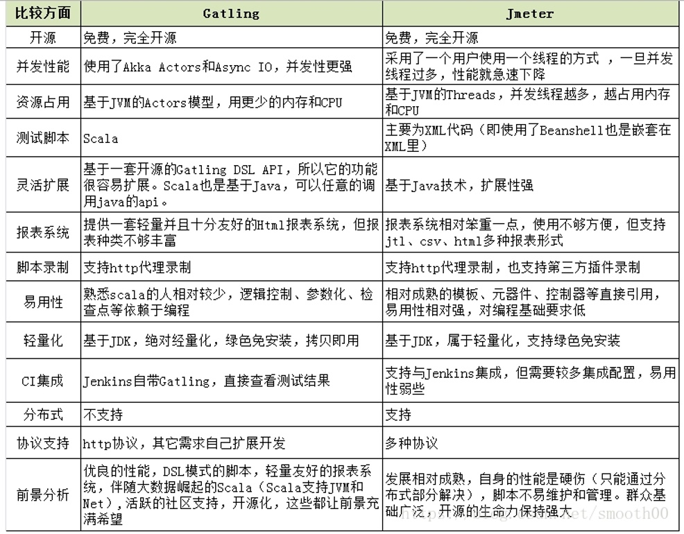
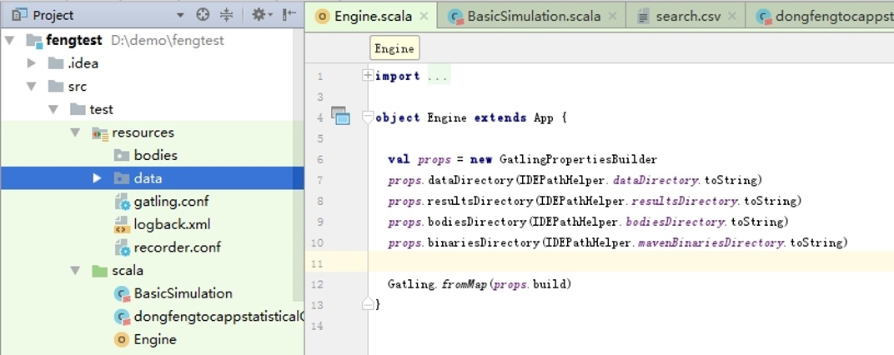
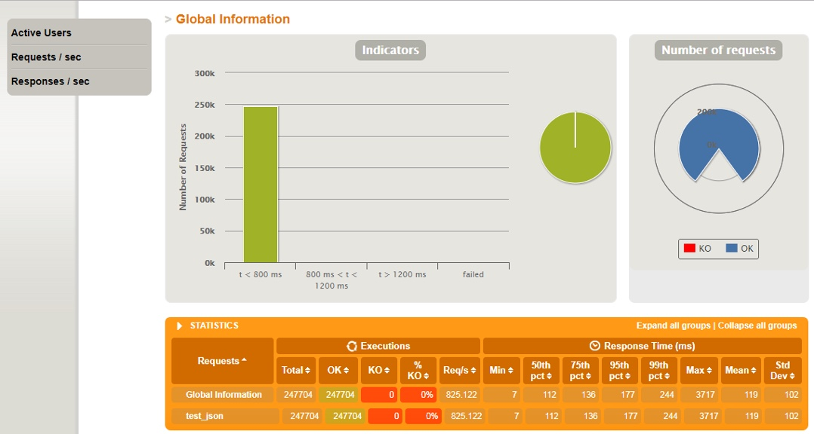
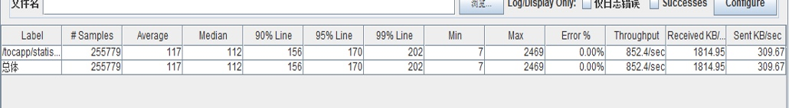

### 一、 jemeter与gatling介绍

jemeter与gatling都是开源性和轻量化的性能测试软件，以下表格对两个软件进行的比较

### 二、gatling的安装及脚本编写

1\. 执行测试用例：只需要在压测客户端下载gatling软件目录即可执行，与jmeter一样结构如下：

bin: 录制组件启动脚本、运行组件的启动脚本。

conf: 配置文件的目录。

lib:gatling运行jar包

results: 存放测试报告目录。

target:编译后的class文件。

user-files: 执行测试.scala脚本。

2\. 脚本开发部分：推荐使用Intelj idea + maven archetype搭建脚本开发环境，根据maven创建固定结构项目，如下是我的测试脚本

### 三、测试用例执行（对比jmeter）

测试前提条件：都使用个人电脑作为压测客户端进行测试，测试数据参数化一致，客户端与服务器软硬件环境一致

1\. gatling 测试场景（ 100用户并发，持续执行5分钟）

gatling测试结束后，会生成一个网页报表，对测试结构进行汇总

打开网址，如下

对比jmeter 测试场景（ 100用户并发，持续执行5分钟）与结果与gatling一致

PS：之后又分别对2000并发 5000并发进行对比测试，结果相近。

四、结论

1、低并发下，gatling与jmeter结果基本一致

2、高并发下，如本人测试过程中，现有环境并发提高到5000时，gatling占用cpu的资源更少。

3、对于两者的脚本编写，jmeter效率更高一些，有可视化窗口，方便调试，gatling是基于scala语言，有可能gatling自动化方面更有优势，待研究

