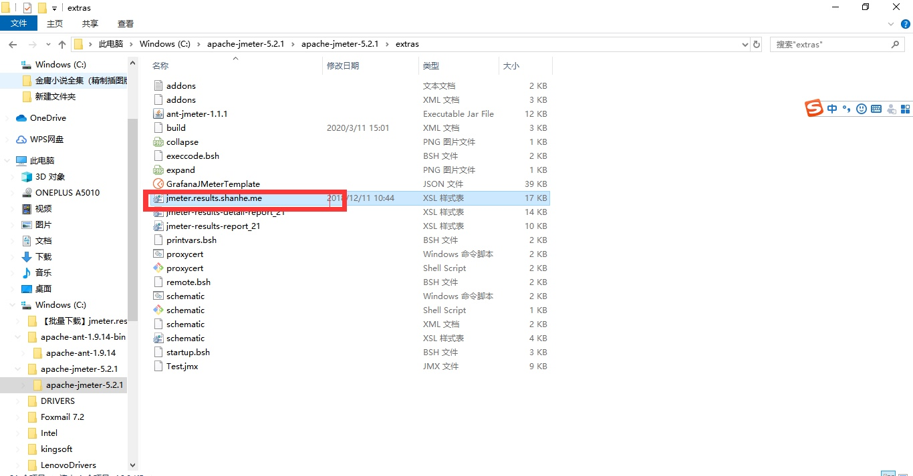
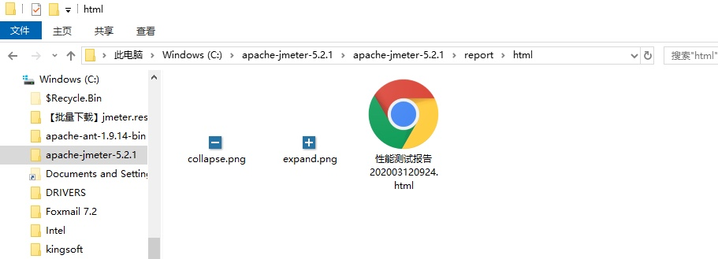
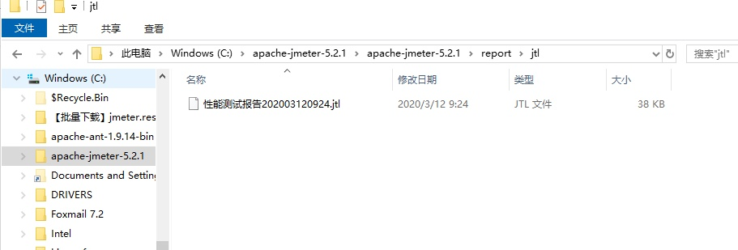
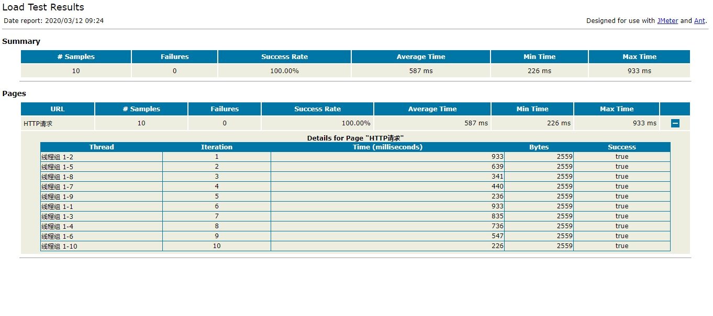

1\. 下载组件
--------

Jmeter生成Html报告需要下载文件：“jmeter.results.shanhe.me.xsl”。常用的文件下载地址如下：

```sh
http://shanhe.me/2011/06/07/new-xsl-stylesheet-for-jmeter-command-line-results-report
```

2.修改配置
------

* 将”jmeter.results.shanhe.me.xsl"文件放入jmeter的安装目录下extras文件夹内，如下图：



* 修改配置文件jmeter.properties

修改编码为UTF-8

```properties
sampleresult.default.encoding=UTF-8
```

修改输出格式为xml（默认为csv）

```properties
jmeter.save.saveservice.output_format=xml
```

3\. 使用方式
--------

* 将jmeter目录下extras文件夹中的ant-jmeter-1.1.1.jar包copy到Ant的lib目录下。
* 修改extras文件夹下的build.xml，配置输出结果。（注释配置项需要修改）

```xml
<?xml version="1.0" encoding="UTF-8"?>
 
<project name="ant-jmeter-test" default="run" basedir=".">
    
	<tstamp>
        <format property="time" pattern="yyyyMMddhhmm" />
    </tstamp>
    <!-- 需要改成自己本地的 Jmeter 目录路径-->  
    <property name="jmeter.home" value="C:\apache-jmeter-5.2.1\apache-jmeter-5.2.1" />
    <!-- jmeter生成jtl格式的结果报告的路径，可自定义--> 
    <property name="jmeter.result.jtl.dir" value="C:\apache-jmeter-5.2.1\apache-jmeter-5.2.1\report\jtl" />
    <!-- jmeter生成html格式的结果报告的路径，可自定义-->
    <property name="jmeter.result.html.dir" value="C:\apache-jmeter-5.2.1\apache-jmeter-5.2.1\report\html" />
    <!-- 生成的报告的前缀名字-->  
    <property name="ReportName" value="性能测试报告" />
    <property name="jmeter.result.jtlName" value="${jmeter.result.jtl.dir}/${ReportName}${time}.jtl" />
    <property name="jmeter.result.htmlName" value="${jmeter.result.html.dir}/${ReportName}${time}.html" />
    
    <path id="xslt.classpath">
        <fileset dir="${jmeter.home}/lib" includes="xalan*.jar"/>
        <fileset dir="${jmeter.home}/lib" includes="serializer*.jar"/>
    </path>
    
    <target name="run">
        <antcall target="test" />
        <antcall target="report" />
    </target>
    
    <target name="test">
        <taskdef name="jmeter" classname="org.programmerplanet.ant.taskdefs.jmeter.JMeterTask" />
    
    <jmeter jmeterhome="${jmeter.home}" resultlog="${jmeter.result.jtlName}">
             <!-- 声明要运行的脚本路径，"*.jmx"指包含此目录下的所有jmeter脚本-->
            <testplans dir="C:\apache-jmeter-5.2.1\apache-jmeter-5.2.1\workspace" includes="*.jmx" />
        </jmeter>
    </target>
        
    <target name="report">
        <tstamp> <format property="report.datestamp" pattern="yyyy/MM/dd HH:mm" /></tstamp>
        <xslt classpathref="xslt.classpath"
              force="true"
              in="${jmeter.result.jtlName}"
              out="${jmeter.result.htmlName}"
              style="${jmeter.home}/extras/jmeter-results-detail-report_21.xsl">
              <param name="dateReport" expression="${report.datestamp}"/>
        </xslt>
        <copy todir="${jmeter.result.html.dir}">
            <fileset dir="${jmeter.home}/extras">
                <include name="collapse.png" />
                <include name="expand.png" />
            </fileset>
        </copy>
    </target>
	
</project>
```

* 运行命令

```xml
ant.bat -file build.xml -Dtest=Test
```

* 查看结果







PS：后续将继续讲解 jmeter+ant+jenkins 完成自动化测试。


