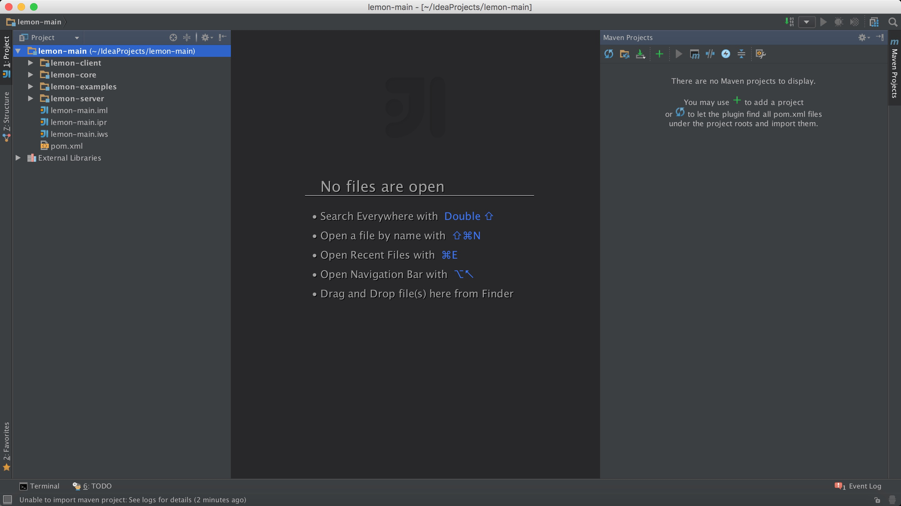

### 1.创建main工程

```sh
mvn archetype:generate -DgroupId=com.neusoft.lemon -DartifactId=lemon-main -DarchetypeArtifactId=maven-archetype-quickstart -DinteractiveMode=false
```

[check code](http://www.baidu.com/link?url=0TmA-KLUooJygypts366JD-cwdN9pLOBiKeDDhhPo8JymHZu5YR6hmDUuFPywgVO5p_k_9sCBS-CIV3QoAgfZABXcRX5b6TFF96wSlMg_x_)

### 2.修改main工程

删除src目录，修改pom.xml 中 \<packaging\>jar\</packaging\> 替换为pom

```sh
  <project xmlns="http://maven.apache.org/POM/4.0.0" xmlns:xsi="http://www.w3.org/2001/XMLSchema-instance"
    xsi:schemaLocation="http://maven.apache.org/POM/4.0.0 http://maven.apache.org/maven-v4_0_0.xsd">
   <modelVersion>4.0.0</modelVersion>
   <groupId>com.neusoft.lemon</groupId>
   <artifactId>lemon-main</artifactId>
   <packaging>pom</packaging>
   <version>1.0-SNAPSHOT</version>
   <name>lemon-main</name>
   <url>http://maven.apache.org</url>
    <dependencies>
      <dependency>
        <groupId>junit</groupId>
        <artifactId>junit</artifactId>
       <version>3.8.1</version>
        <scope>test</scope>
      </dependency>
    </dependencies>
  </project>
```

### 3.创建child工程

在main工程的目录下创建

```sh
mvn archetype:generate -DgroupId=com.neusoft.lemon -DartifactId=lemon-server -DarchetypeArtifactId=maven-archetype-quickstart -DinteractiveMode=false
```

这时可以看见main工程下pom中多了几个配置项

```sh
<?xml version="1.0" encoding="UTF-8"?>
<project xmlns="http://maven.apache.org/POM/4.0.0" xmlns:xsi="http://www.w3.org/2001/XMLSchema-instance" xsi:schemaLocation="http://maven.apache.org/POM/4.0.0 http://maven.apache.org/maven-v4_0_0.xsd">
  <modelVersion>4.0.0</modelVersion>
  <groupId>com.neusoft.lemon</groupId>
  <artifactId>lemon-main</artifactId>
  <packaging>pom</packaging>
  <version>1.0-SNAPSHOT</version>
  <name>lemon-main</name>
  <url>http://maven.apache.org</url>
  <dependencies>
    <dependency>
      <groupId>junit</groupId>
      <artifactId>junit</artifactId>
      <version>3.8.1</version>
      <scope>test</scope>
    </dependency>
  </dependencies>
  <!-- 多出来的配置项，是创建子项目时自动添加的，我创建了2个子项目 -->
  <modules>
    <module>lemon-server</module>
    <module>lemon-client</module>
  </modules>
</project>
```

修改子项目的pom文件，去掉\<groupId\>和\<version\> 子项目会继承父项目的，添加 \<packaging\>jar\</packaging\>。并添加不同子项目的依赖。

```sh
<?xml version="1.0"?>
<project xsi:schemaLocation="http://maven.apache.org/POM/4.0.0 http://maven.apache.org/xsd/maven-4.0.0.xsd" xmlns="http://maven.apache.org/POM/4.0.0"
    xmlns:xsi="http://www.w3.org/2001/XMLSchema-instance">
  <modelVersion>4.0.0</modelVersion>
  <parent>
    <groupId>com.neusoft.lemon</groupId>
    <artifactId>lemon-main</artifactId>
    <version>1.0-SNAPSHOT</version>
  </parent>
  
  <artifactId>lemon-server</artifactId>
  <packaging>jar</packaging>
  
  <name>lemon-server</name>
  <url>http://maven.apache.org</url>
  
  <dependencies>
    <dependency>
      <groupId>junit</groupId>
      <artifactId>junit</artifactId>
      <version>3.8.1</version>
      <scope>test</scope>
    </dependency>
    
    <dependency>
      <groupId>com.neusoft.lemon</groupId>
      <artifactId>lemon-core</artifactId>
      <version>${project.version}</version>
    </dependency>
  
  </dependencies>
</project>
```

### 4.完毕

导入Idea中。如下图：

PS:子项目已可以镶嵌子项目。



