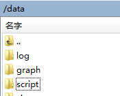

Zabbix可以实现基于触发器的邮件告警，即对于异常值的自动判定和报警发送。
但对于定时发送采集指标图形的需求，我们是利用了脚本来实现的定时邮件发送聚合图形。

1、根据Zabbix数据库取得聚合图形信息

```
SELECT
	a. NAME,
	a.hsize,
	a.vsize,
	b.resourceid,
	b.width,
	b.height,
	b.x,
	b.y
FROM
	screens a,
	screens_items AS b
WHERE
	a.screenid = b.screenid
AND a.templateid <=> NULL
ORDER BY
	a. NAME
```


2、获取图片保存到本地（Perl脚本）

```
#!/usr/bin/perl
use File::Path;
use DBI;

my $path = '/data/graph';
if(-e $path) { rmtree($path); }
mkdir($path);

my $stime = `date +%Y%m%d`; chop($stime); $stime .= '1000';
if( length($stime) != 12 ) { print "Error get date"; exit; }

my $period = 86400;    # 24 hours

my $login = 'admin';   # Zabbix Web User
my $pass = 'zabbix'; # Zabbix Web User Password, must be URL Encoded

my $cook = "/tmp/cookie";
my $dsn = 'DBI:mysql:zabbix:10.30.50.151:3306'; # Connect MySQL DB "zabbix" on localhost
my $db_user_name = 'zabbix'; # MySQL DB user
my $db_password = 'zabbix'; # MySQL DB user password

my $dbh = DBI->connect($dsn, $db_user_name, $db_password);
my $sth = $dbh->prepare(qq{select a.name,a.hsize,a.vsize, b.resourceid, b.width, b.height,b.x,b.y from screens a,screens_items as b where a.screenid=b.screenid and a.templateid<=>NULL order by a.name});
$sth->execute();
my %screens;

# Get all graphs by using curl
while (my ($name,$hsize,$vsize, $id,$width,$height,$x,$y) = $sth->fetchrow_array())
{
    if(length($id) > 2){
        #print "$id => $ids\n";
        my $p = "$path/$name.$hsize.$vsize.$y.$x.$id.png";
        my $strcomm  = `curl  -c $cook -b $cook -d "request=&name=$login&password=$pass&autologin=1&enter=Sign+in"  10.30.50.153:8071/zabbix/index.php`;
        $strcomm  = `curl  -b $cook -F  "graphid=$id" -F "period=$period" -F "stime=$stime" -F "width=$width" -F "height=$height" 10.30.50.153:8071/zabbix/chart2.php > $p`;
    }
}

exit ;
```


3、取得图片发送邮件（Python）

```
#! /usr/bin/env python

import os
import smtplib

from email.MIMEMultipart import MIMEMultipart
from email.MIMEText import MIMEText
from email.MIMEImage import MIMEImage

def _sendmail(smtp_server,port,account,password,str_from,list_to,msg):
    smtp = smtplib.SMTP(smtp_server,port)
    smtp.ehlo()
    smtp.starttls()
    smtp.ehlo()
    smtp.login(account, password)
    smtp.sendmail(str_from, list_to,msg)
    smtp.close()

def _get_pictures(image_dir):
    pictures = []
    for f in os.listdir(image_dir):
        pictures.append(f)
    return pictures

def _create_msg(screen_name,screens,image_dir,str_from,list_to):
    msgRoot = MIMEMultipart('related')
    msgRoot['Subject'] = 'Zabbix Screen Report: %s' % screen_name
    msgRoot['From'] = str_from
    msgRoot['To'] = ",".join(list_to)
    msgRoot.preamble = 'This is a multi-part message in MIME format.'

    # Encapsulate the plain and HTML versions of the message body in an
    # 'alternative' part, so message agents can decide which they want to display.
    msgAlternative = MIMEMultipart('alternative')
    msgRoot.attach(msgAlternative)

    msgText = MIMEText('This is the alternative plain text message.')
    msgAlternative.attach(msgText)
    contents = ""
    contents += "<h1>Screen %s</h1><br>" % screen_name
    _,hsize,vsize,_,_,_,_,= tuple(screens[0].split('.'))
    contents +="<table>"
    screens = sorted(screens)
    y= -1
    for f in screens:
        items = f.split('.')
        _,_,_,image_y,image_x,image_id,_ = tuple(items)
        image_name = "image-%s-%s" % (screen_name, image_id)
        fp = open('%s/%s' % (image_dir,f), 'rb')
        msgImage = MIMEImage(fp.read())
        fp.close()
        msgImage.add_header('Content-ID', "<%s>" % image_name)
        msgRoot.attach(msgImage)
        if y != image_y:
            if y!= -1:
                contents +="</tr>"
            y = image_y
            contents +="<tr>"
        contents +="<td></td>" % image_name
    contents += "</table>"
    msgText = MIMEText(contents, 'html')
    msgAlternative.attach(msgText)
    #msgRoot.attach(msgAlternative)
    return msgRoot

# Create the root message and fill in the from, to, and subject headers
def main(str_from,list_to,image_dir):
    pictures = _get_pictures(image_dir)
    for screen_name in list(set([x.split('.')[0] for x in pictures ])):
        screens = [x for x in pictures if x.startswith(str(screen_name) + '.') ]
        msgRoot = _create_msg(screen_name,screens,image_dir,str_from,list_to)
        _sendmail('mail.mapbar.com',25,'zhaicy','111qqq,,,',str_from,list_to,msgRoot.as_string())

if __name__ == '__main__':
   str_from = 'test@163.com'
   list_to = [
                "test@sohu.com",
                "test@sina.com"
             ]
   image_dir = '/data/graph'
   main(str_from,list_to,image_dir)
```


4、设置crontab定时任务

```
crontab -e
*/10 * * * * /usr/bin/perl /data/script/save-graph.pl >/dev/null 2>>/data/log/log
30 10 * * * /usr/bin/python /data/script/email-pic.py >/dev/null 2>>/data/log/log
```


5、定时任务依赖文件夹结构,
上述方案的服务器对应目录结构如下：


