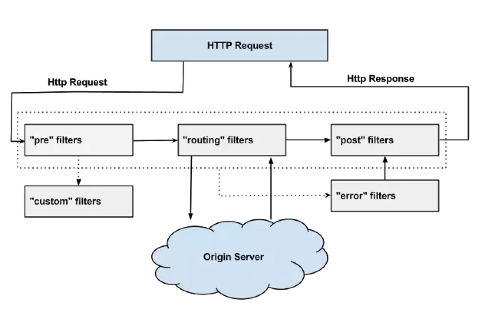

1\. 简介
------

zuul相当于是第三方调用（app应用端和PC端）和服务提供方之间的防护门。作为前端服务（Edge Service也称边缘服务，前端服务的作用是对后端服务做必要的聚合和裁剪后暴露给外部不同的设备，如PC，Pad或者Phone），Zuul旨在实现动态路由，监控，弹性和安全性。它具备根据需求将请求路由到多个AWS自动弹性伸缩组的能力。

2.功能
----

Netflix API流量的量级和多样性随时可能导致生产环境故障而没有预警。因此需要一个系统能使我们迅速改变策略行为，以便应对各种情况。 zuul使用一些不同类型的过滤器，使我们能够快速灵活地将功能应用于我们的前端服务。这些过滤器具有以下功能：

权限控制和安全性--为每个请求提供身份认证，并拒绝不满足条件的请求。

预警和监控--跟踪前端有意义的请求和统计数据，以便我们准确了解生产环境运行状况。

动态路由--根据需求将请求动态地路由到不同的后端集群。

压力测试--逐渐增大到集群的流量，以便进行性能评估。

负载均衡--为每种类型的请求分配容量并丢弃超过限额的请求。

静态资源处理--直接在Zuul处理静态资源并响应，而并非转发这些请求到内部集群中。

多区域弹性--实现跨AWS区域请求路由，扩大了ELB的使用范围，并使前端服务更接近我们的成员。

以上主要应用其权限控制和安全性、动态路由，负载均衡的功能。

3\. 架构
------

架构图如下：

在zuul中，首先将请求给zuulservlet处理，zuulservlet中有一个zuulRunner对象，该对象中初始化了RequestContext作为存储整个请求的一些数据，并被所有的zuulfilter共享。zuulRunner中还有 FilterProcessor，FilterProcessor作为执行所有的zuulfilter的管理器。FilterProcessor从filterloader 中获取zuulfilter，而zuulfilter是被filterFileManager所加载，并支持groovy热加载，采用了轮询的方式热加载。有了这些filter之后，zuulservelet首先执行的Pre类型的过滤器，再执行route类型的过滤器，最后执行的是post 类型的过滤器，如果在执行这些过滤器有错误的时候则会执行error类型的过滤器。执行完这些过滤器，最终将请求的结果返回给客户端。

Filter是zuul的核心，用来实现对外服务的控制。Filter的生命周期有4个，分别是“PRE”、“ROUTING”、“POST”、“ERROR”，整个生命周期可以用下图来表示。

**PRE：** 这种过滤器在请求被路由之前调用。我们可利用这种过滤器实现身份验证、在集群中选择请求的微服务、记录调试信息等。

**ROUTING：**这种过滤器将请求路由到微服务。这种过滤器用于构建发送给微服务的请求，并使用Apache HttpClient或Netfilx Ribbon请求微服务。

**POST：**这种过滤器在路由到微服务以后执行。这种过滤器可用来为响应添加标准的HTTP Header、收集统计信息和指标、将响应从微服务发送给客户端等。

**ERROR：**在其他阶段发生错误时执行该过滤器。 除了默认的过滤器类型，Zuul还允许我们创建自定义的过滤器类型。例如，我们可以定制一种STATIC类型的过滤器，直接在Zuul中生成响应，而不将请求转发到后端的微服务。

**zuul中的默认过滤器**

过滤器的order值越小，就越先执行，并且在执行过滤器的过程中，它们共享了一个RequestContext对象，该对象的生命周期贯穿于请求，可以看出优先执行了pre类型的过滤器，并将执行后的结果放在RequestContext中，供后续的filter使用。同时也提供自定义Filter需要继承ZuulFilter然后实现里边的逻辑即可。