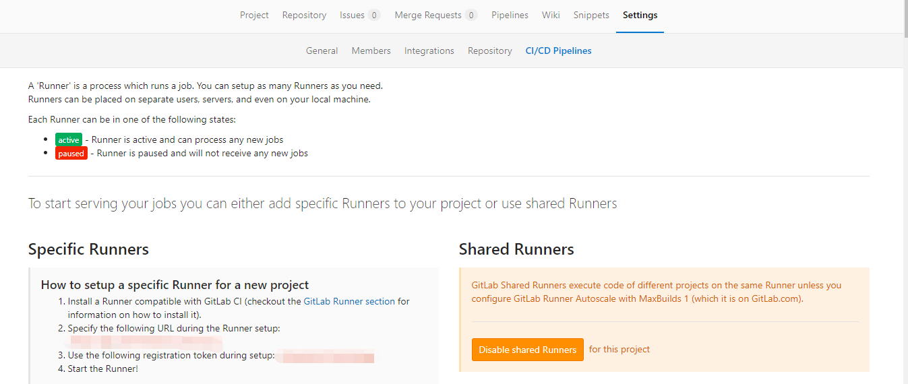

## 安装Hexo
> 需要 npm
```
$ npm install hexo-cli -g --registry=https://registry.npm.taobao.org
```

```
$ npm install hexo --registry=https://registry.npm.taobao.org
```

```
$ hexo init <folder>
$ cd <folder>
$ npm install
```
## 提交至gitlab
> 需要 git
```
$ git init 
$ git remote add origin http：//gitlab.com/blog.git
$ git add .
$ git commit -m"first commit"
$ git push -u origin master
```
## 创建gitlab runner
> 进入 Setting > CI/CD Pipelines




