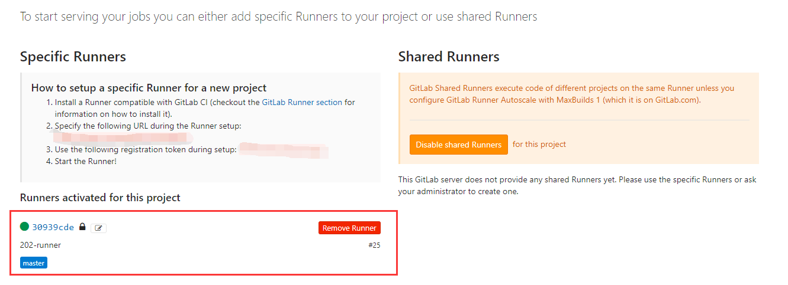

## 安装Hexo
> 需要 npm
```
$ npm install hexo-cli -g --registry=https://registry.npm.taobao.org
```

```
$ npm install hexo --registry=https://registry.npm.taobao.org
```

```
$ hexo init <folder>
$ cd <folder>
$ npm install
```
## 提交至gitlab
> 需要 git
```
$ git init 
$ git remote add origin http：//gitlab.com/blog.git
$ git add .
$ git commit -m"first commit"
$ git push -u origin master
```
## 创建gitlab runner
> 进入 Setting > CI/CD Pipelines


* 根据 `How to setup a specific Runner for a new project` 进行配置 [gitlab-runner](https://about.gitlab.com/stages-devops-lifecycle/continuous-integration/#gitlab-runner)
  > 以 centos7 环境为例
  ```shell script
  curl -LJO https://gitlab-runner-downloads.s3.amazonaws.com/latest/rpm/gitlab-runner_amd64.rpm
  rpm -i gitlab-runner_amd64.rpm
  # 自启动
  systemctl start gitlab-runner
  ```
  * 注册gitlab-runner
  ```shell script
  gitlab-runner register
  # 提示输入gitlab-ci地址, 将页面上的 http://xxx/ci 输入
  Please enter the gitlab-ci coordinator URL (e.g. https://gitlab.com )
  https://gitlab.com
  # 提示输入token, 将页面上的 token 输入
  Please enter the gitlab-ci token for this runner
  xxx
  # 提示输入runner的描述
  Please enter the gitlab-ci description for this runner
  [hostname] my-runner
  # 提示输入触发runner的tag
  Please enter the gitlab-ci tags for this runner (comma separated):
  my-tag,another-tag
  # 提示输入runner执行的应用, 使用 docker 需要确认docker是否已经启动
  Please enter the executor: ssh, docker+machine, docker-ssh+machine, kubernetes, docker, parallels, virtualbox, docker-ssh, shell:
  docker
  # 提示输入默认镜像
  Please enter the Docker image (eg. ruby:2.6):
  node:latest
  ```
  > 若需要修改 gitlab-runner 注册信息, 只需进入 /etc/gitlab-runner/config.toml 进行编辑修改

页面出现可执行的runner即可, 在页面上也可对runner配置进行修改


配置完成后, 只需在 Project > CI configuration 进行配置即可触发 CI
.gitlab-ci.yml
```yaml
image: node:8.11.2

pages:
  cache:
    paths:
    - node_modules/

  script:
  - npm install --registry=https://registry.npm.taobao.org
  - npm run clean
  - npm run build
  - npm run deploy
  artifacts:
    paths:
    - public
  only:
  - master
```
若需要进行部署, 则在 .gitlab-ci.yml 中增加部署脚本内容即可
多任务模板:
```yaml
stages:
  - build
  - deploy

build_job:
  stage: build
  script:
  - npm install --registry=https://registry.npm.taobao.org
  - npm run clean
  - npm run build
  - npm run deploy
  artifacts:
    paths:
    - public
  only:
    - master

deploy_job:
  stage: deploy
  script:
    cp public nginx/www
```

## 配置Hexo部署
* 部署至 git
  * ` npm install hexo-deployer-git --save `
  * 在 `_config.yml` 增加配置内容
    ```yaml
    deploy:
      type: git
      repo: https://github.com/<username>/<project>
      # example, https://github.com/hexojs/hexojs.github.io
      branch: gh-pages
    ```
* 部署至 sftp
  * ` npm install hexo-deployer-sftp --save `
    * 在 `_config.yml` 增加配置内容
      ```yaml
      deploy:
        type: sftp
        host: host
        user: root
        pass: password
        remotePath: /opt/nginx/html/
        port: 22
      ```
## Pipeline
* 查看CI/CD 执行, 也可点击 `Run Pipeline` 进行手动触发


* schedules 可进行定时执行

* environment 可设置环境变量

