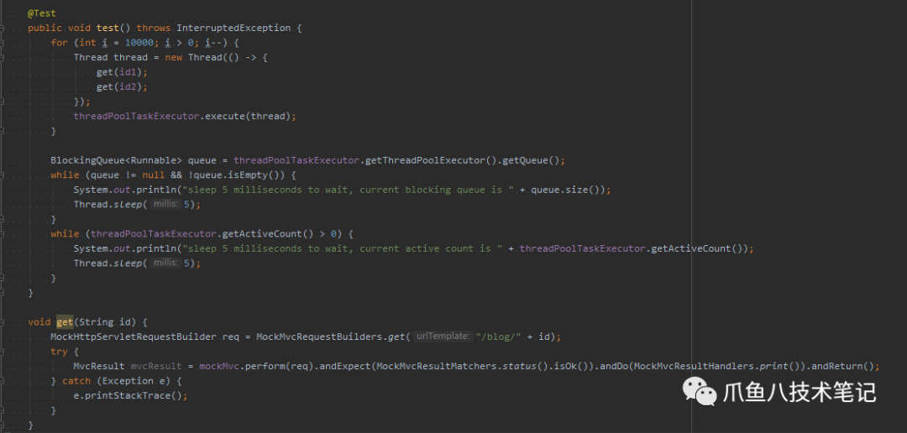
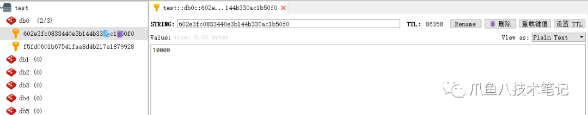

### 前言

**原子性（atomicity）:** 一个事务是一个不可分割的最小工作单位,要么都成功要么都失败。

##### 在Redis控制台原子性操作方式

##### 

```
redis\> MULTI \# 标记事务开始
OK
redis\> INCR blog\_id \# 多条命令按顺序入队
QUEUED
redis\> INCR blog\_id
QUEUED
redis\> INCR blog\_id
QUEUED
redis\> EXEC
 1) "1"
 2) "2"
 3) "3"
```

> 事务开始命令后，INCR blog\_id 命令被放入队列缓存
> 收到 EXEC 命令后进入事务执行，事务中任意命令执行失败，其余的命令都不会被执行
> 在事务执行过程，其他客户端提交的命令请求不会插入到事务执行命令序列中

### springboot 实现redis记录博客点击

#### spring-boot-starter-data-redis

* springboot 提供了 redis 的快速启动依赖

```
\<dependency\> 
 \<groupId\>org.springframework.boot\</groupId\> 
 \<artifactId\>spring-boot-starter-data-redis\</artifactId\>
\</dependency\>
```
* `RedisAtomicDouble` `RedisAtomicInteger` `RedisAtomicLong`
redis 提供了对 `Double` `Integer` `Long` 三种类型的自增操作
以 `RedisAtomicLong` 为例，`RedisAtomicLong` 提供了方法 incrementAndGet， 该方法实际是 `redis` 的 `INCR` 命令。
进入其中的 `increment`方法，使用了 `execute(RedisCallback<T> callback, boolean exposeConnection)`回调方法。

#### 对博客详情接口进行切面

* 博客详情接口

```
 @Controller
 @RequestMapping("/blog")
 public class IndexController { 
 @Autowired 
 private BlogService blogService; 

 @GetMapping("/{id}") 
 public ResponseEntity getBlog(@PathVariable String id) { 
 return new ResponseEntity\<\>(blogService.getById(id), HttpStatus.OK); 
 }
 }
```
* 切面

```
 @Aspect
 @Component
 public class BlogViewAspect { 
 @Autowired 
 private StringRedisTemplate redisTemplate; 

 @Pointcut(
 "execution(public \* com.kirin.fm.blog.controller.IndexController.getBlog(..))")
 public void getBlogDetail() { } 

 @AfterReturning(value = "getBlogDetail()", returning = "response") 
 public void countBlogView(JoinPoint joinPoint, Object response) { 
 if (null == ((ResponseEntity) response).getBody()) { 
 return; 
 } 
 String blogId = joinPoint.getArgs()[0].toString();
 \# 原子方法
 RedisAtomicLong entityIdCounter = 
 new RedisAtomicLong(blogId, redisTemplate.getConnectionFactory());
 entityIdCounter.getAndIncrement(); 
 entityIdCounter.expire(24 \* 60 \* 60, TimeUnit.SECONDS); 
 }
 }

```
* 测试



 测试结果： 




 点击数能够正确记录

#####  多余的话

 在编写测试用例的时候使用 Spring 提供的 `ThreadPoolTaskExecutor`查看线程是否都已执行完毕。
 最开始只判断了 `threadPoolTaskExecutor.getThreadPoolExecutor().getQueue()`队列是否为空，最后导致发现结果不是想要的 10000。
** 增加对线程活动数量的判断** `threadPoolTaskExecutor.getActiveCount() <= 0`

 由此可见，需要判断线程活动数量以及队列中的数量，才能准确判断所有线程是否完全结束。

#### 源码地址

https://github.com/Kirinfm/RedisAtomic