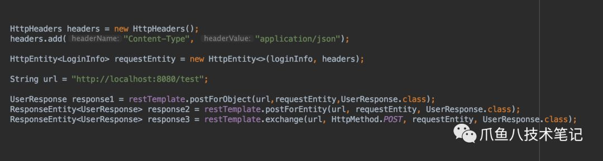
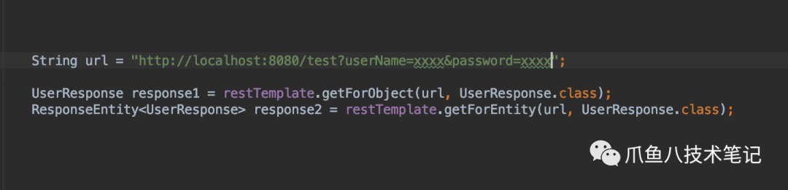
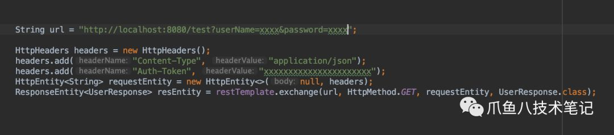
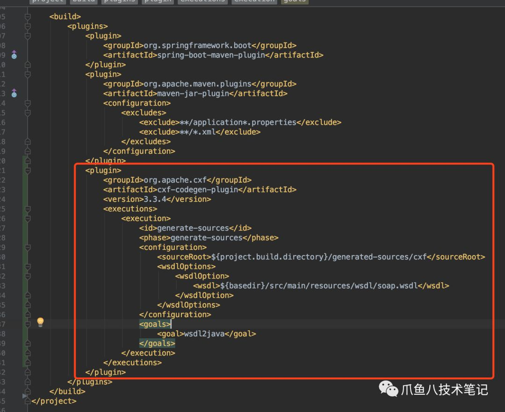
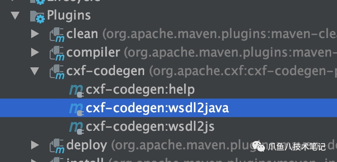
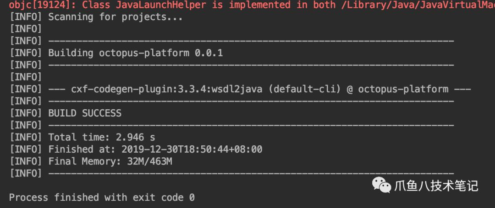
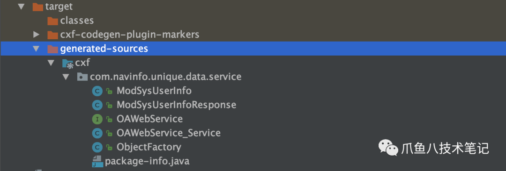

在我们日常的开发过程中，经常会去调用外部接口，通常会以WebService和Restful的方式去实现。本文主要的也是讲这两种方式的实现方式。

---

**WebService与Restful**

这里首先简单讲解一下WebService和Restful的区别，WebService是基于SOAP协议，而Restful是基于Http协议，所以二者皆可以跨平台跨语言。WebService面向活动，Restful面向资源。业务简单只需要使用增删改操作则建议使用Restful，如果业务比较复杂注重安全性选WebService。不过现在Restful是越来越流行，相信很多人只是知道WebService，但从来没有使用过。

**Restful**

Post请求

说到post请求，我相信大家都会使用，没错最常用的3种方式是postForEntity、postForObject和exchange。那么他们的区别是什么呢？到底该使用那个呢？下面主要说一下他们的区别。

postForObject可以直接返回消息体，也就是我们可以通过实体类的方式映射我们请求的消息体，但是获取不到请求的header的信息，而postForEntity则可以获取header和body的所有信息。而exchange则更加灵活。看下图可以很清楚的体现他们之间的关系(不是实现关系哈)。

 下图就是以实现登录获取用户信息的实现。

Get请求

Get的方式基本上也差不多，同样也有getForObject、getForEntity和exchange的方式。使用方式和Post基本一致。代码实现如下图：

大家可以看到，这两个方式没有办法传header，但是在我们日常的使用时很多情况时需要修改header或者需要通过header添加某些信息，别着急exchange帮你去搞定，如下图。

总结：

到这里相信大家心里已经很清楚了，在需求中用那个方法能满足我们的需求。

**WebService**

WebService使得无须借助第三方，就可以完成数据交换，无须关注语言、平台或者其他内部协议。使用的是xml标准，基于SOAP协议。它缩减了业务接口之间的成本，为企业（内部或者外部）业务流程的集成提供了一个通用机制。

Restful的流行，也就是SpringBoot的流行，那么在我们日常接触到的业务当中也有很大一部需求是调用WebService接口的需求，那现在下面就列举一些访问的方式。

访问WebService的方法有很多种，jaxb2方式httpclient都试过，但是最终不如用cxf生成java文件实用。

1\. pom配置

注意低版本可能不适配soap1.2

2\. 编译

点击wsdl2java

3\. 生成代码

4\. 使用服务（自己动手哈）