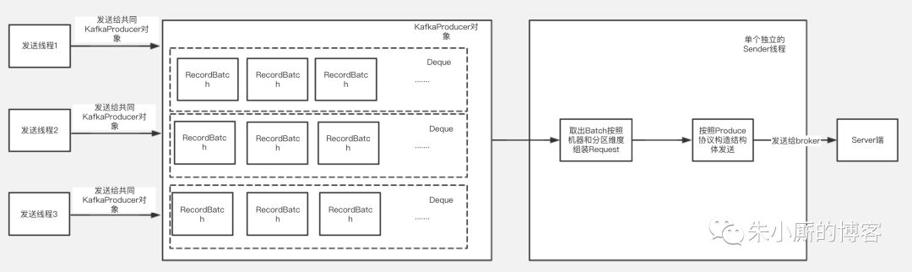
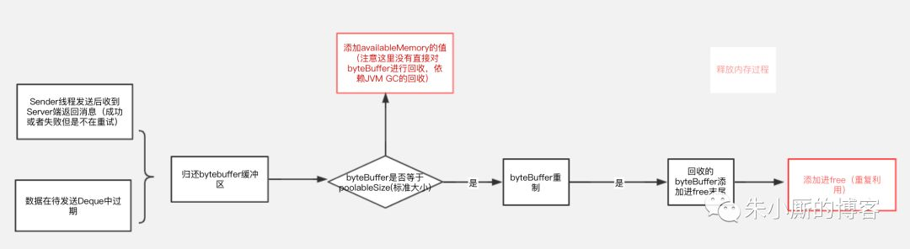
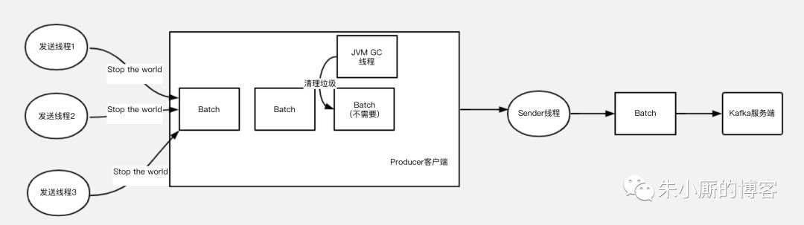
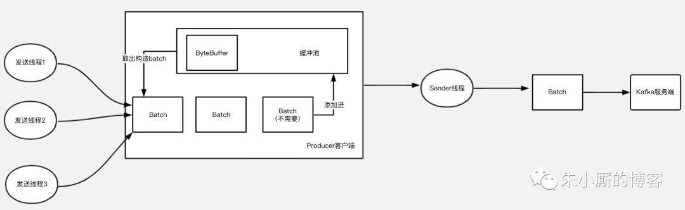

大家都知道Kafka是一个高吞吐的消息队列，是大数据场景首选的消息队列，这种场景就意味着发送单位时间消息的量会特别的大，那么Kafka如何做到能支持能同时发送大量消息的呢？

答案是Kafka通过批量压缩和发送做到的。

我们知道消息肯定是放在内存中的，大数据场景消息的不断发送，内存中不断存在大量的消息，很容易引起GC

频繁的GC特别是full gc是会造成“stop the world”，也就是其他线程停止工作等待垃圾回收线程执行，继而进一步影响发送的速度影响吞吐量，那么Kafka是如何做到优化JVM的GC问题的呢？看完本篇文章你会get到。

Kafka的内存池
---------

下面介绍下Kafka客户端发送的大致过程，如下图：

Kafka的kafkaProducer对象是线程安全的，每个发送线程在发送消息时候共用一个kafkaProducer对象来调用发送方法，最后发送的数据根据Topic和分区的不同被组装进某一个RecordBatch中。

发送的数据放入RecordBatch后会被发送线程批量取出组装成ProduceRequest对象发送给Kafka服务端。

可以看到发送数据线程和取数据线程都要跟内存中的RecordBatch打交道，RecordBatch是存储数据的对象，那么RecordBatch是怎么分配的呢？

下面我们看下Kafka的缓冲池结构，如下图所示：

> **名词解释：**缓冲池：BufferPool（缓冲池）对象，整个KafkaProducer实例中只有一个BufferPool对象。内存池总大小，它是已使用空间和可使用空间的总和，用totalMemory表示(由buffer.memory配置，默认32M)。

可使用的空间：它包含包括两个部分，绿色部分代表未申请未使用的部分，用availableMemory表示

黄色部分代表已经申请但没有使用的部分，用一个ByteBuffer双端队列(Deque)表示，在BufferPool中这个队列叫free，队列中的每个ByteBuffer的大小用poolableSize表示(由batch.size配置，默认16k)，因为每次free申请内存都是以poolableSize为单位申请的，申请poolableSize大小的bytebuffer后用RecordBatch来包装起来。

已使用空间：代表缓冲池中已经装了数据的部分。

根据以上介绍，我们可以知道，总的BufferPool大小=已使用空间+可使用空间；free的大小=free.size \* poolableSize（poolsize就是单位batch的size）。

**数据的分配过程** 总的来说是判断需要存储的数据的大小是否free里有合适的recordBatch装得下

如果装得下则用recordBatch来存储数据，如果free里没有空间但是availableMemory+free的大小比需要存储的数据大（也就是说可使用空间比实际需要申请的空间大），说明可使用空间大小足够，则会用让free一直释放byteBuffer空间直到有空间装得下要存储的数据位置，如果需要申请的空间比实际可使用空间大，则内存申请会阻塞直到申请到足够的内存为止。

整个申请过程如下图：

****

**数据的释放过程** 总的来说有2个入口，释放过程如下图：

再来看段申请空间代码：

    //判断需要申请空间大小，如果需要申请空间大小比batchSize小，那么申请大小就是batchsize，如果比batchSize大，那么大小以实际申请大小为准
    int size = Math.max(this.batchSize, Records.LOG\_OVERHEAD + Record.recordSize(key, value));
    log.trace("Allocating a new {} byte message buffer for topic {} partition {}", size, tp.topic(), tp.partition());
    //这个过程可以参考图3
    ByteBuffer buffer = free.allocate(size, maxTimeToBlock);

再来段回收的核心代码：

    public void deallocate(ByteBuffer buffer, int size) {
     lock.lock();
     try {
     //只有标准规格（bytebuffer空间大小和poolableSize大小一致的才放入free）
     if (size == this.poolableSize && size == buffer.capacity()) {
     //注意这里的buffer是直接reset了，重新reset后可以重复利用，没有gc问题
     buffer.clear();
     //添加进free循环利用
     this.free.add(buffer);
     } else {
     //规格不是poolableSize大小的那么没有进行重制，但是会把availableMemory增加，代表整个可用内存空间增加了，这个时候buffer的回收依赖jvm的gc
     this.availableMemory += size;
     }
     //唤醒排在前面的等待线程
     Condition moreMem = this.waiters.peekFirst();
     if (moreMem != null)
     moreMem.signal();
     } finally {
     lock.unlock();
     }
    }

通过申请和释放过程流程图以及释放空间代码，我们可以得到一个结论

就是如果用户申请的数据（发送的消息）大小都是在poolableSize（由batch.size配置，默认16k）以内，并且申请时候free里有空间，那么用户申请的空间是可以循环利用的空间，可以减少gc，但是其他情况也可能存在直接用堆内存申请空间的情况，存在gc的情况。

如何尽量避免呢，如果批量消息里面单个消息都是超过16k，可以考虑调整batchSize大小。

如果没有使用缓冲池，那么用户发送的模型是下图5，由于GC特别是Full GC的存在，如果大量发送，就可能会发生频繁的垃圾回收，导致的工作线程的停顿，会对整个发送性能，吞吐量延迟等都有影响。

使用缓冲池后，整个使用过程可以缩略为下图：

总结
--

Kafka通过使用内存缓冲池的设计，让整个发送过程中的存储空间循环利用，有效减少JVM GC造成的影响，从而提高发送性能，提升吞吐量。

作者简介：黄益明，来自滴滴出行kafka团队，对kafka有一年多的研究实践，负责滴滴内部云平台的架构设计和Kafka特性研发工作