**前言**

---

本文是笔者在学习官方文档、相关博客文章和实践过程中，整理了一些知识概念和自己的思考，主要在探索 lstio 的实际应用场景， Sidecar 原理， Service Mesh 为什么出现、要解决什么问题等，帮助我们思考微服务技术架构的升级和落地的可行性。

> 本文不是 Istio 的全部，但是希望入门仅此一篇就够。

**概念**
======

---

> 围绕云原生(CN)的概念，给人一种知识大爆炸的感觉，但假如你深入了解每一个概念的细节，你会发现它和你很近，甚至就是你手里每天做的事情。

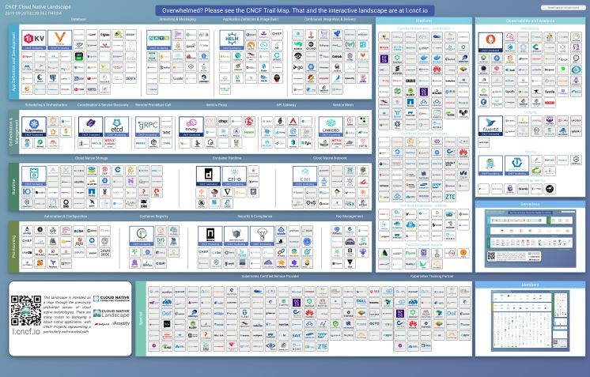

图片来源：https://landscape.cncf.io/

**关键词：Service Mesh、Istio、Sidecar、Envoy 等。**

**服务网格**
--------

服务网格( Service Mesh )是一个新瓶装旧酒的概念，它的发展随着微服务兴起，必然是早于 Kubernates 出现了。但 Kubernates 和 Istio 的出现，促使它成为了一种更火更标准化的概念。

Sidecar 是服务网格技术中常用的(其中)一种设计架构，在 Kubernates 中，不同的容器允许被运行在同一个 Pod 中（即多个进程运行在同一个 cgroup 下），这在很大程度上给 Sidecar 模式提供了良好的土壤。

首先看看 Sidecar 的设计：


图片来源于网络

为什么是新瓶旧酒？任何技术的发展都不是凭空地跳跃式发展的。

### **历史**


原始的应用程序--图片来源于网络

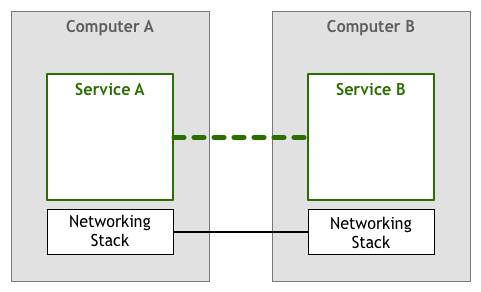

独立的网络层--图片来源于网络

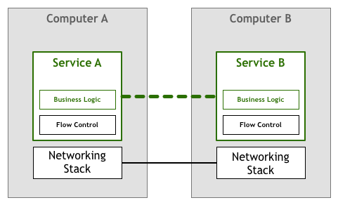

出现网络层（4层协议）控制的需求--图片来源于网络

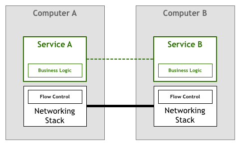

控制逻辑下移到网络层--图片来源于网络

早期，应用程序随着功能迭代发展，尤其是一个大型项目，程序堆积了越来越多的功能，功能之间紧密耦合在一起，变得越来越难以维护（因为模块耦合度较高，没有人敢动古老的模块代码），迭代周期变长（工程复杂度成几何增长）。

于是，人们提出，将不同的功能分离到不同的程序（进程）中，减低模块的耦合度，敏捷开发迭代，这就是微服务概念的兴起。

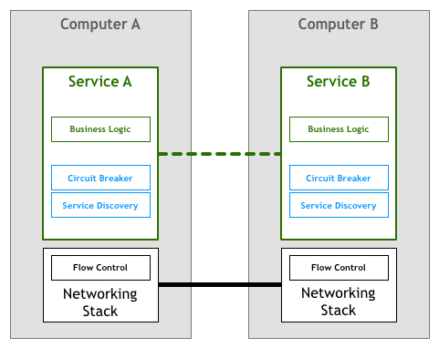

出现新的应用层（7层协议）需求（服务发现、熔断、超时重试等）--图片来源于网络

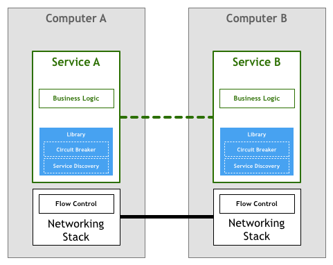

封装成三方库（服务发现：Dubbo/HSF）--图片来源于网络

**困难：**

服务被拆分成众多的微服务，最困难的问题就是——调用它自己：

1、原本在进程中互相调用那么简单的事情，都要变成一次在 7 层网络上的远程调用。

2、原本公共工具类做的事情，现在需要写成二方库 SDK 等，在每一个进程中使用，版本迭代成为了灾难。

3、原本是内部透明调用的不需要做任何防护，分离后却要额外增加安全防护和隔离的工作。

4、不再是代码即文档，需要维护大量的 API 定义和版本管理。

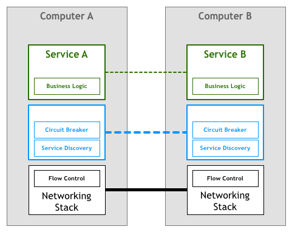

封装到隔离的进程中代理--图片来源于网络

到这里，独立进程的方式基本成型，即为Sidecar模式。

**Sidecar 解决什么问题？**

这里有个服务网格里的概念：微服务之间的调用，一般在架构图中是横向的，被称为东西流量。服务暴露到外部被公网可见的外部调用，被称为南北流量。

Sidecar 的设计就是为了解决微服务互相调用（东西流量）的问题。

先来一张我们比较熟悉的图：

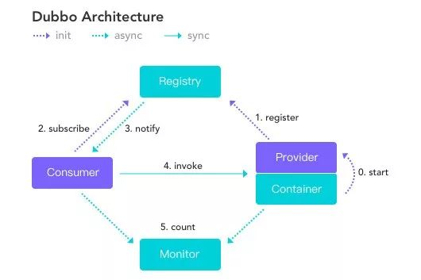

图片来源于网络

Consumer 与 Provider 就是微服务互相调用的一种解决方案。

毫无疑问，我们熟知的一整套中间件解决方案，解决的正是东西流量的问题，图为Dubbo 架构。

只不过， Dubbo 中间件一整套组件是基于 SPI 机制以一种较为隔离的方式侵入到运行时的代码中。并且，这只能限定 Java 这样被官方支持的语言来开发服务应用。

**小结**

**
**

归纳一下与东西流量有关的问题：

流量管理（服务发现、负载均衡、路由、限流、熔断、容错等）、可观测性（监控、日志聚合、计量、跟踪）、安全（认证、授权），再甚至更高级的动态配置、故障注入、镜像流量等

相比来说， Sidecar 的模式更为巧妙并更进一步。通过容器机制，在进程上是隔离的，基于 L7 代理进行通讯，允许微服务是由任何语言进行开发的。

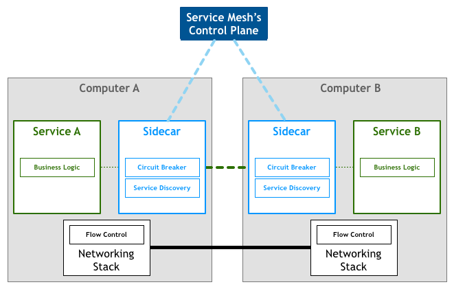

图片来源于网络

以下是微服务集群基于Sidecar互相通讯的简化场景：

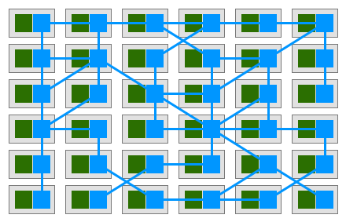

图片来源于网络

所以说，回到服务网格的概念上来，虽然概念是不同的，但是逻辑上我们可以理解成：所有使用中间件的服务组成了一个大的服务网格，这样可以帮助我们理解。服务网格基于 Kubernates 这样的容器技术，将东西流量的问题解决得更加透明无感。

一句话总结，服务网格（ Service Mesh ）是解决微服务之间的网络问题和可观测性问题的(事实)标准，并且正在走向标准化。

> Service Mesh 是 Kubernetes 支撑微服务能力拼图的最后一块

**Istio 和 Envoy**
-----------------

> Istio，第一个字母是(ai)。

Istio 实现的服务网格分为数据平面和控制平面。核心能力包括4大块：

1、流量控制（Traffic Management）。

2、安全（Security）。

3、动态规则（Policy）。

4、可观测能力（Observability）。

Envoy 面向数据平面，也就是服务之间调用的代理。

Envoy 是 Istio Service Mesh 中默认的 Sidecar 方案。

Istio 在 Enovy 的基础上按照 Envoy 的 xDS 协议扩展了其控制平面。

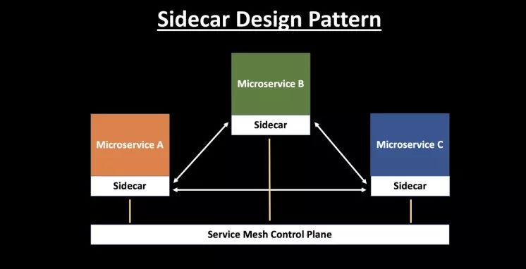

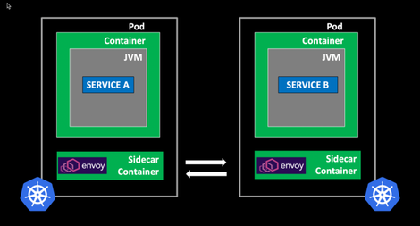

Istio基于Envoy实现Service Mesh数据平面--图片来源于网络


Envoy角色--图片来源于网络

Envoy 是一个由 C++ 实现的高性能代理，与其等价的，还有 Nginx、Traefik ，这就不难理解了。

也就是下图中的 Proxy ：

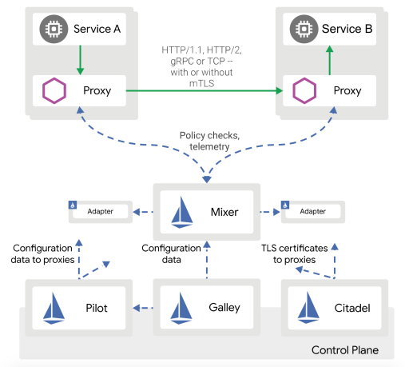

图片来源于Istio官网

Istio 在控制平面上主要解决流量管理、安全、可观测性三个方面的问题，也就是前面提到的东西流量相关的问题。类似一个有配置中心的微服务集群架构。具体细节不在这里赘述。

**Sidecar注入**
-------------

**
**

前面在介绍服务网格时，只是简单地提到Sidecar设计在其中的作用和特性，这里详细展开介绍其中的原理。

首先是一些预备概念：

1、Sidecar 模式：容器应用模式之一，Service Mesh 架构的一种实现方式

2、Init 容器：Pod 中的一种专用的容器，在应用程序容器启动之前运行，用来包含一些应用镜像中不存在的实用工具或安装脚本。

3、iptables：流量劫持是通过 iptables 转发实现的。

Sidecar 模式解决微服务之间的网络通讯（远程调用），通常通讯层的实现方式，有以下选择：

1、在微服务应用程序中导入 SDK 类库。

2、节点代理（使用纵向的API网关或者是本地 Agent ），代理接口的调用路由规则，转发到特定的机器。

3、用 Sidecar 容器的形式运行，和应用容器一同运行，透明地劫持所有应用容器的出入流量。

SDK 库的方式是很自然的，并且调用方式是进程内的，没有安全隔离的包袱。但是随着编程语言的发展，很多新的语言为特定的场景而生，而SDK库的方式限制了使用方必须用支持列表中的语言。

节点代理的方式，是使用一个特定的服务专门代理微服务中的请求，是一个中间人的角色。但这个代理人的安全性要求非常高，因为它需要处理来自不同微服务的请求，并鉴别它们各自的身份。

Sidecar 模型是介于 SDK 库和节点代理中间的一种形式，相当于是给每个微服务都配上一个自己独有的代理。这样，每个微服务自己的 Sidecar 就代表了自己特定的身份，有利于调用的安全审计。因此，从外部看， Sidecar 与其附属的应用程序具有相同的权限。

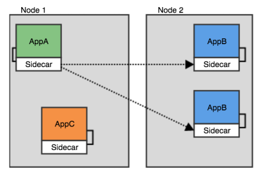

图片来源：https://toutiao.io/posts/uva4uy/preview

以 Istio 为例：

在 Istio 中， Sidecar 模式启动时会首先执行一个init 容器 istio-init ，容器只做一件事情，通过 iptables 命令配置 Pod 的网络路由规则，让 Envoy 代理可以拦截所有的进出 Pod 的流量。

之后，微服务应用通过 Pod 中共享的网络命名空间内的 loopback ( localhost )与 Sidecar 通讯。而外部流量也会通过 Sidecar 处理后，传入到微服务。

因为它们共享一个 Pod ，对其他 Pod 和节点代理都是不可见的，可以理解为两个容器共享存储、网络等资源，可以广义的将这个注入了 Sidecar 容器的 Pod 理解为一台主机，两个容器共享主机资源。

下图是具体 iptables 与 Sidecar 之间互作用原理，来源：

https://jimmysong.io/posts/envoy-sidecar-injection-in-istio-service-mesh-deep-dive/

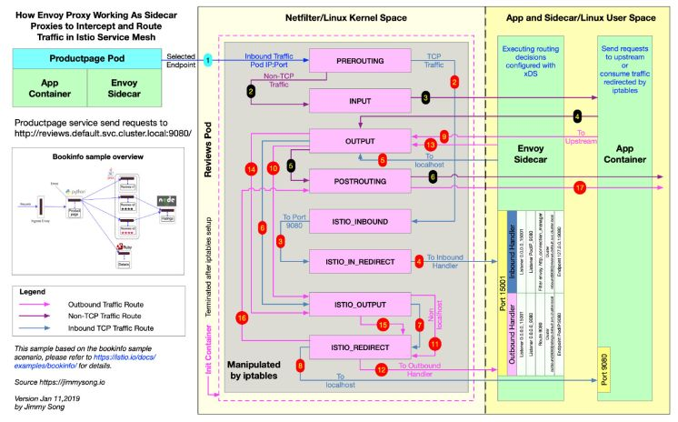

具体原理上的细节，我们可以通过实践，慢慢挖掘。

**小结**
------

最后给概念章节有个阶段性的总结：

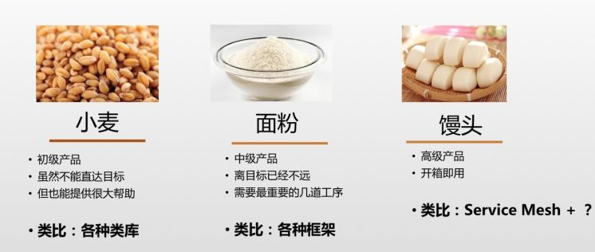

图片来源于网络

> 所以我们打算卖什么？

**实践**
======

---

铺垫这么多概念，我们可以实操起来了。具体怎么做？从安装 Istio 开始。

**准备工作**
--------

首先，预备一个Kubernates集群，这里不赘述。

> 如果是本地测试，Docker-Desktop也可以启动一个单机的k8s集群

装 Istio 的命令行工具 istioctl ：

下载 istio-release（包括 istioctl 、示例文件和安装配置）。

* 

```
curl -sL "https://github.com/istio/istio/releases/download/1.4.2/istio-1.4.2-osx.tar.gz" | tar xz
```

安装 helm （可选）：

> 从 1.4.0 版本开始，不再使用 helm 来安装 Istio

* 
* 

```
\# helm工具$ brew install kubernetes-helm
```

**
**
-----

**安装Istio**
-----------

**
**

进入到安装文件的目录，开始将 Istio 安装到 k8s 上。

首先确认 kubectl 连接的正确的 k8s 集群。

选择以下其中一种方式：

**方式1**、使用 `istioctl` 安装

* 
* 
* 
* 
* 
* 
* 
* 
* 
* 
* 
* 
* 
* 

```
cd istio-1.4.2\# 安装istioctlcp bin/istioctl /usr/local/bin/ \# 也可以加一下PATH\# （可选）先查看配置文件istioctl manifest generate --set profile=demo \> istio.demo.yaml\# 安装istioistioctl manifest apply --set profile=demo\#\# 以下是旧版本istio的helm安装方式 \#\#\# 创建istio专属的namespacekubectl create namespace istio-system\# 通过helm初始化istiohelm template install/kubernetes/helm/istio-init --name istio-init --namespace istio-system | kubectl apply -f -\# 通过helm安装istio的所有组件helm template install/kubernetes/helm/istio --name istio --namespace istio-system | kubectl apply -f -
```

**方式2**、使用 helm 安装

* 
* 
* 
* 
* 
* 
* 

```
\#\# 以下是旧版本istio的helm安装方式 \#\#\# 创建istio专属的namespacekubectl create namespace istio-system\# 通过helm初始化istiohelm template install/kubernetes/helm/istio-init --name istio-init --namespace istio-system | kubectl apply -f -\# 通过helm安装istio的所有组件helm template install/kubernetes/helm/istio --name istio --namespace istio-system | kubectl apply -f -
```

等待所有的 Istio 组件的容器启动，直到：

* 
* 

```
$ kubectl get crds | grep 'istio.io' | wc -l23
```

> 如果是阿里云ACS集群，安装完Istio后，会有对应的一个SLB被创建出来，转发到Istio提供的虚拟服务器组

**示例：****Hello World**
----------------------

**
**

示例代码在源码的 samples 目录中

    * 

    ```
    cd samples/hello-world
    ```

### **注入**

Istio Sidecar 的注入有两种方式：自动、手动。

这里先通过 istioctl 命令直接手工inject：

* 

```
istioctl kube-inject -f helloworld.yaml -o helloworld-istio.yaml
```

    实际上就是通过脚本修改了原文件，增加了：

1、sidecar init容器。

2、istio proxy sidecar容器。

### **分析**

我们可以简单对比一下注入的配置，原文件:

* 
* 
* 
* 
* 
* 
* 
* 
* 
* 
* 
* 
* 
* 
* 
* 
* 
* 
* 
* 
* 
* 
* 
* 
* 
* 
* 
* 
* 
* 
* 
* 
* 
* 
* 
* 
* 
* 
* 
* 
* 
* 
* 
* 
* 
* 
* 
* 
* 
* 
* 
* 
* 
* 
* 
* 
* 
* 
* 
* 
* 
* 
* 
* 
* 
* 
* 
* 
* 
* 
* 
* 

```
apiVersion: v1kind: Servicemetadata: name: helloworld labels: app: helloworldspec: ports: - port: 5000 name: http selector: app: helloworld---apiVersion: apps/v1kind: Deploymentmetadata: creationTimestamp: null labels: version: v1 name: helloworld-v1spec: replicas: 1 selector: matchLabels: app: helloworld version: v1 strategy: {} template: metadata: labels: app: helloworld version: v1 spec: containers: - image: docker.io/istio/examples-helloworld-v1 imagePullPolicy: IfNotPresent name: helloworld ports: - containerPort: 5000 resources: requests: cpu: 100m---apiVersion: apps/v1kind: Deploymentmetadata: creationTimestamp: null labels: version: v2 name: helloworld-v2spec: replicas: 1 selector: matchLabels: app: helloworld version: v2 strategy: {} template: metadata: labels: app: helloworld version: v2 spec: containers: - image: docker.io/istio/examples-helloworld-v2 imagePullPolicy: IfNotPresent name: helloworld ports: - containerPort: 5000 resources: requests: cpu: 100m
```

可以看到，需要部署两个版本 helloworld-v1/v2 的容器，挂载在同一个服务下。

这是一个典型的蓝绿部署方式，后续我们可以通过配置 Istio ，来调整它们的流量权重，这是真实生产环境版本升级的场景。

再来看增加的部分:


这里增加了一部分 Istio 的配置，是 K8s 中的标准做法 annotations 。


这部分可以看到，原有的服务容器没有任何改动，只是增加了一个sidecar容器，包括启动参数和环境变量（因为配置排序的问题， args 排在了最前面，整体的定义：

* 
* 
* 
* 
* 
* 
* 
* 
* 
* 
* 
* 
* 
* 
* 
* 
* 
* 
* 
* 
* 
* 
* 
* 
* 
* 
* 
* 
* 
* 
* 
* 
* 
* 
* 
* 
* 
* 
* 
* 

```
 - args: - proxy - sidecar - ... env: - name: POD\_NAME valueFrom: fieldRef: fieldPath: metadata.name - ... image: docker.io/istio/proxyv2:1.3.2 imagePullPolicy: IfNotPresent name: istio-proxy ports: - containerPort: 15090 name: http-envoy-prom protocol: TCP readinessProbe: failureThreshold: 30 httpGet: path: /healthz/ready port: 15020 initialDelaySeconds: 1 periodSeconds: 2 resources: limits: cpu: "2" memory: 1Gi requests: cpu: 100m memory: 128Mi securityContext: readOnlyRootFilesystem: true runAsUser: 1337 volumeMounts: - mountPath: /etc/istio/proxy name: istio-envoy - mountPath: /etc/certs/ name: istio-certs readOnly: true
```

    镜像名 docker.io/istio/proxyv2:1.3.2 。

另外一部分，就是 initContainer ：

* 
* 
* 
* 
* 
* 
* 
* 
* 
* 
* 
* 
* 
* 
* 
* 
* 
* 
* 
* 
* 
* 
* 
* 
* 
* 
* 
* 
* 
* 
* 
* 
* 
* 
* 
* 
* 
* 
* 
* 
* 
* 

```
 initContainers: - args: - -p - "15001" - -z - "15006" - -u - "1337" - -m - REDIRECT - -i - '\*' - -x - "" - -b - '\*' - -d - "15020" image: docker.io/istio/proxy\_init:1.3.2 imagePullPolicy: IfNotPresent name: istio-init resources: limits: cpu: 100m memory: 50Mi requests: cpu: 10m memory: 10Mi securityContext: capabilities: add: - NET\_ADMIN runAsNonRoot: false runAsUser: 0 volumes: - emptyDir: medium: Memory name: istio-envoy - name: istio-certs secret: optional: true secretName: istio.default
```

**部署**

**
**

* 
* 
* 
* 
* 
* 
* 
* 
* 
* 
* 
* 
* 
* 
* 
* 
* 
* 
* 
* 
* 

```
$ kubectl apply -f helloworld-istio.yamlservice/helloworld createddeployment.apps/helloworld-v1 createddeployment.apps/helloworld-v2 created$ kubectl get deployments.apps -o wideNAME READY UP-TO-DATE AVAILABLE AGE CONTAINERS IMAGES SELECTORhelloworld-v1 1/1 1 1 20m helloworld,istio-proxy docker.io/istio/examples-helloworld-v1,docker.io/istio/proxyv2:1.3.2 app=helloworld,version=v1helloworld-v2 1/1 1 1 20m helloworld,istio-proxy docker.io/istio/examples-helloworld-v2,docker.io/istio/proxyv2:1.3.2 app=helloworld,version=v2

并启用一个简单的gateway来监听，便于我们访问测试页面$ kubectl apply -f helloworld-gateway.yamlgateway.networking.istio.io/helloworld-gateway createdvirtualservice.networking.istio.io/helloworld created

部署完成之后，我们就可以通过gateway访问hello服务了：$ curl "localhost/hello"Hello version: v2, instance: helloworld-v2-7768c66796-hlsl5$ curl "localhost/hello"Hello version: v2, instance: helloworld-v2-7768c66796-hlsl5$ curl "localhost/hello"Hello version: v1, instance: helloworld-v1-57bdc65497-js7cm
```

两个版本的 Deployment 都可以随机被访问到

**深入探索**
========

---

接着刚才我们部署好的 hello-world ，我们随着Istio的feature进行探索。

**流量控制 - 切流**
-------------

**
**

首先，我们尝试控制一下流量，比如只走v2。参考Traffic Shifting:

https://istio.io/docs/tasks/traffic-management/traffic-shifting/

我们可以通过 VirtualService 配置控制版本流量，详情参考：

https://istio.io/docs/reference/config/networking/v1alpha3/virtual-service/

先查看一下当前 Gateway 和 VirtualService 的配置：

* 
* 
* 
* 
* 
* 
* 
* 
* 
* 
* 
* 
* 
* 
* 
* 
* 
* 
* 
* 
* 
* 
* 
* 
* 
* 
* 
* 
* 
* 
* 
* 
* 
* 

```
$ kubectl get gw helloworld-gateway -o yamlapiVersion: networking.istio.io/v1alpha3kind: Gatewaymetadata: name: helloworld-gatewayspec: selector: istio: ingressgateway \# use istio default controller servers: - port: number: 80 name: http protocol: HTTP hosts: - "\*"$ kubectl get vs helloworld -o yamlapiVersion: networking.istio.io/v1alpha3kind: VirtualServicemetadata: name: helloworldspec: hosts: - "\*" gateways: - helloworld-gateway http: - match: - uri: exact: /hello route: - destination: host: helloworld \# short for helloworld.${namespace}.svc.cluster.local port: number: 5000
```

可以看到，VS 转发 /hello 路径的请求到 helloworld:5000 ，不过，这种 short 写法不推荐。我们可以改成 helloworld.${namespace}.svc.cluster.local 。

我们将其中 VirtualService 的配置修改为：

* 
* 
* 
* 
* 
* 
* 
* 
* 
* 
* 
* 
* 
* 
* 
* 
* 
* 
* 
* 
* 
* 

```
apiVersion: networking.istio.io/v1alpha3kind: VirtualServicemetadata: name: helloworldspec: hosts: - "\*" gateways: - helloworld-gateway http: - match: - uri: exact: /hello route: - destination: host: helloworld.default.svc.cluster.local subset: v1 weight: 0 - destination: host: helloworld.default.svc.cluster.local subset: v2 weight: 100
```

在 http.route 里增加一个 destination ，并将 v2 的 weight 权重配置到100 。

并增加一个 DestinationRule 对 subset 进行定义。

* 
* 
* 
* 
* 
* 
* 
* 
* 
* 
* 
* 
* 

```
apiVersion: networking.istio.io/v1alpha3kind: DestinationRulemetadata: name: helloworld-destinationspec: host: helloworld.default.svc.cluster.local subsets: - name: v1 labels: version: v1 - name: v2 labels: version: v2
```

然后应用更新：

* 
* 
* 
* 

```
$ kubectl apply -f helloworld-gateway.yamlgateway.networking.istio.io/helloworld-gateway unchangedvirtualservice.networking.istio.io/helloworld configureddestinationrule.networking.istio.io/helloworld-destination created
```

测试一下效果：

* 
* 
* 
* 
* 
* 
* 
* 
* 
* 
* 
* 
* 
* 
* 
* 
* 
* 
* 
* 
* 
* 

```
$ while true;do sleep 0.05 ;curl localhost/hello;doneHello version: v2, instance: helloworld-v2-76d6cbd4d-tgsq6Hello version: v2, instance: helloworld-v2-76d6cbd4d-tgsq6Hello version: v2, instance: helloworld-v2-76d6cbd4d-tgsq6Hello version: v2, instance: helloworld-v2-76d6cbd4d-tgsq6Hello version: v2, instance: helloworld-v2-76d6cbd4d-tgsq6Hello version: v2, instance: helloworld-v2-76d6cbd4d-tgsq6Hello version: v2, instance: helloworld-v2-76d6cbd4d-tgsq6Hello version: v2, instance: helloworld-v2-76d6cbd4d-tgsq6Hello version: v2, instance: helloworld-v2-76d6cbd4d-tgsq6Hello version: v2, instance: helloworld-v2-76d6cbd4d-tgsq6Hello version: v2, instance: helloworld-v2-76d6cbd4d-tgsq6Hello version: v2, instance: helloworld-v2-76d6cbd4d-tgsq6Hello version: v2, instance: helloworld-v2-76d6cbd4d-tgsq6Hello version: v2, instance: helloworld-v2-76d6cbd4d-tgsq6Hello version: v2, instance: helloworld-v2-76d6cbd4d-tgsq6Hello version: v2, instance: helloworld-v2-76d6cbd4d-tgsq6Hello version: v2, instance: helloworld-v2-76d6cbd4d-tgsq6Hello version: v2, instance: helloworld-v2-76d6cbd4d-tgsq6Hello version: v2, instance: helloworld-v2-76d6cbd4d-tgsq6Hello version: v2, instance: helloworld-v2-76d6cbd4d-tgsq6Hello version: v2, instance: helloworld-v2-76d6cbd4d-tgsq6
```

流量完美切走。不过，到目前为止我们只接触了Gateway 、VirtualService和DestinationRule。我们来回顾一下：

### **Gateway**

Gateway 用于处理服务网格的边界，定义了出入负载的域名、端口、协议等规则。

### **VirtualService**

VirtualService 可以控制路由（包括subset/version权重、匹配、重定向等）、故障注入、TLS 。

### **DestinationRule**

DestinationRule 定义确定路由的细节规则，比如 subset 定义、负载均衡的策略，甚至可以针对特定的端口再重新定义规则。

**示例：****Bookinfo**
-------------------

**
**

前面的例子，通过控制流量权重达到版本切流的目的。

下面，我们再通过另外一个 Bookinfo 的例子继续探索其它Istio的feature。


图片来源于 Istio 官网

本例是一个多实例微服务架构，并且由不同语言开发。

**开始**

* 

```
$ cd samples/bookinfo
```

### **注入**

这次Pod定义比较多，我们打开auto sidecar-injection

* 

```
$ kubectl label namespace default istio-injection=enabled
```

打开之后，每次创建的Pod都会自动注入上istio-proxy和相应的initContainer

### **部署**

* 
* 
* 
* 
* 
* 
* 
* 
* 
* 
* 
* 
* 
* 
* 

```
$ kubectl apply -f platform/kube/bookinfo.yamlservice/details createdserviceaccount/bookinfo-details createddeployment.apps/details-v1 createdservice/ratings createdserviceaccount/bookinfo-ratings createddeployment.apps/ratings-v1 createdservice/reviews createdserviceaccount/bookinfo-reviews createddeployment.apps/reviews-v1 createddeployment.apps/reviews-v2 createddeployment.apps/reviews-v3 createdservice/productpage createdserviceaccount/bookinfo-productpage createddeployment.apps/productpage-v1 created
```

创建一个Gateway用于查看页面：

* 
* 
* 

```
$ kubectl apply -f networking/bookinfo-gateway.yamlgateway.networking.istio.io/bookinfo-gateway createdvirtualservice.networking.istio.io/bookinfo created
```

访问 http://localhost/productpage 页面：


不断刷新可以看到右侧Reviews有三个版本：


**流量控制 - 网络可见性**
----------------

**
**

基于前面安装好的 Bookinfo 应用，起一个 Pod 探索一下网络可见性：

* 
* 
* 
* 
* 
* 

```
$ kubectl run --image centos:7 -it probe\# 请求productpage服务上的接口[root@probe-5577ddd7b9-rbmh7 /]\# curl -sL http://productpage:9080 | grep -o "\<title\>.\*\</title\>"\<title\>Simple Bookstore App\</title\>$ kubectl exec -it $(kubectl get pod -l run=probe -o jsonpath='{..metadata.name}') -c probe -- curl www.baidu.com | grep -o "\<title\>.\*\</title\>"\<title\>百度一下，你就知道\</title\>
```

我们可以看到，默认情况下，所有的微服务(容器)之间都是公开可访问的，并且微服务可以访问外部网络。

接下来，介绍 Sidecar 配置对可见性进行控制。

### **Sidecar**

由于每个容器都自动注入了Sidecar容器，托管了所有的出入请求。所以基于这个 Sidecar 容器，我们可以很容易对它进行配置。

Sidecar 配置就是 Istio 中专门用于配置 sidecar 之间的网络可见性。

首先，修改全局配置，使用 blocked-by-default 的方式。

* 
* 
* 
* 
* 

```
$ kubectl get configmap istio -n istio-system -o yaml | sed 's/mode: ALLOW\_ANY/mode: REGISTRY\_ONLY/g' | kubectl replace -n istio-system -f -configmap "istio" replaced$ kubectl get configmap istio -n istio-system -o yaml | grep -n1 -m1 "mode: REGISTRY\_ONLY"67- outboundTrafficPolicy:68: mode: REGISTRY\_ONLY
```

outboundTrafficPolicy.mode=REGISTRY\_ONLY 表示默认容器不允许访问外部网络，只允许访问已知的ServiceEntry。

然后，我们设置一个全局性的 Sidecar 配置：

* 
* 
* 
* 
* 
* 
* 
* 
* 
* 
* 
* 
* 

```
$ kubectl apply -f - \<\<EOFapiVersion: networking.istio.io/v1alpha3kind: Sidecarmetadata: name: default namespace: istio-systemspec: egress: - hosts: - "./\*" - "istio-system/\*"EOFsidecar.networking.istio.io/default configured
```

> * 每个namespace只允许一个无 workloadSelector 的配置
> * rootNamespace中无 workloadSelector 的配置是全局的，影响所有namespace，默认的rootNamespace=istio-system

这个配置的含义是：

所有namespace里的容器出流量(egress)只能访问自己的namespace或namespace=istio-system 中提供的 services 。

#### **egress**

我们先测试一下外网连通性， Sidecar 的出流量被称作 egress 流量。

> 这里需要等待一会生效，或者直接销毁重新部署一个测试容器

* 
* 
* 
* 
* 
* 
* 
* 
* 
* 
* 
* 
* 

```
$ kubectl exec -it $(kubectl get pod -l run=probe -o jsonpath='{..metadata.name}') -c probe -- curl -v www.baidu.com\* About to connect() to www.baidu.com port 80 (\#0)\* Trying 220.181.38.150...\* Connected to www.baidu.com (220.181.38.150) port 80 (\#0)\> GET / HTTP/1.1\> User-Agent: curl/7.29.0\> Host: www.baidu.com\> Accept: \*/\*\>\* Recv failure: Connection reset by peer\* Closing connection 0curl: (56) Recv failure: Connection reset by peercommand terminated with exit code 56
```

    效果是：外网已经访问不通。

恢复：这时，我们将需要访问的域名注册到 ServiceEntry 中，并且增加一个 Sidecar 的 egress 规则，例如：

* 
* 
* 
* 
* 
* 
* 
* 
* 
* 
* 
* 
* 
* 
* 
* 
* 
* 
* 
* 
* 
* 
* 
* 
* 
* 

```
apiVersion: networking.istio.io/v1alpha3kind: ServiceEntrymetadata: name: baiduspec: hosts: - www.baidu.com ports: - number: 80 name: http protocol: HTTP resolution: DNS location: MESH\_EXTERNAL---apiVersion: networking.istio.io/v1alpha3kind: Sidecarmetadata: name: defaultspec: egress: - hosts: - "./www.baidu.com" port: number: 80 protocol: HTTP name: http
```

重新请求，确认恢复了。

* 
* 
* 
* 
* 
* 
* 
* 
* 
* 
* 
* 
* 
* 
* 
* 
* 
* 
* 
* 
* 

```
$ kubectl exec -it $(kubectl get pod -l run=probe -o jsonpath='{..metadata.name}') -c probe -- curl -v www.baidu.com\* About to connect() to www.baidu.com port 80 (\#0)\* Trying 220.181.38.150...\* Connected to www.baidu.com (220.181.38.150) port 80 (\#0)\> GET / HTTP/1.1\> User-Agent: curl/7.29.0\> Host: www.baidu.com\> Accept: \*/\*\>\< HTTP/1.1 200 OK\< accept-ranges: bytes\< cache-control: private, no-cache, no-store, proxy-revalidate, no-transform\< content-length: 2381\< content-type: text/html\< date: Tue, 15 Oct 2019 07:45:33 GMT\< etag: "588604c8-94d"\< last-modified: Mon, 23 Jan 2017 13:27:36 GMT\< pragma: no-cache\< server: envoy\< set-cookie: BDORZ=27315; max-age=86400; domain=.baidu.com; path=/\< x-envoy-upstream-service-time: 21
```

同样地，容器之间的流量同理：

* 
* 
* 
* 
* 
* 
* 
* 
* 
* 
* 
* 
* 
* 
* 
* 
* 
* 
* 
* 
* 
* 
* 
* 
* 
* 
* 
* 
* 
* 
* 
* 

```
$ kubectl exec -it $(kubectl get pod -l run=probe -o jsonpath='{..metadata.name}') -c probe -- curl productpage:9080curl: (56) Recv failure: Connection reset by peercommand terminated with exit code 56配置上ServiceEntryapiVersion: networking.istio.io/v1alpha3kind: Sidecarmetadata: name: defaultspec: egress: - hosts: - "./www.baidu.com" - "./productpage.default.svc.cluster.local" \# 这里必须用长名称---apiVersion: networking.istio.io/v1alpha3kind: ServiceEntrymetadata: name: baiduspec: hosts: - www.baidu.com resolution: DNS location: MESH\_EXTERNAL---apiVersion: networking.istio.io/v1alpha3kind: ServiceEntrymetadata: name: productpagespec: hosts: - productpage resolution: DNS location: MESH\_EXTERNAL
```

* 
* 

```
$ kubectl exec -it $(kubectl get pod -l run=probe -o jsonpath='{..metadata.name}') -c probe -- curl productpage:9080 | grep -o "\<title\>.\*\</title\>"\<title\>Simple Bookstore App\</title\>
```

> 需要留意的是，不带workloadSelector的（不指定特定容器的）Sidecar配置只能有一个，所以规则都需要写在一起。

#### **ingress**

下面我们探究容器入流量的配置：

* 
* 
* 
* 
* 
* 
* 
* 
* 
* 
* 
* 
* 
* 
* 
* 

```
apiVersion: networking.istio.io/v1alpha3kind: Sidecarmetadata: name: productpage-sidecarspec: workloadSelector: labels: app: productpage ingress: - port: number: 9080 protocol: HTTP defaultEndpoint: 127.0.0.1:10080 egress: - hosts: - "\*/\*"
```

    这个配置的效果是让 productpage 应用的容器收到 9080 端口的 HTTP 请求时，转发到容器内的10080端口。

由于容器内没有监听 10080 ，所以会访问失败。

* 
* 

```
$ kubectl exec -it $(kubectl get pod -l run=probe -o jsonpath='{..metadata.name}') -c probe -- curl -s productpage:9080upstream connect error or disconnect/reset before headers. reset reason: connection failure
```

### 

**小结**

**
**

Sidecar 的示例说明就到这里，这只是一个示例。

egress 配置覆盖的域名访问规则没必要在 ingress 中重复，所以 ingress 配置主要用于配置代理流量的规则。例如，我们可以将所有的入口流量传入 sidecar 中的监听进程（做一些定制开发的权限检查等），然后再传给下游微服务。

egress 的配置更多的是关注在服务网格对外访问的能力，服务内部如果限制了，应用自身访问都会需要大量的 ServiceEntry 注册，所以微服务之间东西流量的信任访问，需要靠安全机制来解决。

**安全机制**

**
**

### **概述**

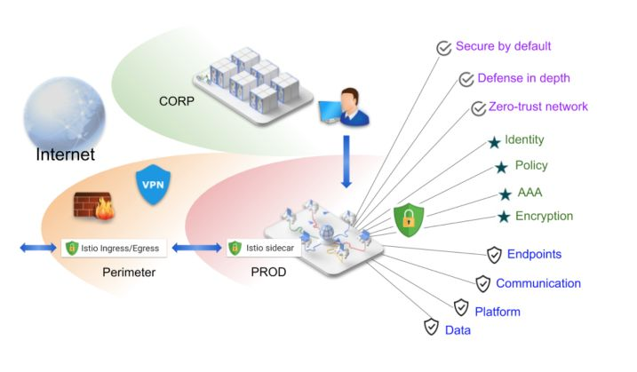

图片来源于Istio官网

Istio 提供包含了南北流量和东西流量两部分的防御机制：

1、Security by default：微服务应用不需要提供任何代码或引入三方库来保证自身安全。

2、Defense in depth：能够与已有的安全体系融合，深度定制安全能力。

3、Zero-trust Network：提供安全的方案都是假定服务网格的内部和外部都是0信任（不安全）网络。

下图是 Istio 中每个组件的角色：


图片来源于Istio官网

1、Citadel，证书（CA）管理

2、Sidecar等Envoy Proxy，提供TLS保障

3、Pilot，策略（Policy）和身份信息下发

4、Mixer，认证和审计

#### **策略（Policy）**

Istio 支持在运行时实时地配置策略（Policy），支持：

1、服务入流量速率控制。

2、服务访问控制，黑白名单规则等。

3、Header重写，重定向。

也可以自己定制 Policy Adapter 来定义业务逻辑。

#### **TLS**

在介绍安全机制之前，有必要先科普一下 TLS 。

SSL ( Security Socket Layer ，安全 Socket 层），是一个解决 4 层 TCP 和 7 层HTTPS 中间的协议层，解决安全传输的问题。

TLS ( Transport Layer Security ，传输层安全协议)，是基于 SSL v3 的后续升级版本，可以理解为相当于 SSL v3.1 。

主要提供：

1、认证（Transport Authentication），用户、服务器的身份，确保数据发送到正确的目的地。

2、加密数据，防止数据明文泄露。

3、数据一致性，传输过程不被串改。

Istio 中的安全传输机制都是建立在 TLS 之上的。

更多信息可以查看官方概念，详情参考：

https://istio.io/docs/concepts/security

#### **认证（Authentication）与鉴权（Authorization）**

这两个词很相近，甚至缩写 auth 都是相同的，所以有时候很容混淆。

在 istioctl 中有两个命令 authn 和 authz ，这样就可以区分它们。

认证和鉴权分别做什么，在后文两节会具体介绍。这里先说一下它们的关系。

认证 实际上是 鉴权 的必要条件

认证 实际上是 鉴权 的必要条件

认证 实际上是 鉴权 的必要条件

**为什么？**

1、认证是识别身份（Identification）。

2、鉴权是检查特定身份（Identity）的权限。

这样就很好理解了。二者时常相随，我们常说的比如登录，就是：

1、基于登录机制的cookie来识别访问来源的身份——认证。

2、然后判断来源的身份是否具备登录系统的权限（或者是访问某一个页面的具体细节的权限）——鉴权。

那么在 Istio 体系中，Authentication 是基于 mTLS 机制来做的，那么开启mTLS之后，就可以设置一些 AuthorizationPolicy 来做访问控制。细节可以看下文。

### **认证（Authentication）**

Istio 中的认证包含两种：

1、Transport Authentication ，传输层认证。基于 mTLS ( Mutual TLS )，检查东西流量的合法性。

2、Origin Authentication ，客户端认证。基于 JWT 等校验南北流量的登录身份。

#### **示例：****配置Policy**

这次我们跟着 Task: Authentication Policy 例子走，这里简化一下过程不做全程搬运，只分析关键点。

##### 准备环境：

这个例子中，创建了 3 个 namespace ，其中两个 foo 和 bar 注入了Sidecar， legacy 不注入用于对比。

* 
* 
* 
* 
* 
* 
* 
* 
* 
* 

```
\#!/bin/bash kubectl create ns fookubectl apply -f \<(istioctl kube-inject -f samples/httpbin/httpbin.yaml) -n fookubectl apply -f \<(istioctl kube-inject -f samples/sleep/sleep.yaml) -n fookubectl create ns barkubectl apply -f \<(istioctl kube-inject -f samples/httpbin/httpbin.yaml) -n barkubectl apply -f \<(istioctl kube-inject -f samples/sleep/sleep.yaml) -n barkubectl create ns legacykubectl apply -f samples/httpbin/httpbin.yaml -n legacykubectl apply -f samples/sleep/sleep.yaml -n legacy
```

默认情况下，容器之间是互通的（mTLS运行在PRESSIVE\_MODE）。

这里通过一个 check.sh 脚本检查连通性：

* 
* 
* 
* 
* 
* 
* 
* 
* 
* 
* 

```
\#!/bin/bashfor from in "foo" "bar" "legacy"; do for to in "foo" "bar" "legacy"; do kubectl exec $(kubectl get pod -l app=sleep -n ${from} -o jsonpath={.items..metadata.name}) -c sleep -n ${from} -- curl "http://httpbin.${to}:8000/ip" -s -o /dev/null -w "sleep.${from} to httpbin.${to}: %{http\_code}\\n"; done; done$ ./check.shsleep.foo to httpbin.foo: 200sleep.foo to httpbin.bar: 200sleep.foo to httpbin.legacy: 200sleep.bar to httpbin.foo: 200sleep.bar to httpbin.bar: 200sleep.bar to httpbin.legacy: 200sleep.legacy to httpbin.foo: 200sleep.legacy to httpbin.bar: 200sleep.legacy to httpbin.legacy: 200
```

##### 打开TLS：

通过全局的 MeshPolicy 配置打开mTLS：

* 
* 
* 
* 
* 
* 
* 
* 
* 

```
$ kubectl apply -f - \<\<EOFapiVersion: "authentication.istio.io/v1alpha1"kind: "MeshPolicy"metadata: name: "default"spec: peers: - mtls: {}EOF
```

这时，原本互通的容器访问不通了

执行：

* 
* 
* 
* 
* 
* 
* 
* 
* 
* 
* 
* 

```
$ ./check.shsleep.foo to httpbin.foo: 503sleep.foo to httpbin.bar: 503sleep.foo to httpbin.legacy: 200sleep.bar to httpbin.foo: 503sleep.bar to httpbin.bar: 503sleep.bar to httpbin.legacy: 200sleep.legacy to httpbin.foo: 000command terminated with exit code 56sleep.legacy to httpbin.bar: 000command terminated with exit code 56sleep.legacy to httpbin.legacy: 200
```

Sidecar 注入的 namespace 中，会返回 503\. 而没有注入的 ns 上，连接会直接被重置(connection reset)。

##### **配置托管的 mTLS 能力**

接着，通过 DestinationRule ，重新对注入Sidecar的微服务增加 mTLS 能力：

* 
* 
* 
* 
* 
* 
* 
* 
* 
* 
* 
* 

```
kubectl apply -f - \<\<EOFapiVersion: "networking.istio.io/v1alpha3"kind: "DestinationRule"metadata: name: "default" namespace: "istio-system"spec: host: "\*.local" trafficPolicy: tls: mode: ISTIO\_MUTUALEOF
```

1、\*.local 配置的含义是，对所有 K8s 集群内任意 namespace 之间的东西流量有效

2、tls.mode=ISTIO\_MUTUAL ：查看文档，表示完全由 Istio 托管 mTLS 的实现，其它选项失效。具体配置后面再涉及。

重新运行 check.sh ：

* 
* 
* 
* 
* 
* 
* 
* 
* 
* 
* 
* 

```
$ ./check.shsleep.foo to httpbin.foo: 200sleep.foo to httpbin.bar: 200sleep.foo to httpbin.legacy: 503sleep.bar to httpbin.foo: 200sleep.bar to httpbin.bar: 200sleep.bar to httpbin.legacy: 503sleep.legacy to httpbin.foo: 000command terminated with exit code 56sleep.legacy to httpbin.bar: 000command terminated with exit code 56sleep.legacy to httpbin.legacy: 200
```

注意，如果走了前面的例子会有全局 default 的 Sidecar Egress 配置，限制了只能访问同 namespace 的服务，那么跨 namespace 的调用仍然会 503 ：

* 

```
sleep.foo to httpbin.bar: 503
```

可以自己试验一下，回顾一下配置：

* 
* 
* 
* 
* 
* 
* 
* 
* 
* 

```
apiVersion: networking.istio.io/v1alpha3kind: Sidecarmetadata: name: default namespace: istio-systemspec: egress: - hosts: - ./\* \# \<-- - istio-system/\*
```

##### **分析**

对比之前的结果，有两点变化：

1、同样注入Sidecar的微服务互相可以访问了（200）。

2、没有注入Sidecar（ns=legacy）的微服务不能被已注入Sidecar的微服务访问（503）。

> ns=legacy中的行为仍然不变

变化1：说明微服务之间的 TLS 已经由 Istio 托管，这个期间我们没有修改任何服务的代码，很魔性。

变化2：说明服务网格对外部容器也要求具备 TLS 能力，因为 legacy 中的服务没有注入 Sidecar ，因此访问失败。

### **鉴权（Authorization）**

Istio 的鉴权机制的前提就是打开 mTLS 认证，让每一个或特定的微服务的 sidecar 互相访问都基于 mTLS 机制。

> 不是必要前提
> 
> 有一部分鉴权规则是不依赖mTLS的，但是很少。

鉴权基于 istio CRD ：AuthorizationPolicy

例如，默认拒绝所有微服务互相访问：

* 
* 
* 
* 
* 
* 

```
apiVersion: security.istio.io/v1beta1kind: AuthorizationPolicymetadata: name: deny-all namespace: foospec:
```

需要留意的是，如果默认全部拒绝，那么甚至 istio-system 中的 istio-ingressgateway 流量访问 foo 这个namespace的服务也都会被拒绝。就无法从外部访问所有 foo 的服务了。所以我们可以改为：

* 
* 
* 
* 
* 
* 
* 
* 
* 
* 
* 

```
apiVersion: security.istio.io/v1beta1kind: AuthorizationPolicymetadata: name: deny-all namespace: foospec: rules: - from: - source: namespaces: - "istio-system"
```

AuthorizationPolicy 的规则文档里都已经很详细了，这里就不再赘述。

应用配置之后，在任意一个微服务中访问另外一个微服务，就都会遇到 403 错误，消息为 RBAC access denied 。

**其它**
======

---

Istio 能力本文仅覆盖了流量控制（Traffic Management）、安全机制（Security）中比较浅显的部分，有关高级的 Policy 设置（限流、路由的干预等）、服务观测（Telemetry）等能力没有涉及。

此外，如何地高效运维管理（比如升级 istio 版本、管理不同集群的配置等），0 信任基础下的安全访问策略配置，基于istio做二次开发扩展，等等问题都是在生产实践当中需要关注的点，以后有机会再分享整理。

**参考文档**
========

* Istio官方文档

  https://istio.io/docs/
* Istio Handbook

  https://www.servicemesher.com/istio-handbook/concepts-and-principle/what-is-service-mesh.html
* Pattern Service Mesh

  https://philcalcado.com/2017/08/03/pattern\_service\_mesh.html

**作者信息：**

袁赓拓，花名三辰，阿里云智能-计算平台事业部技术专家，负责数加平台 &DataWorks 的微服务生态建设，目前主要关注微服务、Service Mesh 等相关技术方向。