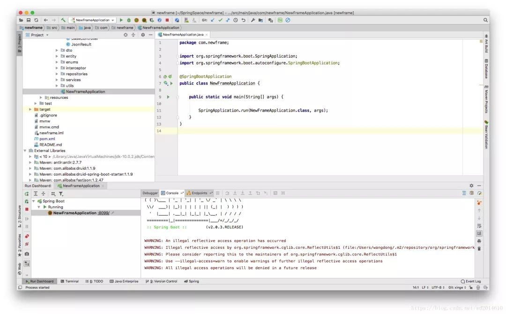
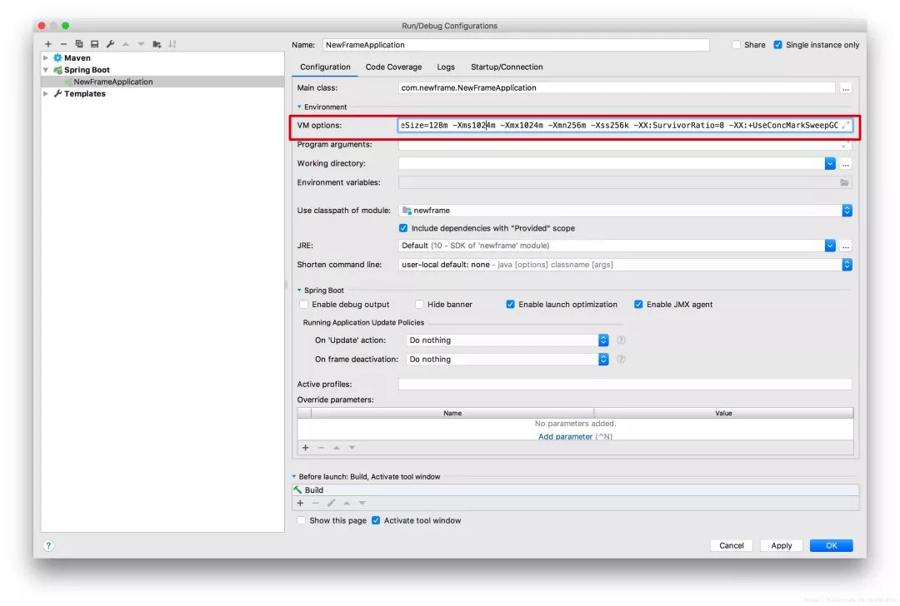
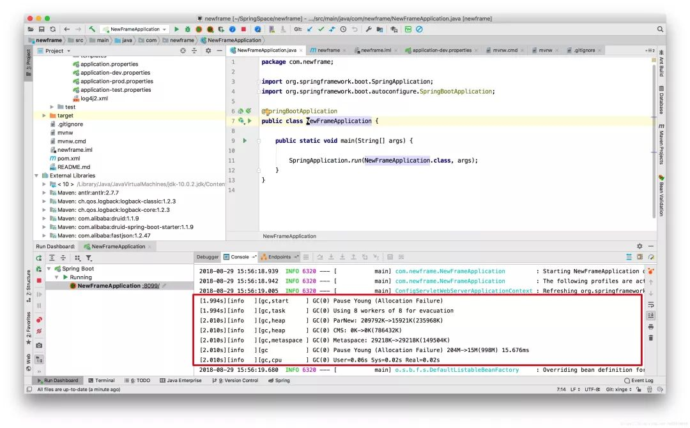
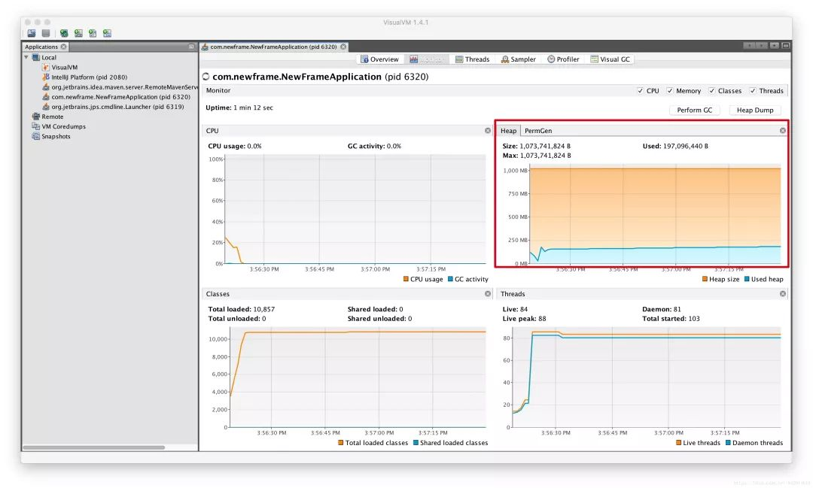
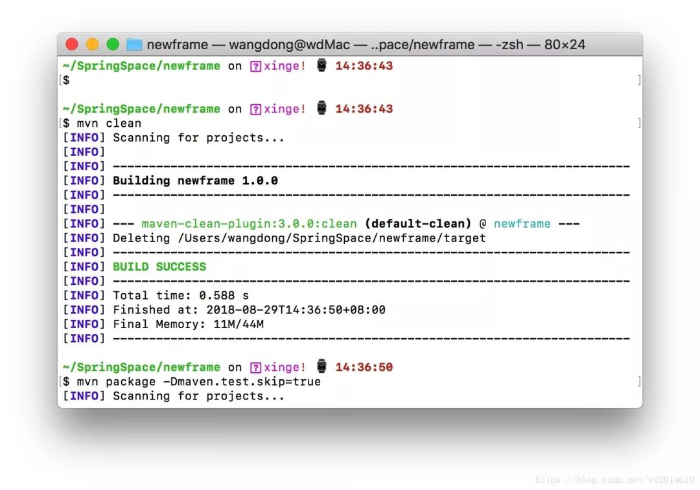
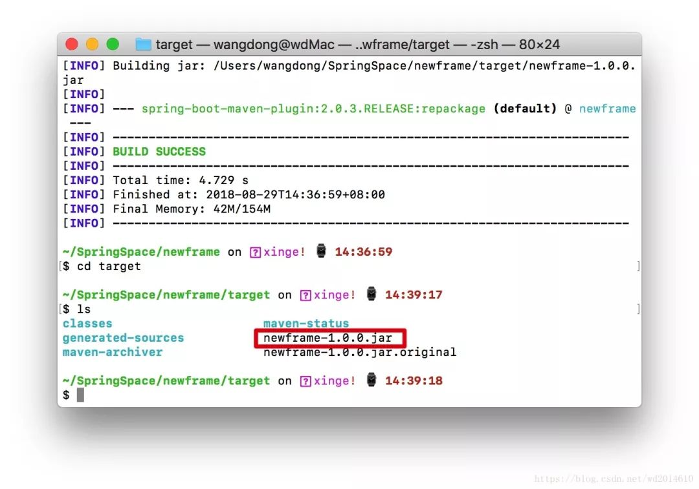
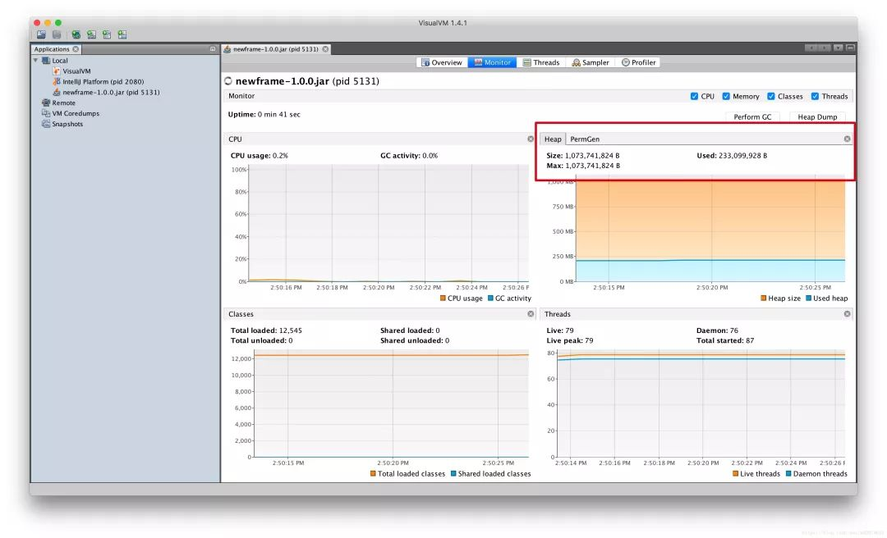

项目调优
----

作为一名工程师，项目调优这事，是必须得熟练掌握的事情。

在SpringBoot项目中，调优主要通过配置文件和配置JVM的参数的方式进行。

一、修改配置文件
--------

关于修改配置文件application.properties。

SpringBoot项目详细的配置文件修改文档

> https://docs.spring.io/spring-boot/docs/current/reference/html/common-application-properties.html\#common-application-properties

其中比较重要的有：

```
server.tomcat.max-connections=0 # Maximum number of connections that the server accepts and processes at any given time.
server.tomcat.max-http-header-size=0 # Maximum size, in bytes, of the HTTP message header.
server.tomcat.max-http-post-size=0 # Maximum size, in bytes, of the HTTP post content.
server.tomcat.max-threads=0 # Maximum number of worker threads.
server.tomcat.min-spare-threads=0 # Minimum number of worker threads.

```

二、Jvm调优
-------

关于Jvm调优Oracle官网有一份指导说明：

> https://docs.oracle.com/middleware/11119/wls/PERFM/jvm\_tuning.htm\#i1146060

有兴趣大家可以去看看。

三、Jvm调优实战
---------

### 1、未设置JVM参数的情况

我现在有一个项目，默认情况下，没有设置任何Jvm参数。

下面我来启动看一下。



看一下堆栈分配：

很明显默认的最大堆内存分配了8个G。很明显的不合理嘛。


### 2、下面我们来设置下Jvm参数

例如要配置JVM这么一大段参数：

     -XX:MetaspaceSize=128m 
     -XX:MaxMetaspaceSize=128m 
     -Xms1024m -Xmx1024m -Xmn256m 
     -Xss256k -XX:SurvivorRatio=8
     -XX:+UseConcMarkSweepGC

**方式一：**

如果你用的是IDEA等开发工具，来启动运行项目，那么要调试JDK就方便太多了。

只需要将参数值设置到VM options中即可。



设置成功，我的GC日志和堆栈分配都已经OK了。

GC日志：



堆栈分配：



**方式二：**

适用于在项目部署后，在启动的时候，采用脚本或者命令行运行的时候设置。

先在项目路径下，给项目打包：

清理就旧项目

```
mvn clean

```



打包新项目：

```
 mvn package -Dmaven.test.skip=true

```

打包完成后进入可运行Jar包的路径下：



执行启动设置Jvm参数的操作。

    $ java -jar -XX:MetaspaceSize=128m
     -XX:MaxMetaspaceSize=128m
     -Xms1024m -Xmx1024m -Xmn256m -Xss256k
     -XX:SurvivorRatio=8
     -XX:+UseConcMarkSweepGC newframe-1.0.0.jar

这个时候，你再看监控，你就会发现，已经是Ok的了。

堆栈都是按照启动时候，设置的Jvm参数启动的。



关于这些设置的JVM参数是什么意思，请参考第二步中的oracle官方给出的调优文档。

我在这边简单说一下：

> -XX:MetaspaceSize=128m （元空间默认大小）
> -XX:MaxMetaspaceSize=128m （元空间最大大小）
> -Xms1024m （堆默认大小）
> -Xmx1024m （堆最大大小）
> -Xmn256m （新生代大小）
> -Xss256k （棧最大深度大小）
> -XX:SurvivorRatio=8 （新生代分区比例 8:2）
> -XX:+UseConcMarkSweepGC （指定使用的垃圾收集器，这里使用CMS收集器）
> -XX:+PrintGCDetails （打印详细的GC日志）

知识点：

> JDK8之后把-XX:PermSize 和 -XX:MaxPermGen移除了，取而代之的是
> -XX:MetaspaceSize=128m （元空间默认大小）
> -XX:MaxMetaspaceSize=128m （元空间最大大小）
> 
> JDK 8开始把类的元数据放到本地化的堆内存(native heap)中，这一块区域就叫Metaspace，中文名叫元空间。
> 
> 使用本地化的内存有什么好处呢？
> 
> 最直接的表现就是java.lang.OutOfMemoryError: PermGen 空间问题将不复存在，因为默认的类的元数据分配只受本地内存大小的限制，也就是说本地内存剩余多少，理论上Metaspace就可以有多大（貌似容量还与操作系统的虚拟内存有关？这里不太清楚），这解决了空间不足的问题。
> 
> 不过，让Metaspace变得无限大显然是不现实的，因此我们也要限制Metaspace的大小：使用-XX:MaxMetaspaceSize参数来指定Metaspace区域的大小。JVM默认在运行时根据需要动态地设置MaxMetaspaceSize的大小。