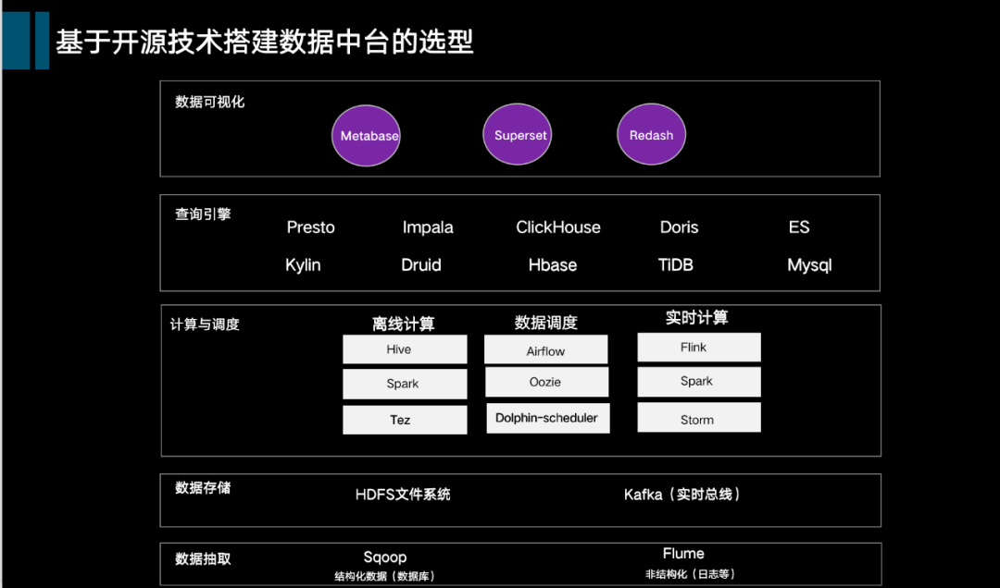
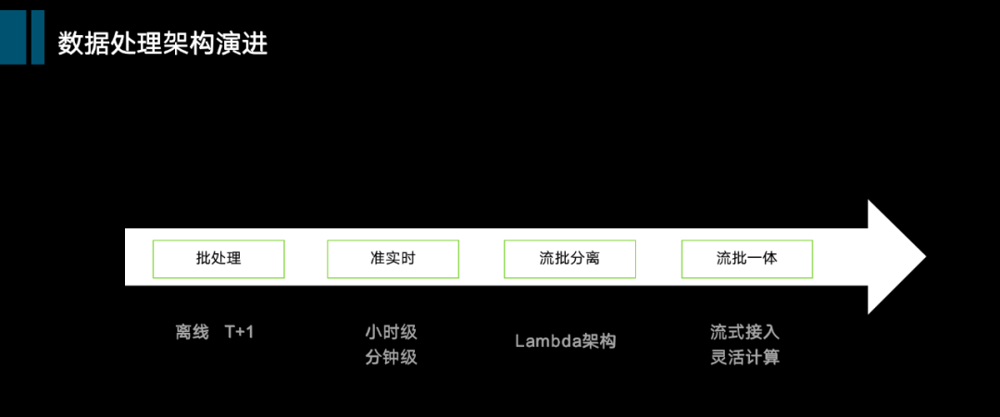
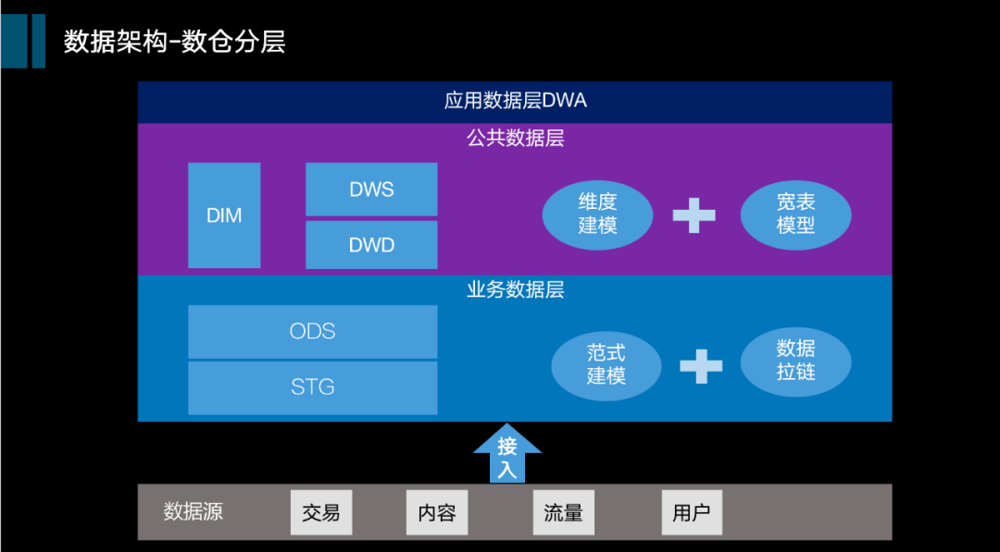
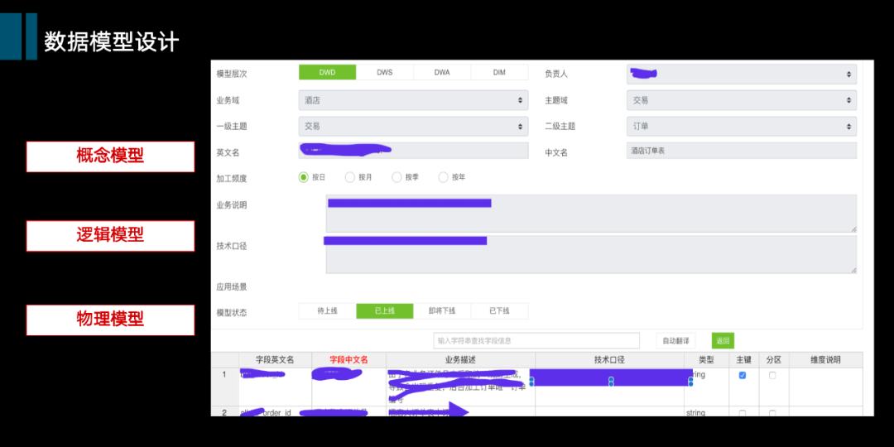
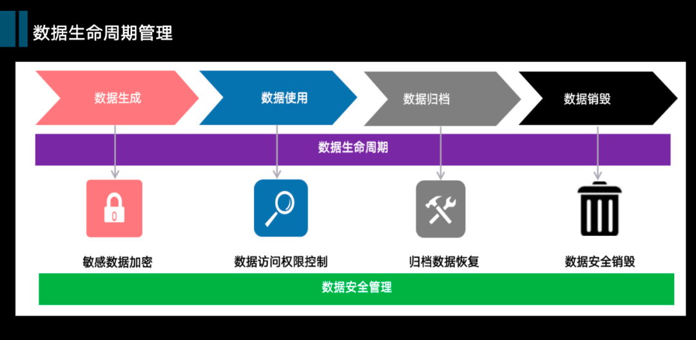

**颜博**

马蜂窝数仓研发总监

* 现任马蜂窝数据仓库团队负责人，曾供职于京东、IBM、亚信等公司。
* 数据行业老兵一名，历经传统数据仓库、大数据平台到数据中台的发展。

大家好，今天分享的议题主要包括几大内容：

* 带大家回顾一下大数据在国内的发展，从传统数仓到当前数据中台的演进过程；
* 我个人认为数据中台的核心组成，以及一些技术选型参考；
* 数据研发是数据中台很重要的一环，会分享一些我们在数据研发方面的实践，主要是数据仓库架构与研发方面。

**一、大数据演进，从数据仓库到数据中台**

第一阶段

21世纪的第一个10年，企业级数据仓库（EDW）从萌芽到蓬勃发展，“IOT”( IBM、Oracle、Teradata)占领了大部分市场，提供数据仓库建设从硬件、软件到实施的整体方案。

这个时代的数据仓库实施不仅需要购买大（中、小）型机，配套商用的关系型数据库（Oracle、DB2、SQL Server）以及一些ETL/OLAP套件，实施成本相对高昂，数据仓库建设主要集中在金融、电信、大型零售与制造等行业。

数据仓库的应用主要通过为企业提供报表、分析等数据，辅助企业的经营决策。像电信行业的经营分析系统、银行的风控管理等，都是这个期间比较典型的应用。

第二阶段

2010-2015年，大数据平台阶段，移动互联网的飞速发展带动Bigdata(大数据)的发展。其中Hadoop生态技术开始逐步在国内大范围使用，企业只要基于Hadoop分布式的计算框架，使用相对廉价的PC服务器就能搭建起大数据集群。

数据湖的概念也是这个阶段诞生（主要是为降低传统数仓较为复杂的中间建模过程，通过接入业务系统的原始数据，包括结构化、非结构数据，借助hadoop生态强大计算引擎，将数据直接服务于应用）。这个阶段不只是金融、电信这些行业，国内主流互联网企业也纷纷搭建起大数据平台。

大数据应用更为丰富，不仅限于决策分析，基于APP/门户站点的搜索推荐、以及通过A/B Test来对产品进行升级迭代等是这个阶段常规的应用点，用户画像在这个阶段也得到重视，主要应用于企业的营销、运营等场景。

第三阶段

就是我们现在所处的阶段，数据中台以及云上大数据阶段，通过前10多年不断的技术积累，大数据在方法和组织的变革上也有了新的沉淀，主要体现在几个方面：

**1）数据统一化**

其核心思想是数据流转的所有环节进行统一化，如从采集到存储到加工等过程，在这些过程中通过建立统一的公共数据模型体系、统一的指标与标签体系，提高数据的标准性、易用性，让数据本身更好地连通，提升使用效率。

**2）工具组件化**

数据在采集、计算、存储、应用过程中涉及多业务线条，多场景，将这些场景与工具（采集工具、管道工具、计算&调度工具、数据服务工具，数据管理工具、可视化工具等）进行沉淀，研发出通用、高效的组件化工具，避免重复开发，降低研发成本。

**3）应用服务化**

之前大数据应用的数据调用比较混杂，有些直接访问数仓数据表，有些调用临时接口等。通过数据中台应用服务化建设，提供标准的应用服务，以数据可视化产品、数据API工具等服务，支撑应用的灵活调用。

**4）组织清晰化**

数据中台团队专注于数据内容&数据平台开发，提供各种基于数据的能力模块，而其他部门人员如业务产品、运营、分析等角色，只需要借助工具/产品有效地使用数据，发挥其价值，无需关注数据加工的过程，做到各尽其职，充分发挥各自专长，同样也能达到降本提效目的。大数据团队内部本身组织和职责也倾于清晰化，比如按照职责分为平台（工具）研发、数据研发、数据产品、数据分析等不同组织。

当前阶段

数据应用到各个角落，除了之前可以支撑的决策分析以外，大数据与线上事务系统（OLTP）的联动场景非常多，比如我们在电商平台查询个人所有历史订单，再比如一些刷单、反作弊的实时拦截，以及一些实时推荐等，这些都是通过将数据的运算交给数据中台部门处理，前台部门直接通过API进行结果调用。数据中台的集中化建设也更好地支撑起创新业务，比如通过大数据+分析建立起商业化数据变现产品，进行数据售卖，把数据变成新的业务。

大家知道共享复用是中台建设中很关键的一个词，这也是为什么我们很多数据中台下面会包括共享数据组，公共数据组等。实际上共享复用并不是大数据发展的一个新词，在早期数据仓库（建立公共数据模型）、大数据平台（研发一些组件化工具）的建设中，也是满足共享复用的。

如上提到，数据中台本身是组织，方法的升级与变革，更多是利用技术的进步更好地支持这些升级变革，如果你当前的建设还是数据平台+数仓（数据湖等）但是已经具备这些方法和特性，我个人认为也是合理的。

数据中台的建设也需要相应的成本与门槛，例如集群搭建、工具建设等。云计算的发展可以快速提供数据中台建设的能力，例如企业无需自己搭建机房，使用云计算的弹性计算存储能力以及丰富的工具，可以支撑数据中台的快速搭建。

关于数据中台的合理性也一直颇有争议，大型（集团型）公司有相互独立的子公司，数据之间不需要太多连接与共享，分别构建自己子数据中台也是合理的架构，集团层面可以利用数据子中台进行数据上报解决集团层面数据大盘、统计、分析、财务等诉求。再比如一些小型公司是否需要在一开始就按照数据中台的架构进行建设，也是存有一些争议。

数据中台是2015年阿里提出来的双中台的概念其中的一个重要组成，阿里作为先驱者，提供了数据中台架构、以及非常多的建设思路供大家参考。从目前的建设效果来看，很多公司在数据中台建设中有不错的成效（尤其是大中型公司），数据中台整体思路得到了验证。但是数据中台本身还算一个新鲜事务，这个新鲜事务目前还没有标准答案，只有参考答案。

**二、数据中台架构与技术选型**

1、数据中台架构核心组成

我认为的数据中台核心架构包括四大组成部分，具体是：

* **底座是数据基础平台**，包括数据采集平台&计算平台&存储平台，这些可以自建也可以使用云计算服务；
* **中间部分两大块是中台的公共数据区**，公共数据区包括数据仓库(数据湖) ，主要负责公共数据模型研发，还包括统一指标（标签）平台，负责把模型组织成可以对外服务的数据，例如数据指标、数据标签；
* **上层是数据应用服务层**，主要将公共数据区的数据对外包装并提供服务，包括数据接口平台、多维查询平台，数据可视化平台、数据分析平台等。

另外，数据研发平台和数据管理平台贯穿始终，其中：

**1）数据开发****平台**包括数据开发的各类工具组合，例如：数据管道工具（比如数据接入、数据导出）、模型设计工具、脚本开发工具、数据调度工具等。

**2）数据管理平台**包括统一元数据管理、数据质量管理、数据生命周期管理。针对数据全链路的数据管理，保证数据中台可以监控数据链路中的数据流向、数据使用效果、数据生命周期，以衡量数据的价值与成本。

以上是数据中台的核心部分，数据中台的组成也可以更加丰富，比如包括：数据资产平台、算法平台等等。

在数据中台的建设中一定不要忽视的是与业务的衔接，因为数据来源于业务并最终应用于业务，在数据中台的建设中需要有一系列的流程制度明确与业务的充分衔接，以保障数据源&数据产出的质量。

2、数据中台技术选型参考

在搭建数据中台方面，基于开源技术的选型，尤其是Hadoop生态圈有非常多的选择，从数据整体流向来看各大层级的选型。

* **数据抽取层：**sqoop和flume是两大主流工具，其中sqoop作为结构化数据（关系型数据库）离线抽取，flume作为非结构化日志接入；
* **数据存储层：**Hadoop文件系统Hdfs大家都比较了解，而kafka作为流式数据总线应用也非常广泛；
* **计算与调度层**，包括：

* 离线计算：离线计算主要是hive，spark，也有部分选用tez
* 实时计算：前些年storm，spark比较流行，最近几年大家纷纷往Flink转型
* 数据调度：除了像Airflow Azkaban Oozie等，易观开源的Dolphin-scheduler也非常活跃

* **数据引擎层：**也就是我们常说的OLAP层，我们看到这一层里的选择非常多，就不一一列举了，（业务需求带动技术进步的典型，选择丰富主要是可以适配不同的数据应用场景）。从概念上讲分为ROLAP、MOLAP以及两者混搭。MOLAP提前做一些预计算，以生成Cube的方式，达到空间换取查询效率；而ROLAP是即查即用，效率完全取决于查询引擎的性能，我个人认为从将来看，ROLAP的趋势会更加明显，因为没有中间的数据链路。但目前看来，没有一个统一的引擎足以支撑各类数据场景（这或许是将来的机会~）；
* **数据可视化层：**比较主流的有Metabase、Superset、Redash，也可以选择阿里、百度的一些开源控件。

在开源技术的选择里，我们看到各层里都有越来越多国内开源的工具（也充分体现了我们在大数据技术领域的进步）。除了以上列举的这些，整个Hadoop生态圈的技术选择非常多，可以结合自己的实际场景选择自己的架构，在选型层面可以参照的一些原则，比如：

* 是否有鲜活的成功案例，优先找自己类似业务场景；
* 接口的开放性，与其他组件的兼容性；
* 社区活跃性度&发展趋势。

当然，数据中台的选型不只是开源技术，开源本身也不是完美的，例如维护开发成本较高，升级迭代不好把控，通过开源技术去建立数据中台还是有一定研发门槛。

所以也有很多商业化的套件、以及基于云的数据组件可以选择，包括数据采集、处理、分析、数据可视化全过程，国内外有很多厂商都提供了丰富的选择。尤其在大数据可视化这块，国内有许多非常专业的商业套件。

**三、数据研发实践**

1、数据处理架构

下面是一个简单的数据处理架构演进过程：

最早数据仓库的计算只支持批处理，通常是按天定时处理数据，在后期逐步进化到准实时，本质上还是批处理，只是处理频度上得有提升，到小时级，或者15分钟这种。

随着技术不断进步，后期演化出一条新的流处理链路，这个链路和之前的批处理分别处理，然后在服务层面利用大数据的计算能力进行合并，向外提供离线+实时数据服务，这也是著名的lambda架构。

最近几年随着Flink等技术的发展，有一个趋势是流批一体化，在接入层统一采用流式接入，计算层采用统一套框架支持实时计算+离线计算，批处理仅仅作为流处理的一个特殊场景进行支持。整体上可以做到流处理、批处理的自由切换。

流计算和批处理在需求场景上有一些本质区别，前者主要用于支持线上业务场景（比如互联网的推荐、搜索、风控等），而批处理更多是支持离线统计分析。

日出而作，日落而息，大家针对大数据的统计分析习惯不会发生根本性变化，最简单的T+1批处理方式也还是数据应用必不可少的环节。在使用同一套架构上，由于数据源变化&维度变化的多样性，批处理往往面临一些复杂场景，这是采用同一套框架上的一些难点，充分支持好批处理也是将来流批一体框架的发展方向。

2、数仓分层与主题分类

**1）数仓分层**

与传统ETL不同的，我们采用的是ELT的数据架构，较为适合在互联网，总体分为业务数据层、公共数据层、应用数据层三大层次。

**① 业务数据层（ODS层）**

原始数据经过缓冲层（STG）的加载，会进入数仓的业务数据层，这一层采用范式建模，基本保持与数据源完全一致的结构，对于变化的数据，使用数据拉链加工与存储。

这一层选用范式建模，是指保持源系统（例如关系数据库）的范式结构，好处主要是：

* 一次性接入数据源结构，针对需求的变动不用频繁去与数据源对接；
* 便于业务研发更好地理解数据，同时是也是公司的原始数据资产。

针对变化数据采用数据拉链的好处：

* 保留历史数据的同时，尽可能少占用存储空间，长期来看，拉链存储比起每天全量保留历史节约大概90%空间；
* 快速、高效地获取历史任意一天业务系统的快照数据。

**② 公共数据层（包括公共明细层DWD，公共汇总层DWS）**

公共数据层是数据仓库的核心层，是整个数仓中使用率最高的，这一层主要采用的维度建模思路进行设计，类型包括事务事实、周期快照、累积快照。同时为了方便下游对数据的使用，我们会设计一系列的宽表模型，将不同业务过程中的事实进行统一整合，包括纵向整合&横向整合；对于商品、用户主数据类可能分散在不同的源系统中采用纵向整合；横向整合主要包括交易、内容等行为数据不同业务过程的整合，比如：用户（用户信息、注册信息）购买（下单、支付、结算、覆约、完成）商品（商品信息，商家信息，等），我们会把订单流转业务过程整合放到一张明细表里，同时会研发一些基于用户、或者商品视角的轻度汇总宽表。

宽表非常便于理解和易用，下游应用调用也方便。我们之前也做过一些统计，在调用分布来看，宽表的使用占到70%以上。

虽然宽表的使用在数仓建模中非常普遍，但是也有一些缺陷：

* 数据冗余较多，在存储、计算、调用较为占资源，建议尽量还是按场景去使用；
* 宽表整合的信息较多，数据权限不好控制。建议可以根据需求，在有限范围内开放整体宽表权限，或者通过视图或者子表的方式建立不同权限的数据范围，适应不同组织的需求；
* 宽表通常依赖比较多，会影响数据的产出的时效。

**③ 应用数据层（DWA层）**

顾名思义，就是偏向应用的数据加工，也可以叫集市层，这一层的设计可以相对灵活，贴近应用即可，总体设计思想仍然可以按维度建模思想为主。

**2）主题分类**

数仓架构的数据分类两个视角，包括主题视角与业务视角。

**① 数据主题视角**

最重要的一个视角，也就是咱们经常提到的数仓主题，主题是将企业的业务进行宏观数据抽象，是数据仓库里数据的主要组织形式，划分方法如下：

* 参照波特价值链，分析企业本身经营的业务（基本活动、支持型活动），分别对应哪些数据；
* 参照业界通用模型，例如像IBM、TD等针对大型行业（如电信、金融、零售）有一些数据主题的通用划分方法；
* 对企业的内部数据（线上数据模块、数据字典）进行摸底，确认对应到哪些主题。

划分结果会按照三个层级：主题域--》主题--》子主题。

* 第一级是主题域，针对相对稳定的主题进行合并，归拢到主题域，利于数据的理解与建立全局的数据资产目录；
* 第二级是主题；
* 第三级是子主题，主要针对有些主题下分类较多，比如供应链主题下会包含采购、仓储、配送等子主题。

数据主题划分建议完全互斥，不建议重复。

**② 数据业务视角**

数据业务域是根据企业经营的具体业务，结合企业的组织架构进行划分，层次和分类可以相对灵活，子分类可以允许重复，因为两条不同的业务域可能经营相同的业务，例如电商、内容下都有会员这个业务。

上图是一个比较典型的内容+电商的数据主题与业务分类。

以上一横一纵两个视角，将数据进行更好的归类，在数据模型设计中会打上相应分类标签，从而让数据研发&数据使用人员统一认知。以上两种分类方式主要应用于核心的公共数据层。

业务数据层、应用数据层并不需要遵循以上分类规则，比如业务数据层（ODS层）是按照数据源进行分类，应用数据层（DWA）是根据具体的应用进行分类。

3、数据研发流程

除了合理的架构之外，数据研发的流程也很重要，总体流程如下：

包括需求分析/数据调研、数据模型设计、数据开发&测试、上线发布等流程。

在之前数据中台的核心架构提到不闭门造车，数据研发需要与业务部门充分衔接，比如在数据调研中要与业务研发同学进行线上数据&结构访谈；在数据开发中，与分析&业务同学共同确认标准口径；在数据研发完成后对数据使用方进行数据发布与培训。

以上流程中，除了需求调研，其他部分我们都进行了线上化，包括数据的模型设计，早期我们会手写mapping文档，后期我们逐步把mapping文档进行了线上化，整体的数据模型设计通过模型设计工具完成，包括从概念模型、逻辑模型到物理模型的设计。模型设计完成后，可以一键生成数据知识文档。

4、数据生命周期管理

数据研发完成，还需要关注数据生命周期，一方面数据量的飞速增长不仅仅需要占用大量存储，比如像自建机房，会涉及扩充机柜、机房，往往会面临一些瓶颈；另外一方面，大量的数据会降低数据的计算效率，所以从数据的生成开始，我们就需要考虑生命周期，并且结合数据的使用情况制定数据归档、数据销毁等管理策略。

针对数据已经占用了大量存储资源，可以采取一系列措施进行成本控制，例如：

* **降存量：**通过数据压缩技术、降副本等方式，以及在数据模型更合理的设计，将存量数据存储降低；
* **控增量：**根据数据重要性，可恢复性等考量角度，确认数据的保留周期，并根据周期自动归档或删除；
* **摊成本：**可以通过一些算法，比如数据调用分布、需求来源等，把成本分摊到相应业务部门，让相关业务部门关注到成本。

数据安全也是数据生命周期管理重的一个重要课题，比如针对用户敏感信息，需要在接入时考虑如何加密。一种做法是通过一个独立的物理集群对敏感数据进行隔离与强管控；数据使用中，也需要将数据划分不同的安全或敏感等级（例如有些财务数据的非常敏感，需要谨慎对外开放），根据不同的等级设定不同的访问审批机制。另外，在数据归档、销毁也需要制定好配套的安全管理措施，避免安全风险。

5、数据质量管理

数据质量管理主要包括3个角度：准确性、及时性、一致性。

管理的环节包括：事前、事中、事后、以及事故管理。

针对数据运维的告警发送，传统的方式主要是短信、邮件、电话；随着移动办公工具功能逐步的强大，可以将运维告警以数据接口的方式与这些工具进行对接，将告警发送到企业内部的即时通讯工具。

6、数据应用架构

数据研发最终还是需要赋能到业务&应用，一个合理的数据应用架构是非常关键的，这张图是一个应用架构的简图参考：

从数据的流向上分：

* 数据仓库（或者数据湖）：负责原始数据的计算，主要将数据落地到HDFS；
* 数据引擎层：数据加工完成之后，会将数据推送到不同的引擎中，这一层之前提到选择非常多，可以根据自己的场景选择一个混搭组合，比如我们目前选择的有Presto，Kylin，Druid，Mysql；
* 数据服务层：通过统一化的SQL调用服务，屏蔽底层不同的数据引擎，为上层统一查询提供标准接口；
* 指标平台：指标平台是一个非常关键的产品，定位于衔接数据研发与数据应用，包括指标的标准定义、逻辑、计算方式、分类等各项内容。指标分类上我们分为标准指标(指标口径经过审核过)、以及非标准指标；
* 多维查询：这是我们的一个即席查询工具，查询的数据主要来源指标平台，可以选定不同的指标维度组合进行结果呈现，用户可以一次性查询得到结果，也可以将查询结果配置成可视化的报表进行固化。

中间是统一元数据管理：对整个架构中可以对外提供服务的元数据进行统一管理（包括数仓的元数据、查询引擎的元数据、指标元数据等），以及监控这些元数据的调用情况。

最右侧是权限管理：权限管理关乎到数据安全，在设计上需要考虑周全，比如针对表级、指标级、维度级别都可以进行控制；同时产品层面也需要灵活配置权限审批级别与人员。

在面向用户使用层面，我们主要开放的是多维查询&可视化，用户通过多维去查询各类指标&维度数据，得到数据结果列表，再选择可视化配置面板，完成各类图表、表格的自主配置，并发布到个人看板或者业务大盘目录里。也可以将配置的数据看板进行灵活组合，定制成一个小型的数据产品。

7、数据ROI评估

在数据研发中，也要考量数据的ROI，下面是一个简单的ROI模型：

根据活跃度（调用次数等）、覆盖度（通过血缘关系找出依赖数量），以及贡献度（依赖数据的重要等级）来确认数据的价值。同时会评估数据的成本指数（例如计算成本、存储成本等）。

通过以上两者相除，综合得到数据的ROI，针对ROI可以将数据分为不同等级，并相应进行数据治理。比如针对价值低，成本高的数据，可以考虑下线等。

**数据研发趋势&关注点**

* **提效：**目前借助工具的研发可以把绝大部分数据研发工作线上化，将来借助AI等能力，实现数据处理中包括开发、运维的自动化，提升处理效率；
* **灵活：**流批一体化，包括流处理与批处理自由切换，之前已经提到过，个人认为也是一个发展的趋势；
* **降本：**数据研发链路的成本控制，在数据建设的早期通常不太引起关注，随着数据量不断的积累，往往存储、计算成本成为瓶颈。针对数据建设成本需提前考虑；
* **算力：**我们看到Google，IBM和阿里都在研究量子计算，将来的数据中间层（比如数仓的公共模型）是否可以考虑虚拟化（比如只保留规则&数据结构），具体数据内容在应用发起时，即调即用，更多时候可以不需要占用存储资源。算力的不断提升，有可能会颠覆一些传统数据建设的思路。

**\> \> \> \>**

**Q&A**

**Q1：请问贵公司如何压缩数据？又如何删除副本呢？**

**A：**我们主要使用parquet +snappy压缩；另外，如果发现压缩率较低，可以通过排序来调整数据分布，降副本可以了解下EC纠删码技术。

**Q2：对于批处理效率低的问题该怎么处理？**

**A：**具体可以看什么原因导致，如果是整体效率低，可以看资源利用是否集中，如果集中，可以考虑任务分等级错峰进行队列隔离等；如果是个别任务问题，那就要考虑逻辑和加工链路是否有问题，比如说可以全量改增量处理，逻辑参数优化；如果倾斜导致可以针对具体倾斜原因采取不同的优化方式。

**Q3：请问基于Hadoop生态组件构建DW存在哪些不足？与MPP比较？**

**A：**如果之前一直是按照传统商业套件进行建设，可能在数据不能直接update这个点上不习惯。另外大部分技术都是经历反复演进才达到稳定的，所以最好能选用成熟组件。与MPP比较，MPP横向扩充到一定规模可能会有瓶颈，而Hadoop集群可以灵活扩充节点来增加算力，比如现在国内单集群几千台、上万台的场景都有。

**Q4：数据中台建设团队的KPI怎么评定？**

**A：**需求响应效率、前台数据调用效率、数据覆盖度、数据准确性、及时性、用户满意度、成本控制效果等。

**Q5：您对HATP在行业应用趋势和方向如何看？**

**A：**HATP我个人没有研究；如果HATP能解跨不同环境之间的数据连通性，应该可以替代一些当前大数据的应用场景。

**Q6: 对于搭建数据中台的生态工具，有什么建议吗？**

**A：**文中有一些常规的选型（主要调研了当前一些主流工具），基本上都是经过了验证过，更多还是找适合自己场景的工具。

**Q7：请问现在对提效方面有什么好的开源的线上工具吗？**

**A：**建模、开发中的一些提效小工具成本不高可以考虑自研，但是复杂一些例如任务调度完全可以找到成熟的开源工具。

**Q8：范式建模层，是否会形成统一数据模型，即one model？**

**A：**不会，范式主要应用在业务数据层，原则上我们不对外提供这一层的服务，主要用于加工DW层。

**Q9：业务数据层，如果设计成拉链表，抽取数据是肯定是做更新插入操作，增量和存量数据做比对，很耗性能，特别是存量数据是海量的情况下，请问下如何处理此类问题？**

**A：**大表拉链效率慢优化可以考虑减少计算数据量，例如把稳态数据进行归档，不参与计算。或者可以尝试通过冷热数据分离，再视图合并。

**Q10：请问mapping是建模管理的？是否用用ERWIN或者PD工具吧？**

**A：**以前我们是通过excel模版建模并生成mapping文档，现在只是把这个模版搬到线上，这个小工具可以连通到建表，并且发布到数据知识系统。我们没有使用ERWIN或者PD，模型之间的关系会辅助用一些思维导图软件。

**Q11：为什么要基于Hive建数仓？它不支持索引、更新、事务。**

**A：**Hive 搭建数仓当前来看处理效率、稳定性都是经过验证过的。更新可以通过高效的insert over write来解决。

**Q12：数据湖是什么技术？跟数仓的关系是啥？**

**A：**跟数仓是两个独立的概念，通过直接接入源系统的原始数据（包括结构化、非结构化），利用大数据强大的计算能力，直接将数据服务于应用。主要为缩短传统数仓的中间建模与处理（ETL）过程，目前有看到一些云+数据湖的方案。

**Q13：业务元数据、技术元数据在中台中如何统一对应管理？**

**A：**通过统一元数据管理工具例如指标元数据管理工具、数据表元数据管理工具，可以将业务元数据对应到技术元数据，建议可以在工具中设置一些强规范，来保证统一对应。

**Q14：使用kylin做olap很不灵活，贵公司是使用kylin吗?您认为kylin主要是用于什么场景？**

**A：**是的，大部分场景使用的是kylin，kylin主要使用用业务形态相对稳定、计算的维度指标矩阵相对固定、原始数据量较大且有去重类指标计算的情况。通过一些模型设计和技术手段可以相对降低kylin灵活性差的问题，比如：模型设计的抽象化、底层使用视图、使用Hybrids进行桥接等。

**Q15：贵司数据治理工具用的哪个？**

**A：**目前没有专门的工具，从一开始保持数据的规范化建设、合理的架构，可以降低治理的工作；如果要治理可以考虑通过全链条元数据管理过程配合数据治理。

**Q16：所讲的体系如何保障数据业务化的、端到端的实时应用？**

**A：**我们目前的场景还不多，可以了解其他互联网场景丰富一些方案。如果是支撑端到端的实时应用，要保证稳定性需要在服务层有多种调用方案，例如针对同一个应用，可以有常规API调用以及降级API。

**Q17：关于指标体库如何设计？以及ad-hoc查询场景的支持。**

**A：**我们预计在5、6月会组织一次《数据模型设计实践》以及《指标体系与ad-doc》的直播分享，会有专门负责这块数据架构的小伙伴来给大家介绍。