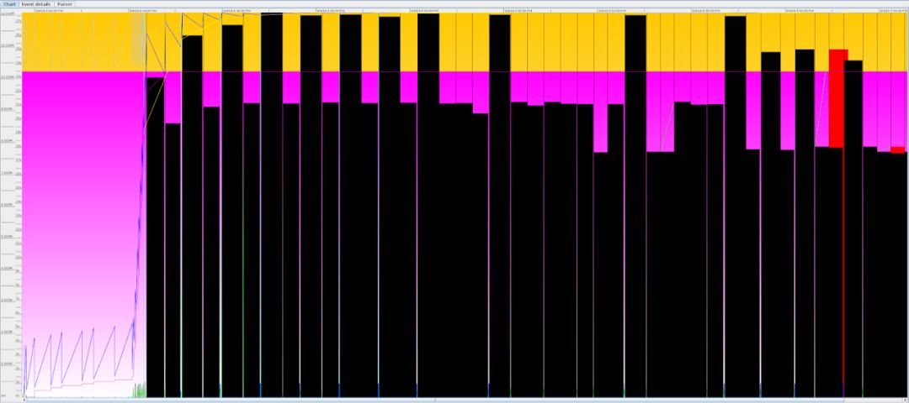
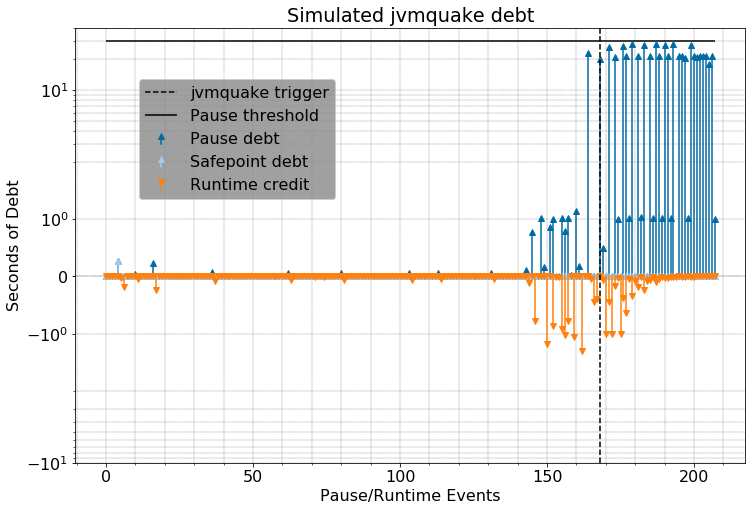

导读：对于基于JVM平台的存储应用来说，比如Cassandra和Elasticsearch等等。很多时候低效查询就会JVM忙于垃圾回收或者JVM内存不足。为了处理这种情况，Netflix推出jvmkill和jvmquake，本文详细论述了该问题和问题的解决方案。

Netflix大量使用各种JVM应用程序，比如Cassandra和Elasticsearch等等。尽管大多数情况下，集群都能稳定运行，但有时低效查询或数据存储区本身的问题会导致内存使用失控，进而导致JVM忙于垃圾回收（GC）甚至JVM内存不足。

于是我们构建了jvmkill，以处理这种情况：jvmkill是使用JVMTI API在JVM进程中运行的代理。当JVM内存不足或无法产生新线程时，jvmkill会介入并杀死整个进程。我们将jvmkill与-XX：HeapDumpOnOutOfMemoryError Hotspot标志结合使用，这样就可以在事后分析堆内存，了解为什么会用光资源。对于应用程序而言，这么处理也是合理的：内存不足的JVM无法继续处理请求，一旦jvmkill介入，systemd将重新启动失败的进程，这样系统重新可用。

然而即使有jvmkill，我们依然会遇到JVM的问题，这些JVM几乎（但不是完全）都是因为内存不足出问题。Java进程一遍又一遍地执行GC，在GC停顿之间几乎没有做任何有用的工作。由于JVM没有100％占用资源，因此jvmkill不会发现问题。然而客户端却发现其数据存储节点的吞吐量下降了四个数量级。

为了说明这种情况，我们可以通过将Cassandra整个数据集加载到内存中来演示：

* 
* 
* 
* 
* 
* 
* 

```
cqlsh\> PAGING OFFDisabled Query paging.cqlsh\> SELECT \* FROM large\_ks.large\_table;OperationTimedOut: errors={}, last\_host=some hostcqlsh\> SELECT \* FROM large\_ks.large\_table;Warning: schema version mismatch detected, which might be caused by DOWN nodes; if this is not the case, check the schema versions of your nodes in system.local and system.peers.Schema metadata was not refreshed. See log for details.
```

然后，我们使用jstat和GC日志发现机器确实处于不停GC中：

* 
* 
* 
* 
* 

```
$ sudo -u cassandra jstat -gcutil $(pgrep -f Cassandra) 100msS0 S1 E O M CCS YGC YGCT FGC FGCT GCT0.00 100.00 100.00 100.00 97.96 95.10 21 8.678 11 140.498 149.1760.00 100.00 100.00 100.00 97.96 95.10 21 8.678 11 140.498 149.1760.00 100.00 100.00 100.00 97.96 95.10 21 8.678 11 140.498 149.176
```

从GC日志中，我们可以清楚地看到GC停顿（每次持续20s以上）在不停重复，我们也可以使用GCViewer以图形方式展示日志中的数据：



在这种情况下，JVM既无法满足我们的性能目标，而且从中恢复的希望也很小。 这种情况一直持续到值班运维工程师杀死受影响的JVM为止。 在碰见太多次这种问题之后，我们决定处理此问题，原因如下：

* 很容易识别
* 解决方案很简单
* 快速干预的收益很大

换句话说，我们需要自动化执行先前手动执行的操作。

**解决方案：****主动识别并杀死不健康的JVM**
---------------------------

**
**

由于希望继续使用jvmkill类似的方式，因此我们研究了扩展jvmkill来添加所需行为的方法。jvmkill挂接ResourceExhausted JVMTI回调，根据相关信息对资源耗尽的评估，向出问题的JVM发送SIGKILL。不幸的是，这个简单的分类器无法很好地应对灰色故障模式，在这种模式下，JVM花费大量时间进行垃圾收集，但它并没有耗尽资源。我们还检查了现有的JVM选项，例如GCHeapFreeLimit，GCTimeLimit，OnOutOfMemoryError，ExitOnOutOfMemoryError和CrashOnOutOfMemoryError。我们发现这些选项可能无法在所有JVM和垃圾收集器上都正常工作。由于现有JVM资源耗尽分类器的性质不一致且难以调整，因此我们决定构建自己的分类器以对其进行补充。

我们的解决方案是--jvmquake，其想法是，对于任何给定的工作负载，JVM应该将其大部分时间用于运行程序代码，而不是进行GC 。如果程序时间所占的比例低于某个水平的时间太长，则JVM显然是不健康的，应该将其杀死。

我们通过将JVM暂停GC的时间建模为“债务”来实现此想法。如果JVM花200毫秒的GC时间，它将增加200毫秒的债务计数器。运行程序代码所花费的时间“偿还”了所有累积的债务，因此，如果同一程序运行≥200ms，其债务计数器将降至零。如果JVM花费的运行时间与GCing的时间比例超过1：1（即吞吐量\> 50％），则其债务将趋于零。另一方面，如果其吞吐量不到50％，其债务将趋于无限。这种“债务计数器”方法类似于用于跟踪程序吞吐量的漏斗算法。在这种情况下，我们以与GC时间成比例的速率添加水，并以与应用程序运行时间成比例地删除水：


随着JVM债务计数器的增加，我们越来越确信它是不健康的，最终我们就会采取某些措施。 例如，真实世界应用的GC循环债务可能看起来像：



如果jvmquake附在此JVM上，它将在虚线处停止。

我们确定了一个可调整的阈值，默认值为30秒，这很宽松：如果JVM在完成GC时其债务计数器超过30秒，jvmquake将终止该进程。我们通过GarbageCollectionStart和GarbageCollectionFinish JVMTI回调来获取这些值。

除了债务阈值外，我们还添加了两个可调参数：

* runtime\_weight：将乘数应用于花费在运行程序代码上的时间，以便我们可以实现1：1（50％吞吐量）以外的吞吐量目标。例如，runtime\_weight为2表示目标是1：2（吞吐量为33％）。更一般而言，x的runtime\_weight表示1：x比率（100％/（x + 1）的吞吐量，实际应该根据吞吐量确定该参数）。服务器JVM通常以超过95％的吞吐量运行，因此，即使最低50％的吞吐量也是相当保守的。
* action：jvmkill只会向该进程发送SIGKILL，但是在jvmquake中，我们添加了在SIGKILL之前发送任意信号的功能。我们将在下一节中说明为什么需要该功能。

应用jvmquake之后，如果我们对Cassandra节点运行相同的查询，现在我们看到：


就像以前一样，JVM开始进入GC循环，但是这次jvmquake注意到JVM累积了30倍的GC债务（以4：1的运行时权重）并停止了JVM。 与其像JVM那样被永久杀死，不如将其永久固定。

### **不要扔掉证据！**

**
**

当我们使用jvmkill或手动终止JVM时，我们总是有机会分别使用-XX：HeapDumpOnOutOfMemoryError或jmap来收集heap dump。heap dump对于确定内存泄漏的根本原因至关重要。不幸的是，当jvmquake将SIGKILL发送到尚未遇到OutOfMemoryError的JVM时，这两种方法均无效。我们的解决方案很简单：jvmquake触发时，它会激活一个线程，该线程故意在堆上分配大型数组造成JVM OOM。这将触发-XX：HeapDumpOnOutOfMemoryError功能，并最终终止该进程。

然而这样做也有一个严重的问题：Java heap dump写入并存储在磁盘上，如果我们反复执行自动终止操作，可能会填满磁盘。因此，我们研究了获取OS本地core dump而不是JVM特定的heap dump的方法。我们意识到，如果可以让一个不健康的JVM发送SIGABRT而不是SIGKILL，则Linux内核将自动为我们创建core dump。相比JVM heap dump，我们更喜欢这种方法，因为它是所有语言运行时（包括尤其是node.js和Python）的标准配置，最重要的是它允许我们收集非常大的core/heap dump并将其写入管道，而无需占用额外的磁盘空间。

当Linux进行core dump时，其默认行为是在崩溃进程的工作目录中写入一个名为“ core”的文件。为了防止写入core文件会导致磁盘空间不足的情况，Linux对写入的core文件的大小做了资源限制（ulimit -c）。默认资源限制为零，因此内核根本不写入任何core文件。然而使用kernel.core\_pattern sysctl，可以指定将core dump通过管道传输到到其他程序。通过这种方式，我们编写了一个脚本来压缩core文件并上传到S3，并将相关崩溃程序的元数据也一起存储在S3中。

上传完成后，systemd将重新启动OOMed JVM。这是一个折衷：我们将core文件同步上传到S3，而不必考虑是否需要在本地存储core文件。实际上，我们能够在不到两分钟的时间内可靠地上传16GB core dump文件。

### **告诉我出了什么问题**

**
**

现在已经捕获了core dump文件，我们可以找出出问题的根源–是错误的查询，或者是硬件问题还是配置问题？ 在大多数情况下，原因可以从使用的类及其占用内存空间大小中确定。

我们的团队已将jvmquake部署到所有的Java数据存储应用中。 到目前为止，它已处理了数十次问题（每次仅几分钟），并提高了生产环境数据库集群的可用性。 此外，core dump和脱机转换工具使我们能够调试和修复Cassandra和Elasticsearch数据存储产品中的复杂错误，以便我们的应用程序获得所需的“始终可用”的数据存储服务。 我们已经将许多补丁回馈给了社区，我们期待可以发现并解决更多的问题。

注：
我们使用Cassandra 2.1.19，具有大约20GiB的数据和12GiB的堆内存。 在本实验中，我们关闭了DynamicEndpointSnitch，以确保查询可以路由到本地副本，并关闭分页以确保该节点将整个数据集保持在内存中。

原文地址：https://medium.com/@NetflixTechBlog/introducing-jvmquake-ec944c60ba70

**参考阅读：**

* [里程碑式 Dubbo 2.7.5 版本发布，性能提升30%，支持 HTTP/2、TLS、Protobuf等特性](http://mp.weixin.qq.com/s?__biz=MzAwMDU1MTE1OQ==&mid=2653551746&idx=1&sn=e3609a67e2c2c023ae344ae7604e36b7&chksm=813a6d1ab64de40c1945e7649f7b4e077c86405f3944a7578c626f8802be542d8389fe704840&scene=21#wechat_redirect)
* [千万级延时任务队列如何实现，看美图开源的-LMSTFY](http://mp.weixin.qq.com/s?__biz=MzAwMDU1MTE1OQ==&mid=2653551690&idx=1&sn=9373fd8f445710464d89e540beaa299a&chksm=813a6dd2b64de4c4c347d4f2476e358f04b64229eefc656c83ad5c6cb039a30d584c4c0b98f4&scene=21#wechat_redirect)
* [掐指算算: 你的CDN多花了几百万?](http://mp.weixin.qq.com/s?__biz=MzAwMDU1MTE1OQ==&mid=2653551673&idx=1&sn=1504f4efd64138273cc3c8d29251d23c&chksm=813a6da1b64de4b712ec5ee35db2a069a7ea745e4351aad3616f46597dbd12673691e38c9e4e&scene=21#wechat_redirect)
* [美图每天亿级消息存储演进——从Redis到Titan，完美解决扩容问题](http://mp.weixin.qq.com/s?__biz=MzAwMDU1MTE1OQ==&mid=2653551716&idx=1&sn=26b62b9003a404c36d4fffbfffa8af24&chksm=813a6dfcb64de4eaf7799ed57470ab6f9c2726e7da6cdab90f439f8ec1f089a61f339ce71a52&scene=21#wechat_redirect)
* [你所不知道的 ChaosBlade 那些事](http://mp.weixin.qq.com/s?__biz=MzAwMDU1MTE1OQ==&mid=2653551763&idx=1&sn=0ec62444f1030db65ab75558267a6a51&chksm=813a6d0bb64de41ddeba7579e6cafa2984e70c09d2ad543e9e0257dfdc2ecb01b9e6fc4ea533&scene=21#wechat_redirect)

本文由方圆翻译，转载请注明出处，技术原创及架构实践文章，欢迎通过公众号菜单「联系我们」进行投稿。