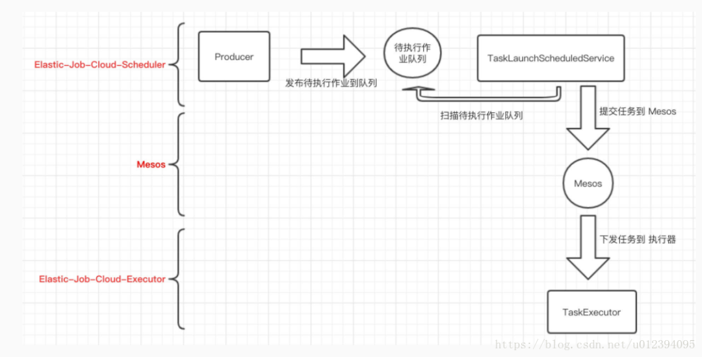
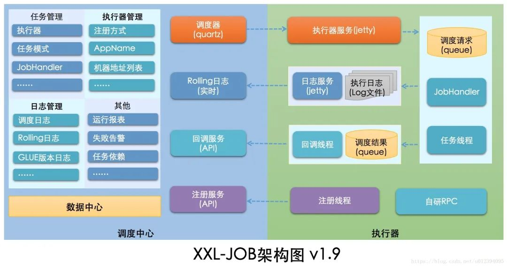

来自：csdn（作者：sharedCode）

原文链接：

https://blog.csdn.net/u012394095/article/details/79470904

* 1\. 什么是分布式定时任务
* 2\. 常见开源方案
  * elastic-job
  * xxl-job
  * quartz
  * Saturn
  * opencron
  * antares
* 3\. 比较

---

1\. 什么是分布式定时任务
==============

把分散的，可靠性差的计划任务纳入统一的平台，并实现集群管理调度和分布式部署的一种定时任务的管理方式。叫做分布式定时任务。

2\. 常见开源方案
==========

* elastic-job
* xxl-job
* quartz
* saturn
* opencron
* antares

elastic-job
-----------

elastic-job 是由当当网基于quartz 二次开发之后的分布式调度解决方案 ， 由两个相对独立的子项目Elastic-Job-Lite和Elastic-Job-Cloud组成 。

Elastic-Job-Lite定位为轻量级无中心化解决方案，使用jar包的形式提供分布式任务的协调服务。

Elastic-Job-Cloud使用Mesos + Docker(TBD)的解决方案，额外提供资源治理、应用分发以及进程隔离等服务

亮点：

1. 基于quartz 定时任务框架为基础的，因此具备quartz的大部分功能
2. 使用zookeeper做协调，调度中心，更加轻量级
3. 支持任务的分片
4. 支持弹性扩容 ， 可以水平扩展 ， 当任务再次运行时，会检查当前的服务器数量，重新分片，分片结束之后才会继续执行任务
5. 失效转移，容错处理，当一台调度服务器宕机或者跟zookeeper断开连接之后，会立即停止作业，然后再去寻找其他空闲的调度服务器，来运行剩余的任务
6. 提供运维界面，可以管理作业和注册中心。

elastic-job结合了quartz非常优秀的时间调度功能，并且利用ZooKeeper实现了灵活的分片策略。除此之外，还加入了大量实用的监控和管理功能，

以及其开源社区活跃、文档齐全、代码优雅等优点，是分布式任务调度框架的推荐选择。

由于elastic-job-lite 不支持动态添加作业，此处仅贴上elastic-job-Cloud架构图

xxl-job
-------

由个人开源的一个轻量级分布式任务调度框架 ，主要分为 调度中心和执行器两部分 ， 调度中心在启动初始化的时候，会默认生成执行器的RPC代理

对象（http协议调用）， 执行器项目启动之后， 调度中心在触发定时器之后通过jobHandle 来调用执行器项目里面的代码，核心功能和elastic-job差不多

，同时技术文档比较完善

系统架构图：

quartz
------

quartz 的常见集群方案如下，通过在数据库中配置定时器信息， 以数据库悲观锁的方式达到同一个任务始终只有一个节点在运行，

优点：

1. 保证节点高可用 （HA）， 如果某一个几点挂了， 其他节点可以顶上

缺点：

1. 同一个任务只能有一个节点运行，其他节点将不执行任务，性能低，资源浪费
2. 当碰到大量短任务时，各个节点频繁的竞争数据库锁，节点越多这种情况越严重。性能会很低下
3. quartz 的分布式仅解决了集群高可用的问题，并没有解决任务分片的问题，不能实现水平扩展

****

Saturn
------

Saturn是唯品会在github开源的一款分布式任务调度产品。它是基于当当elastic-job 1.0版本来开发的，其上完善了一些功能和添加了一些新的feature。

亮点：

1. 支持多语言开发 python、Go、Shell、Java、Php。
2. 管理控制台和数据统计分析更加完善

缺点：

1. 技术文档较少 ， 该框架是2016年由唯品会的研发团队基于elastic-job开发而来的

opencron
--------

一个功能完善真正通用的linux定时任务调度定系统,满足多种场景下各种复杂的定时任务调度,同时集成了linux实时监控,webssh,提供一个方便管理定时任务的平台

缺点：仅支持 kill任务， 现场执行，查询任务运行状态 等， 主要功能是着重于任务的修改和查询上。不能动态的添加任务以及任务分片。

antares
-------

优点：

1. 一个任务仅会被服务器集群中的某个节点调度，调度机制基于成熟的 quartz
2. 并行执行 ， 用户可通过对任务预分片，有效提升任务执行效率
3. 失效转移
4. 弹性扩容，在任务运行时，可以动态的加机器
5. 友好的管理控制台

缺点：

1. 不能动态的添加任务，仅能在控制台对任务进行触发，暂停，删除等操作
2. 文档不多，开源社区不够活跃

系统架构图如下：

3\. 比较
======

此处列出了几个代表性的开源产品

featurequartzelastic-job-cloudxxl-jobantaresopencron依赖mysqljdk1.7+, zookeeper 3.4.6+ ,maven3.0.4+ ,mesosmysql ,jdk1.7+ , maven3.0+jdk 1.7+ , redis , zookeeperjdk1.7+ , Tomcat8.0+HA多节点部署，通过竞争数据库锁来保证只有一个节点执行任务通过zookeeper的注册与发现，可以动态的添加服务器。支持水平扩容集群部署集群部署—任务分片—支持支持支持—文档完善完善完善完善文档略少文档略少管理界面无支持支持支持支持难易程度简单较复杂简单一般一般公司OpenSymphony当当网个人个人个人高级功能—弹性扩容，多种作业模式，失效转移，运行状态收集，多线程处理数据，幂等性，容错处理，spring命名空间支持弹性扩容，分片广播，故障转移，Rolling实时日志，GLUE（支持在线编辑代码，免发布）,任务进度监控，任务依赖，数据加密，邮件报警，运行报表，国际化任务分片， 失效转移，弹性扩容 ，时间规则支持quartz和crontab ，kill任务， 现场执行，查询任务运行状态缺点没有管理界面，以及不支持任务分片等。不适用于分布式场景需要引入zookeeper , mesos, 增加系统复杂度, 学习成本较高调度中心通过获取 DB锁来保证集群中执行任务的唯一性， 如果短任务很多，随着调度中心集群数量增加，那么数据库的锁竞争会比较厉害，性能不好。不支持动态添加任务不适用于分布式场景使用企业大众化产品，对分布式调度要求不高的公司大面积使用36氪，当当网，国美，金柚网，联想，唯品会，亚信，平安，猪八戒大众点评，运满满，优信二手车，拍拍贷——