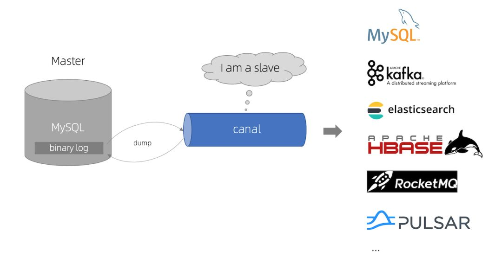
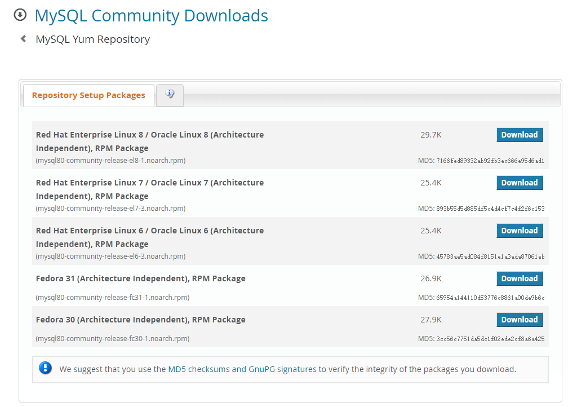
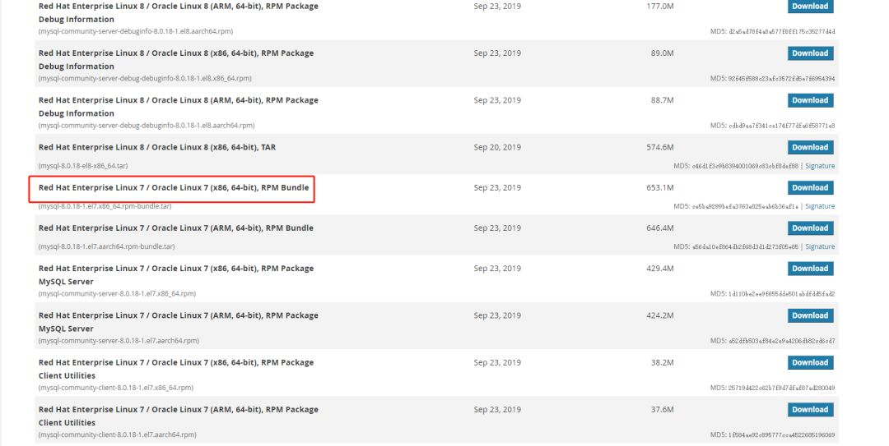
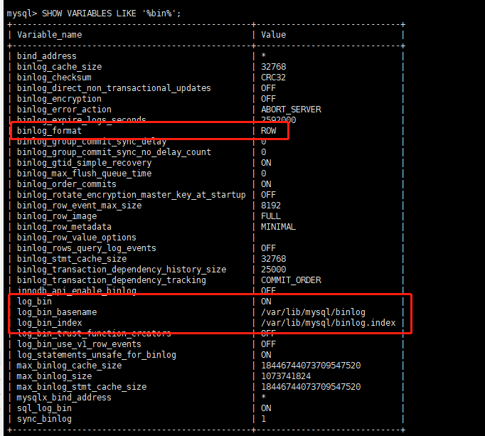
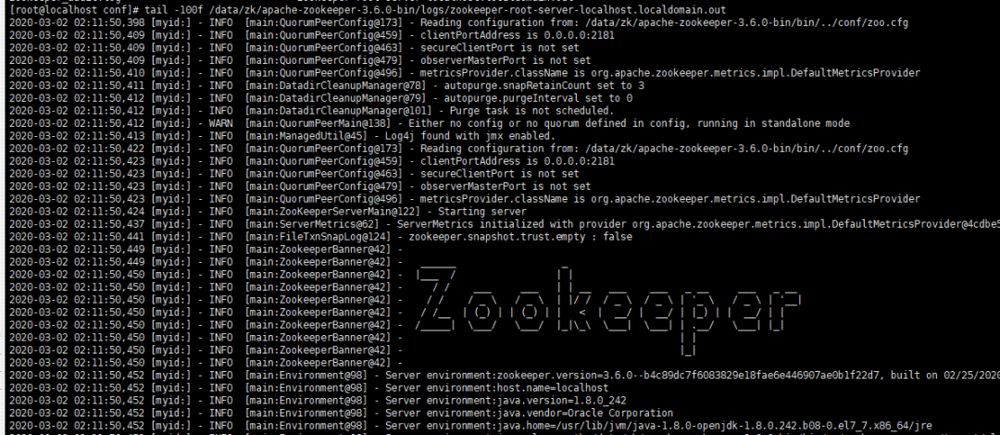
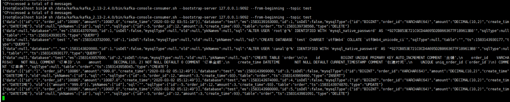

近段时间，业务系统架构基本完备，数据层面的建设比较薄弱，因为笔者目前工作重心在于搭建一个小型的数据平台。优先级比较高的一个任务就是需要近实时同步业务系统的数据（包括保存、更新或者软删除）到一个另一个数据源，持久化之前需要清洗数据并且构建一个相对合理的便于后续业务数据统计、标签系统构建等扩展功能的数据模型。基于当前团队的资源和能力，优先调研了Alibaba开源中间件Canal的使用。


这篇文章简单介绍一下如何快速地搭建一套`Canal`相关的组件。

### 关于Canal

下面的简介和下一节的原理均来自于Canal项目的README：



`Canal[kə'næl]`，译意为水道/管道/沟渠，主要用途是基于MySQL数据库增量日志解析，提供增量数据订阅和消费。

早期阿里巴巴因为杭州和美国双机房部署，存在跨机房同步的业务需求，实现方式主要是基于`业务trigger`获取增量变更。从 2010 年开始，业务逐步尝试数据库日志解析获取增量变更进行同步，由此衍生出了大量的数据库增量订阅和消费业务。

基于日志增量订阅和消费的业务包括：

* 数据库镜像
* 数据库实时备份
* 索引构建和实时维护（拆分异构索引、倒排索引等）
* 业务Cache刷新
* 带业务逻辑的增量数据处理

#### Canal 的工作原理

MySQL主备复制原理：


* MySQL的Master实例将数据变更写入二进制日志（binary log，其中记录叫做二进制日志事件binary log events，可以通过show binlog events进行查看）
* MySQL的Slave实例将master的binary log events拷贝到它的中继日志（relay log）
* MySQL的Slave实例重放relay log中的事件，将数据变更反映它到自身的数据

Canal的工作原理如下：

* Canal模拟MySQL Slave的交互协议，伪装自己为MySQL Slave，向MySQL Master发送dump协议
* MySQL Master收到dump请求，开始推送binary log给Slave（即Canal）
* Canal解析binary log对象（原始为byte流），并且可以通过连接器发送到对应的消息队列等中间件中

#### 关于Canal的版本和部件

截止笔者开始编写本文的时候（2020-03-05），Canal的最新发布版本是v1.1.5-alpha-1（2019-10-09发布的），最新的正式版是v1.1.4（2019-09-02发布的）。

其中，v1.1.4主要添加了鉴权、监控的功能，并且做了一些列的性能优化，此版本集成的连接器是Tcp、Kafka和RockerMQ。而v1.1.5-alpha-1版本已经新增了RabbitMQ连接器，但是此版本的RabbitMQ连接器暂时不能定义连接RabbitMQ的端口号，不过此问题已经在master分支中修复（具体可以参看源码中的CanalRabbitMQProducer类的提交记录）。

换言之，v1.1.4版本中目前能使用的内置连接器只有Tcp、Kafka和RockerMQ三种，如果想尝鲜使用RabbitMQ连接器，可以选用下面的两种方式之一：

* 选用v1.1.5-alpha-1版本，但是无法修改RabbitMQ的port属性，默认为5672。
* 基于master分支自行构建Canal。

目前，Canal项目的活跃度比较高，但是考虑到功能的稳定性问题，笔者建议选用稳定版本在生产环境中实施，当前可以选用v1.1.4版本，本文的例子用选用的就是v1.1.4版本，配合Kafka连接器使用。Canal主要包括三个核心部件：

* canal-admin：后台管理模块，提供面向WebUI的Canal管理能力。
* canal-adapter：适配器，增加客户端数据落地的适配及启动功能，包括REST、日志适配器、关系型数据库的数据同步（表对表同步）、HBase数据同步、ES数据同步等等。
* canal-deployer：发布器，核心功能所在，包括binlog解析、转换和发送报文到连接器中等等功能都由此模块提供。

一般情况下，canal-deployer部件是必须的，其他两个部件按需选用即可。

### 部署所需的中间件

搭建一套可以用的组件需要部署MySQL、Zookeeper、Kafka和Canal四个中间件的实例，下面简单分析一下部署过程。选用的虚拟机系统是CentOS7。

#### 安装MySQL

为了简单起见，选用yum源安装（官方链接是https://dev.mysql.com/downloads/repo/yum）：



> mysql80-community-release-el7-3虽然包名带了mysql80关键字，其实已经集成了MySQL主流版本5.6、5.7和8.x等等的最新安装包仓库

选用的是最新版的MySQL8.x社区版，下载CentOS7适用的rpm包：

```
cd /data/mysql
wget https://dev.mysql.com/get/mysql80-community-release-el7-3.noarch.rpm
// 下载完毕之后
sudo rpm -Uvh mysql80-community-release-el7-3.noarch.rpm

```

此时列举一下yum仓库里面的MySQL相关的包：

```
[root@localhost mysql]\# yum repolist all | grep mysql
mysql-cluster-7.5-community/x86_64 MySQL Cluster 7.5 Community   disabled
mysql-cluster-7.5-community-source MySQL Cluster 7.5 Community - disabled
mysql-cluster-7.6-community/x86_64 MySQL Cluster 7.6 Community   disabled
mysql-cluster-7.6-community-source MySQL Cluster 7.6 Community - disabled
mysql-cluster-8.0-community/x86_64 MySQL Cluster 8.0 Community   disabled
mysql-cluster-8.0-community-source MySQL Cluster 8.0 Community - disabled
mysql-connectors-community/x86_64  MySQL Connectors Community    enabled:    141
mysql-connectors-community-source  MySQL Connectors Community -  disabled
mysql-tools-community/x86_64       MySQL Tools Community         enabled:    105
mysql-tools-community-source       MySQL Tools Community - Sourc disabled
mysql-tools-preview/x86_64         MySQL Tools Preview           disabled
mysql-tools-preview-source         MySQL Tools Preview - Source  disabled
mysql55-community/x86_64           MySQL 5.5 Community Server    disabled
mysql55-community-source           MySQL 5.5 Community Server -  disabled
mysql56-community/x86_64           MySQL 5.6 Community Server    disabled
mysql56-community-source           MySQL 5.6 Community Server -  disabled
mysql57-community/x86_64           MySQL 5.7 Community Server    disabled
mysql57-community-source           MySQL 5.7 Community Server -  disabled
mysql80-community/x86_64           MySQL 8.0 Community Server    enabled:    161
mysql80-community-source           MySQL 8.0 Community Server -  disabled

```

编辑/etc/yum.repos.d/mysql-community.repo文件（[mysql80-community]块中enabled设置为1，其实默认就是这样子，不用改，如果要选用5.x版本则需要修改对应的块）：

```
[mysql80-community]
name=MySQL 8.0 Community Server
baseurl=http://repo.mysql.com/yum/mysql-8.0-community/el/7/$basearch/
enabled=1
gpgcheck=1
gpgkey=file:///etc/pki/rpm-gpg/RPM-GPG-KEY-mysql

```

然后安装MySQL服务：

```
sudo yum install mysql-community-server

```

这个过程比较漫长，因为需要下载和安装5个rpm安装包（或者是所有安装包组合的压缩包mysql-8.0.18-1.el7.x86\_64.rpm-bundle.tar）。如果网络比较差，也可以直接从官网手动下载后安装：



```
// 下载下面5个rpm包 common --\> libs --\> libs-compat --\> client --\> server
mysql-community-common
mysql-community-libs
mysql-community-libs-compat
mysql-community-client
mysql-community-server

// 强制安装
rpm -ivh mysql-community-common-8.0.18-1.el7.x86_64.rpm --force --nodeps
rpm -ivh mysql-community-libs-8.0.18-1.el7.x86_64.rpm --force --nodeps
rpm -ivh mysql-community-libs-compat-8.0.18-1.el7.x86_64.rpm --force --nodeps
rpm -ivh mysql-community-client-8.0.18-1.el7.x86_64.rpm --force --nodeps
rpm -ivh mysql-community-server-8.0.18-1.el7.x86_64.rpm --force --nodeps

```

安装完毕之后，启动MySQL服务，然后搜索MySQL服务的root账号的临时密码用于首次登陆（mysql -u root -p）：

```
// 启动服务，关闭服务就是service mysqld stop
service mysqld start
// 查看临时密码 cat /var/log/mysqld.log
[root@localhost log]\# cat /var/log/mysqld.log 
2020-03-02T06:03:53.996423Z 0 [System] [MY-013169] [Server] /usr/sbin/mysqld (mysqld 8.0.18) initializing of server in progress as process 22780
2020-03-02T06:03:57.321447Z 5 [Note] [MY-010454] [Server] A temporary password is generated for root@localhost: >kjYaXENK6li
2020-03-02T06:04:00.123845Z 0 [System] [MY-010116] [Server] /usr/sbin/mysqld (mysqld 8.0.18) starting as process 22834
// 登录临时root用户，使用临时密码
[root@localhost log]\# mysql -u root -p

```

接下来做下面的操作：

* 修改root用户的密码：`ALTER USER 'root'@'localhost' IDENTIFIED BY 'QWqw12!@';`（注意密码规则必须包含大小写字母、数字和特殊字符）
* 更新root的host，切换数据库use mysql;，指定host为%以便可以让其他服务器远程访问`UPDATE USER SET HOST = '%' WHERE USER = 'root';`
* 赋予'root'@'%'用户，所有权限，执行GRANT ALL PRIVILEGES ON . TO 'root'@'%';
* 改变root'@'%用户的密码校验规则以便可以使用Navicat等工具访问：ALTER USER 'root'@'%' IDENTIFIED WITH mysql\_native\_password BY 'QWqw12!@';


操作完成之后，就可以使用root用户远程访问此虚拟机上的MySQL服务。最后确认是否开启了binlog（注意一点是MySQL8.x默认开启binlog）SHOW VARIABLES LIKE '%bin%';：



最后在MySQL的Shell执行下面的命令，新建一个用户名canal密码为QWqw12!@的新用户，赋予REPLICATION SLAVE和 REPLICATION CLIENT权限：

    CREATE USER canal IDENTIFIED BY 'QWqw12!@';
    GRANT SELECT, REPLICATION SLAVE, REPLICATION CLIENT ON \*.\* TO 'canal'@'%';
    FLUSH PRIVILEGES;
    ALTER USER 'canal'@'%' IDENTIFIED WITH mysql\_native\_password BY 'QWqw12!@';

切换回去root用户，创建一个数据库test：

    CREATE DATABASE `test` CHARSET `utf8mb4` COLLATE `utf8mb4\_unicode\_ci`;

#### 安装Zookeeper

Canal和Kafka集群都依赖于Zookeeper做服务协调，为了方便管理，一般会独立部署Zookeeper服务或者Zookeeper集群。笔者这里选用2020-03-04发布的3.6.0版本：

    midkr /data/zk
    \# 创建数据目录
    midkr /data/zk/data
    cd /data/zk
    wget http://mirror.bit.edu.cn/apache/zookeeper/zookeeper-3.6.0/apache-zookeeper-3.6.0-bin.tar.gz
    tar -zxvf apache-zookeeper-3.6.0-bin.tar.gz
    cd apache-zookeeper-3.6.0-bin/conf
    cp zoo\_sample.cfg zoo.cfg && vim zoo.cfg

把zoo.cfg文件中的dataDir设置为/data/zk/data，然后启动Zookeeper：

    [root@localhost conf]\# sh /data/zk/apache-zookeeper-3.6.0-bin/bin/zkServer.sh start
    /usr/bin/java
    ZooKeeper JMX enabled by default
    Using config: /data/zk/apache-zookeeper-3.6.0-bin/bin/../conf/zoo.cfg
    Starting zookeeper ... STARTED

这里注意一点，要启动此版本的Zookeeper服务必须本地安装好JDK8+，这一点需要自行处理。启动的默认端口是2181，启动成功后的日志如下：



#### 安装Kafka

Kafka是一个高性能分布式消息队列中间件，它的部署依赖于Zookeeper。笔者在此选用2.4.0并且Scala版本为2.13的安装包：

    mkdir /data/kafka
    mkdir /data/kafka/data
    wget http://mirrors.tuna.tsinghua.edu.cn/apache/kafka/2.4.0/kafka\_2.13-2.4.0.tgz
    tar -zxvf kafka\_2.13-2.4.0.tgz

由于解压后/data/kafka/kafka\_2.13-2.4.0/config/server.properties配置中对应的zookeeper.connect=localhost:2181已经符合需要，不必修改，需要修改日志文件的目录log.dirs为/data/kafka/data。然后启动Kafka服务：

    sh /data/kafka/kafka\_2.13-2.4.0/bin/kafka-server-start.sh /data/kafka/kafka\_2.13-2.4.0/config/server.properties


这样启动一旦退出控制台就会结束Kafka进程，可以添加-daemon参数用于控制Kafka进程后台不挂断运行。

    sh /data/kafka/kafka\_2.13-2.4.0/bin/kafka-server-start.sh -daemon /data/kafka/kafka\_2.13-2.4.0/config/server.properties

#### 安装和使用Canal

终于到了主角登场，这里选用Canal的v1.1.4稳定发布版，只需要下载deployer模块：

    mkdir /data/canal
    cd /data/canal
    \# 这里注意一点，Github在国内被墙，下载速度极慢，可以先用其他下载工具下载完再上传到服务器中
    wget https://github.com/alibaba/canal/releases/download/canal-1.1.4/canal.deployer-1.1.4.tar.gz
    tar -zxvf canal.deployer-1.1.4.tar.gz

解压后的目录如下：

    - bin \# 运维脚本
    - conf \# 配置文件
     canal\_local.properties \# canal本地配置，一般不需要动
     canal.properties \# canal服务配置
     logback.xml \# logback日志配置
     metrics \# 度量统计配置
     spring \# spring-实例配置，主要和binlog位置计算、一些策略配置相关，可以在canal.properties选用其中的任意一个配置文件
     example \# 实例配置文件夹，一般认为单个数据库对应一个独立的实例配置文件夹
     instance.properties \# 实例配置，一般指单个数据库的配置
    - lib \# 服务依赖包
    - logs \# 日志文件输出目录

在开发和测试环境建议把logback.xml的日志级别修改为DEBUG方便定位问题。这里需要关注canal.properties和instance.properties两个配置文件。canal.properties文件中，需要修改：

* 去掉canal.instance.parser.parallelThreadSize = 16这个配置项的注释，也就是启用此配置项，和实例解析器的线程数相关，不配置会表现为阻塞或者不进行解析。
* canal.serverMode配置项指定为kafka，可选值有tcp、kafka和rocketmq（master分支或者最新的的v1.1.5-alpha-1版本，可以选用rabbitmq），默认是kafka。
* canal.mq.servers配置需要指定为Kafka服务或者集群Broker的地址，这里配置为127.0.0.1:9092。

> canal.mq.servers在不同的canal.serverMode有不同的意义。
> kafka模式下，指Kafka服务或者集群Broker的地址，也就是bootstrap.servers
> rocketmq模式下，指NameServer列表
> rabbitmq模式下，指RabbitMQ服务的Host和Port

其他配置项可以参考下面两个官方Wiki的链接：

* Canal-Kafka-RocketMQ-QuickStart
* AdminGuide

instance.properties一般指一个数据库实例的配置，Canal架构支持一个Canal服务实例，处理多个数据库实例的binlog异步解析。instance.properties需要修改的配置项主要包括：

* canal.instance.mysql.slaveId需要配置一个和Master节点的服务ID完全不同的值，这里笔者配置为654321。
* 配置数据源实例，包括地址、用户、密码和目标数据库：
  * canal.instance.master.address，这里指定为127.0.0.1:3306。
  * canal.instance.dbUsername，这里指定为canal。
  * canal.instance.dbPassword，这里指定为QWqw12!@。
  * 新增canal.instance.defaultDatabaseName，这里指定为test（需要在MySQL中建立一个test数据库，见前面的流程）。
* Kafka相关配置，这里暂时使用静态topic和单个partition：
  * canal.mq.topic，这里指定为test，也就是解析完的binlog结构化数据会发送到Kafka的命名为test的topic中。
  * canal.mq.partition，这里指定为0。

配置工作做好之后，可以启动Canal服务：

    sh /data/canal/bin/startup.sh 
    \# 查看服务日志
    tail -100f /data/canal/logs/canal/canal
    \# 查看实例日志 -- 一般情况下，关注实例日志即可
    tail -100f /data/canal/logs/example/example.log

启动正常后，见实例日志如下：


在test数据库创建一个订单表，并且执行几个简单的DML：

    use `test`;

    CREATE TABLE `order`
    (
     id BIGINT UNIQUE PRIMARY KEY AUTO\_INCREMENT COMMENT '主键',
     order\_id VARCHAR(64) NOT NULL COMMENT '订单ID',
     amount DECIMAL(10, 2) NOT NULL DEFAULT 0 COMMENT '订单金额',
     create\_time DATETIME NOT NULL DEFAULT CURRENT\_TIMESTAMP COMMENT '创建时间',
     UNIQUE uniq\_order\_id (`order\_id`)
    ) COMMENT '订单表';

    INSERT INTO `order`(order\_id, amount) VALUES ('10086', 999);
    UPDATE `order` SET amount = 10087 WHERE order\_id = '10086';
    DELETE FROM `order` WHERE order\_id = '10086';

这个时候，可以利用Kafka的kafka-console-consumer或者Kafka Tools查看test这个topic的数据：

    sh /data/kafka/kafka\_2.13-2.4.0/bin/kafka-console-consumer.sh --bootstrap-server 127.0.0.1:9092 --from-beginning --topic test



具体的数据如下：

    // test数据库建库脚本
    {"data":null,"database":"`test`","es":1583143732000,"id":1,"isDdl":false,"mysqlType":null,"old":null,"pkNames":null,"sql":"CREATE DATABASE `test` CHARSET `utf8mb4` COLLATE `utf8mb4\_unicode\_ci`","sqlType":null,"table":"","ts":1583143930177,"type":"QUERY"}

    // order表建表DDL
    {"data":null,"database":"test","es":1583143957000,"id":2,"isDdl":true,"mysqlType":null,"old":null,"pkNames":null,"sql":"CREATE TABLE `order`\\n(\\n id BIGINT UNIQUE PRIMARY KEY AUTO\_INCREMENT COMMENT '主键',\\n order\_id VARCHAR(64) NOT NULL COMMENT '订单ID',\\n amount DECIMAL(10, 2) NOT NULL DEFAULT 0 COMMENT '订单金额',\\n create\_time DATETIME NOT NULL DEFAULT CURRENT\_TIMESTAMP COMMENT '创建时间',\\n UNIQUE uniq\_order\_id (`order\_id`)\\n) COMMENT '订单表'","sqlType":null,"table":"order","ts":1583143958045,"type":"CREATE"}

    // INSERT
    {"data":[{"id":"1","order\_id":"10086","amount":"999.0","create\_time":"2020-03-02 05:12:49"}],"database":"test","es":1583143969000,"id":3,"isDdl":false,"mysqlType":{"id":"BIGINT","order\_id":"VARCHAR(64)","amount":"DECIMAL(10,2)","create\_time":"DATETIME"},"old":null,"pkNames":["id"],"sql":"","sqlType":{"id":-5,"order\_id":12,"amount":3,"create\_time":93},"table":"order","ts":1583143969460,"type":"INSERT"}

    // UPDATE
    {"data":[{"id":"1","order\_id":"10086","amount":"10087.0","create\_time":"2020-03-02 05:12:49"}],"database":"test","es":1583143974000,"id":4,"isDdl":false,"mysqlType":{"id":"BIGINT","order\_id":"VARCHAR(64)","amount":"DECIMAL(10,2)","create\_time":"DATETIME"},"old":[{"amount":"999.0"}],"pkNames":["id"],"sql":"","sqlType":{"id":-5,"order\_id":12,"amount":3,"create\_time":93},"table":"order","ts":1583143974870,"type":"UPDATE"}

    // DELETE
    {"data":[{"id":"1","order\_id":"10086","amount":"10087.0","create\_time":"2020-03-02 05:12:49"}],"database":"test","es":1583143980000,"id":5,"isDdl":false,"mysqlType":{"id":"BIGINT","order\_id":"VARCHAR(64)","amount":"DECIMAL(10,2)","create\_time":"DATETIME"},"old":null,"pkNames":["id"],"sql":"","sqlType":{"id":-5,"order\_id":12,"amount":3,"create\_time":93},"table":"order","ts":1583143981091,"type":"DELETE"}

可见Kafka的名为test的topic已经写入了对应的结构化binlog事件数据，可以编写消费者监听Kafka对应的topic然后对获取到的数据进行后续处理。

### 小结

这篇文章大部分篇幅用于介绍其他中间件是怎么部署的，这个问题侧面说明了Canal本身部署并不复杂，它的配置文件属性项比较多，但是实际上需要自定义和改动的配置项是比较少的，也就是说明了它的运维成本和学习成本并不高。后面会分析基于结构化binlog事件做ELT和持久化相关工作以及Canal的生产环境可用级别HA集群的搭建。