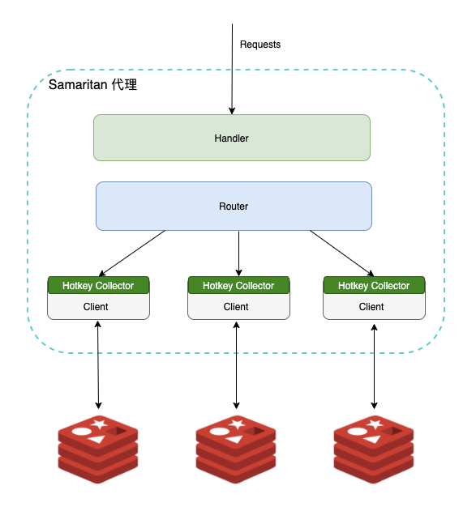
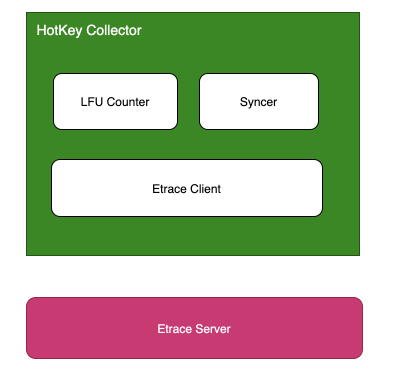
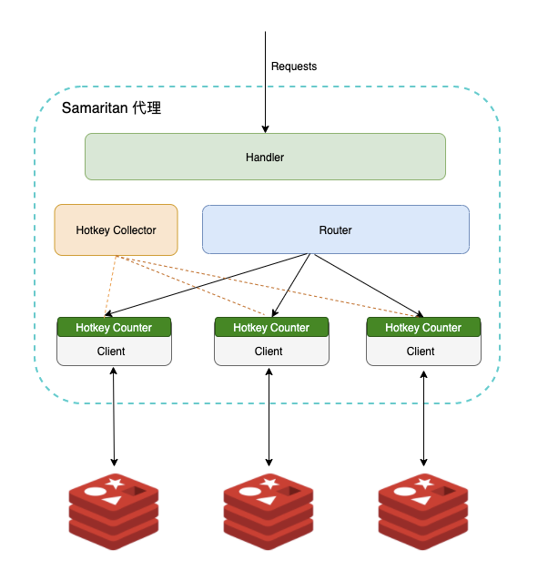

导读：在 Redis 中，热key指的是那些在一段时间内访问频次比较高的键值，具体到业务上，商品的限时抢购、瞬时的新闻热点或某个全局性的资源，都极有可能产生热点key。如何应对热点Key也是解决高并发的必备技能，本文作者条分缕析为你解答这个问题。
---------------------------------------------------------------------------------------------------------------------------

作者简介：饿了么 CI框架工具部缓存组 韩亮

-----------------------

**背景**
------

**
**

在 Redis 中，热 key 指的是那些在一段时间内访问频次比较高的键值，具体到业务上，商品的限时抢购、瞬时的新闻热点或某个全局性的资源，都极有可能产生热点 key。

热点 key 的出现可能会对系统的稳定性和可用性造成影响，比如对应节点的网卡带宽被打满，出现丢包重传，请求波动耗时大幅上升，甚至影响到业务的正常使用，引发用户的不满。因此，在日常的工作中，我们需要着重避免这种情况的出现，比如在设计和编码阶段避免引入全局性热 key，或者在设计时考虑热 key 出现时的应对方案。

**可能的方案**
---------

热点 key 即使我们在设计和开发时已经极力避免，然而在真实的生产环境中还是可能依旧存在的，导致其继续出现的原因有以下几种:

* 有一些边界 case 没有考虑到
* 异常或非预期的流量

既然不可能完全避免，我们就需要有一种方法能够在出问题的时候快速定位有没有热 key 以及热 key 具体是啥，来帮助业务快速排障，定位问题的根源。如果要设计定位方案的话，我们可以从 Redis 请求路径上的节点来着手，比如在客户端、中间层和服务端，具体来说如下:

1. 客户端收集上报

  改动 Redis SDK，记录每个请求，定时把收集到的数据上报，然后由一个统一的服务进行聚合计算。方案直观简单，但没法适应多语言架构，一方面多语言 SDK 对齐是个问题，另外一方面后期 SDK 的维护升级会面临比较大的困难，成本很高。
2. 代理层收集上报

  如果所有的 Redis 请求都经过代理的话，可以考虑改动 Proxy 代码进行收集，思路与客户端基本类似。该方案对使用方完全透明，能够解决客户端 SDK 的语言异构和版本升级问题，不过开发成本会比客户端高些。
3. Redis 数据定时扫描

  Redis 在 4.0 版本之后添加了 hotkeys 查找特性[1]，可以直接利用 redis-cli --hotkeys 获取当前 keyspace 的热点 key，实现上是通过 scan + object freq 完成的。该方案无需二次开发，能够直接利用现成的工具，但由于需要扫描整个 keyspace，实时性上比较差，另外扫描耗时与 key 的数量正相关，如果 key 的数量比较多，耗时可能会非常长。
4. Redis 节点抓包解析

  在可能存在热 key 的节点上(流量倾斜判断)，通过 tcpdump 抓取一段时间内的流量并上报，然后由一个外部的程序进行解析、聚合和计算。该方案无需侵入现有的 SDK 或者 Proxy 中间件，开发维护成本可控，但也存在缺点的，具体是热 key 节点的网络流量和系统负载已经比较高了，抓包可能会情况进一步恶化。

> Redis 的 Monitor 命令不在考虑之列，原因是开销比较大，单个 monitor 的 client 会降低 50% 的系统吞吐，更多详情见: https://redis.io/commands/monitor

-

**我们的选择**
---------

**
**

由于在饿了么内部，所有的 Redis 请求都是经过透明代理 Samaritan[2] 的，并且该代理是由我们自己开发维护的，在代理层改造的成本完全受控，因此我们选择了方案二，即在代理层进行收集上报。

大的方向确定之后，需要考虑具体的细节，比如:

1. 记录所有请求如何能够保证不占用过多的内存甚至 OOM ?
2. 记录所有请求如何能够保证代理的性能, 请求耗时不会有明显的上升?

针对第 1 点，既然我们只关心热 key 而不是要统计所有 key 的 counter，那么就可以用 LFU 只保留访问频次最高的，第 2 点则需要结合代理具体的实现去考虑。

下图是代理内部的实现方案, 略去了一些无关的细节:

注:

* 每个 redis node 会创建一个与之对应的唯一的 client，其上的所有请求都采用 pipeline 执行
* 每个 client 内部都有自己的 Hotkey Collector，不同 Collector 间相互独立

Hotkey Collector 内部结构如下所示，包含 LFU Counter、Syncer 和 Etrace Client 三部分:

> Etrace 是一个内部的应用监控平台，类似的开源产品是 CAT [3]

基本的工作流程是，LFU Counter 负责记录 key 的访问频次，Syncer 会定期将统计数据通过 Etrace Client 发送给远端的服务器。另外，为了避免向服务端发送过多无效的数据，内部会预先设置一个阈值，超过阈值的才发送到服务端。

按照预先的设计，我们将会有一个实时计算的服务去拉取 Etrace 上的数据，进行聚合计算得到当前的热点 key。但不幸地是代理中间件改造上线后的很长一段时间内，这个实时计算服务的开发都未被提上日程，分析下来主要是 ROI 低和维护成本高，因此在业务上如果要查热 key 就只能在 Etrace 上手动戳 event 碰运气比如：

由于使用起来很麻烦，用户在第一次体验之后基本就放弃了，不会再用第二次，甚至连我们自己都不愿意使用… 在当时我们急需要找到一种更好的方案去解决用户体验和系统复杂度的问题，让该特性能真正地赋能于业务。

**最终的方案**
---------

**
**

对前面方案进行优化的话，可以从以下两个方面入手:

1. 如何在不增加实时计算组件提升成本的前提下高效地聚合数据?
2. 如何提升用户体验，让用户方便地使用?

针对第一点，当时第一个想法是能不能把聚合逻辑放在代理进程内，这样的话就不用再依赖任何外部组件，可以降低整个系统的复杂度和维护成本。但这里会有个问题，之前设计外部聚合组件的初衷是为了聚合不同机器的数据，现在采用单机数据会不会有问题，逻辑是不是站得住脚？

仔细思考下来，逻辑上是成立的，因为到达业务的流量是负载均衡过的，不同实例上的流量是比较均匀的，差不太多的，基于这个局部可以代表整体的原则，那么单实例上的热 key 就可以代表全局的一个情况。

另外，就易用性和使用体验上来说，如果聚合的数据在进程内，我们可以提供 HOTKEY 类似的自定义命令，让用户通过 redis-cli 直接获取。

最终的方案如下，已略去无关细节:

实现上来说，每个集群会有一个全局的 Hotkey Collector，每个 client 上有自己独立的 Counter，Counter 依旧采用前面提到的 LFU[4] 算法，Collector 会定时地去收集每个 Counter 的数据并进行聚合，聚合的时候不会使用真实的计数，而是使用概率计数[5]，并且为了适应访问模式的变化 counter 的值会随着时间衰减，整体上与 redis lfu[6]非常类似。

下面是一个生产环境的真实例子，展示了近一段时间内比较热的 key:

注:

1. 默认使用的 log factor 因子是 10，counter 值每分钟衰减一半
2. Collector 默认的容量是 32，只记录请求频次最高的 32 个 key
3. 输出的结果与 redis-cli --hotkeys 非常类似，counter 具体含义可以参考 Using Redis as an LRU cache[7] 一文末尾表格

-

**后续的规划**
---------

**
**

当前的方案虽然能够快速定位系统中的热 key，但并没有真正解决热 key 本身带来的问题，仍旧需要业务方自行改造或者将那些热点 key 调度到单独的节点上，成本是比较高的，甚至有的业务还会自己做 local cache。

本着更好地服务于客户的原则，我们后面将会考虑在代理内实现热点 key 的缓存，不过在代理内实现缓存的话需要先解决内存占用、数据一致性和性能的问题，这块暂时还没有非常好的方案，仍旧在调研之中，好的消息是 Redis 6 计划实现 server-assisted client side caching[8]，如果有可能的话我们会第一时间考虑对接。

最后，热 key 实时收集的功能已经上线，并且也进行了开源，相关源代码可以在 Samaritan 中找到，有兴趣的朋友可以进行尝试，有问题和想法也欢迎提 issue 或者直接与我交流。

文中链接：

[1] https://github.com/antirez/redis/pull/4392

[2] https://github.com/samaritan-proxy/samaritan

[3] https://github.com/dianping/cat

[4] https://en.wikipedia.org/wiki/Least\_frequently\_used

[5] https://en.wikipedia.org/wiki/Approximate\_counting\_algorithm

[6] http://antirez.com/news/109

[7] https://redis.io/topics/lru-cache

[8] https://redis.io/topics/client-side-caching

**参考阅读：**

* [dubbo-go 1.4.0 版本发布，支持 K8s 注册中心、rest 协议](http://mp.weixin.qq.com/s?__biz=MzAwMDU1MTE1OQ==&mid=2653552014&idx=1&sn=737a7e38bf4c9172af78359f50799848&chksm=813a6c16b64de50036518db67095f35d7d4423d50d8e00f1358a7b0a752437bb89793edd4116&scene=21#wechat_redirect)**
**
* [从lstio的角度谈微服务的一些误区](http://mp.weixin.qq.com/s?__biz=MzAwMDU1MTE1OQ==&mid=2653552004&idx=1&sn=b77559dbf98c1c3a17e729ca41cbbc2b&chksm=813a6c1cb64de50a3f64b5068c7afc436c0d3e5d8b5b291a72ddd8ce2838d65eb306a08c5d13&scene=21#wechat_redirect)
* [Go语言如何实现stop the world？](http://mp.weixin.qq.com/s?__biz=MzAwMDU1MTE1OQ==&mid=2653551973&idx=1&sn=63e7dc5c6ba48c34218d06280d647050&chksm=813a6cfdb64de5eb85af961f436fe92bf7c1f8f07048607a00a440fce932272dd8e7d836a406&scene=21#wechat_redirect)
* [Swift程序员对Rust印象：内存管理](http://mp.weixin.qq.com/s?__biz=MzAwMDU1MTE1OQ==&mid=2653551961&idx=1&sn=c61d991dd4ecf29537aa11e3a89d5cda&chksm=813a6cc1b64de5d7d82f5028755d34b1949916fbd6b13a125fd641f85c9aa9008ec9bab41907&scene=21#wechat_redirect)
* [JDK 14发布，空指针错误改进正式落地](http://mp.weixin.qq.com/s?__biz=MzAwMDU1MTE1OQ==&mid=2653551997&idx=1&sn=2ca0423fd2c1c0973d9c1801b7424226&chksm=813a6ce5b64de5f3e7e801ca3f56cbe60fd0ffc853f4e969568f466516bc04d4cf86368cea8a&scene=21#wechat_redirect)