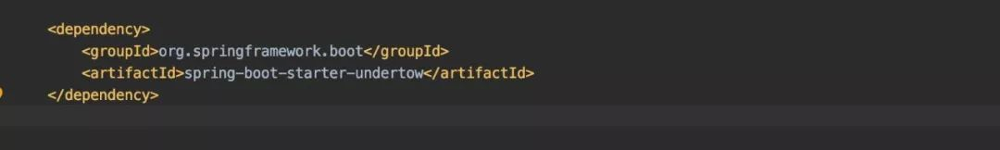
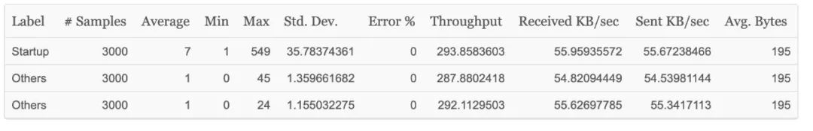
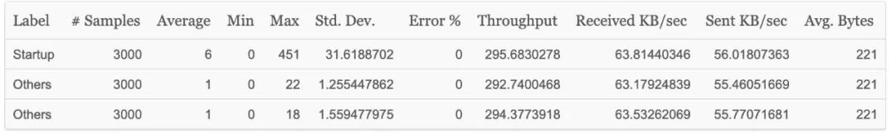
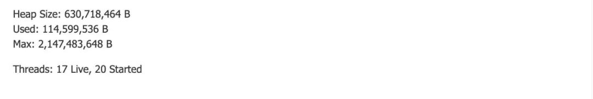

**\# 前言**
=========

在 Spring Boot 框架中，我们使用最多的是 Tomcat，这是 Spring Boot 默认的容器技术，而且是内嵌式的 Tomcat。同时，Spring Boot 也支持 Undertow 容器，我们可以很方便的用 Undertow 替换 Tomcat，而 Undertow 的性能和内存使用方面都优于Tomcat，那我们如何使用 Undertow 技术呢？本文将为大家细细讲解。

=

**\# Spring Boot 中的 Tomcat 容器**
===============================

Spring Boot 可以说是目前最火的 Java Web 框架了。它将开发者从繁重的 XML 解救了出来，让开发者在几分钟内就可以创建一个完整的 Web 服务，极大的提高了开发者的工作效率。Web 容器技术是 Web 项目必不可少的组成部分，因为任 Web 项目都要借助容器技术来运行起来。在 Spring Boot 框架中，我们使用最多的是 Tomcat，这是 Spring Boot 默认的容器技术，而且是内嵌式的 Tomcat。

**\# Spring Boot 设置 Undertow**
==============================

对于 Tomcat 技术，Java 程序员应该都非常熟悉，它是 Web 应用最常用的容器技术。我们最早的开发的项目基本都是部署在 Tomcat 下运行，那除了 Tomcat 容器，Spring Boot 中我们还可以使用什么容器技术呢？没错，就是题目中的 Undertow 容器技术。Srping Boot 已经完全继承了 Undertow 技术，我们只需要引入 Undertow 的依赖即可，如下图所示。

配置好以后，我们启动应用程序，发现容器已经替换为 Undertow。

那么，我们为什么需要替换 Tomcat 为 Undertow 技术呢？

=

**\# Tomcat 与 Undertow 的优劣对比**
==============================

Tomcat 是 Apache 基金下的一个轻量级的 Servlet 容器，支持 Servlet 和 JSP。Tomcat 具有 Web 服务器特有的功能，包括 Tomcat 管理和控制平台、安全局管理和 Tomcat 阀等。Tomcat 本身包含了 HTTP 服务器，因此也可以视作单独的 Web 服务器。但是，Tomcat 和 Apache HTTP 服务器不是一个东西，Apache HTTP 服务器是用 C 语言实现的 HTTP Web 服务器。Tomcat 是完全免费的，深受开发者的喜爱。

Undertow 是 Red Hat 公司的开源产品，它完全采用 Java 语言开发，是一款灵活的高性能 Web 服务器，支持阻塞 IO 和非阻塞 IO。由于 Undertow 采用 Java 语言开发，可以直接嵌入到 Java 项目中使用。同时，Undertow 完全支持 Servlet 和 Web Socket，在高并发情况下表现非常出色。

我们在相同机器配置下压测 Tomcat 和 Undertow，得到的测试结果如下所示：

* QPS测试结果对比：

Tomcat

Undertow

* 内存使用对比：

Tomcat

Undertow

通过测试发现，在高并发系统中 Tomcat 相对来说比较弱。在相同的机器配置下，模拟相等的请求数，Undertow 在性能和内存使用方面都是最优的。并且 Undertow 新版本默认使用持久连接，这将会进一步提高它的并发吞吐能力。所以，如果是高并发的业务系统，Undertow 是最佳选择。

**\# 最后**
=========

Sping Boot 中我们既可以使用 Tomcat 作为 HTTP 服务，也可以用 Undertow 来代替。Undertow 在高并发业务场景中，性能优于 Tomcat。所以，如果我们的系统是高并发请求，不妨使用一下 Undertow，你会发现你的系统性能会得到很大的提升。