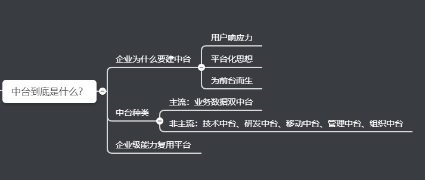
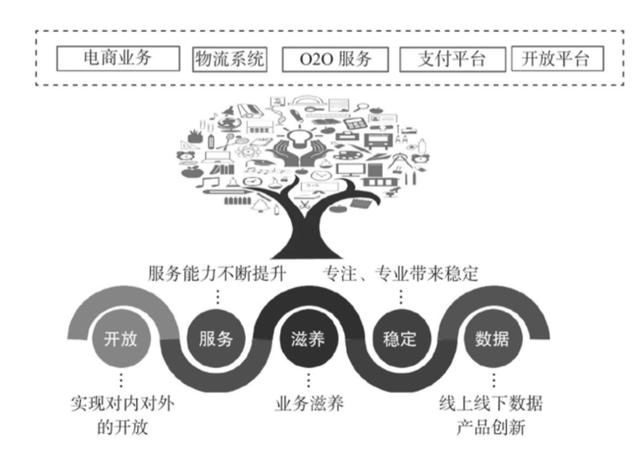
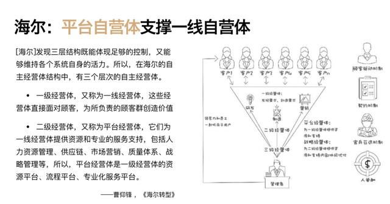
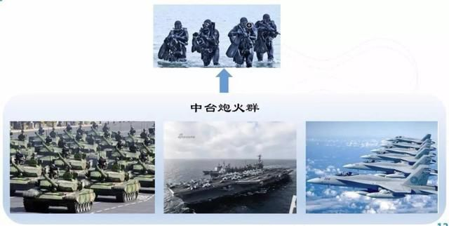
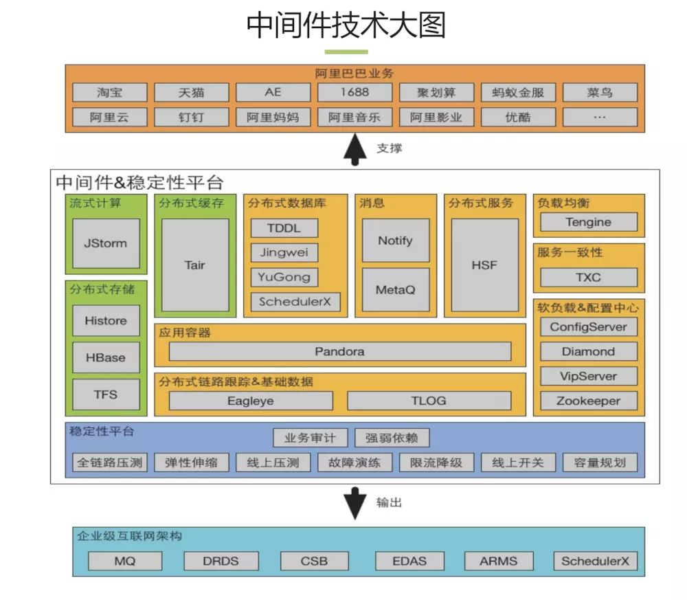
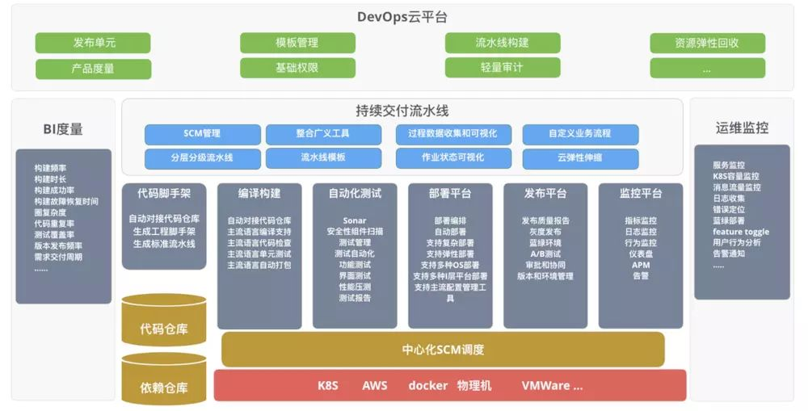
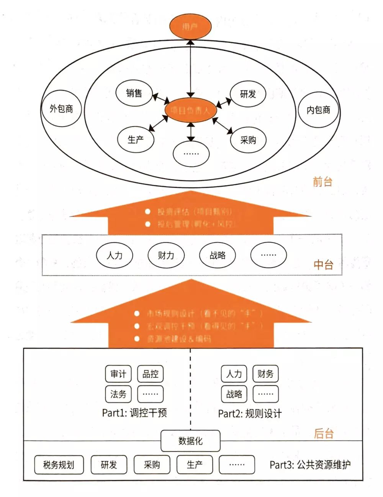

接下来，让我们全面解读中台，包括企业为什么要平台化，目前中台都有哪些形式，实施中台系统的优势、面临的问题以及建议都有哪些？

中台这个概念早期是由美军的作战体系演化而来的，技术上所说的“中台”主要是指学习这种高效、灵活和强大的指挥作战体系。电商经过十几年的发展，组织已经庞大而复杂，业务不断细化拆分，也导致野蛮发展的系统越来越不可维护，开发和改造效率极低，也有很多新业务不得不重复造轮子，所以中台的目标是为了解决效率问题，同时降低创新成本。

 
图来源：说透中台

所谓的业务中台就是：通过制定标准和机制，把不确定的业务规则和流程通过工业化和市场化的手段确定下来，以减少人与人之间的沟通成本，同时还能最大程度地提升协作效率。

**企业为什么要平台化？**

**因为在当今互联网时代，用户才是商业战场的中心，为了快速响应用户的需求，借助平台化的力量可以事半功倍。**不断快速响应、探索、挖掘、引领用户的需求，才是企业得以生存和持续发展的关键因素。

那些真正尊重用户，甚至不惜调整自己颠覆自己来响应用户的企业将在这场以用户为中心的商业战争中得以生存和发展；而反之，那些在过去的成就上故步自封，存在侥幸心理希望用户会像之前一样继续追随自己的企业则会被用户淘汰。这就是这个时代最基本的**企业生存法则。**

数字化企业

平台化之所以重要，就是因为它赋予或加强了企业在以用户为中心的现代商业战争中最最最核心的能力：**用户响应。**这种能力可以帮助企业在商战上先发制人，始终抢得先机。**可以说，在互联网时代，商业的斗争就是对于用户响应力的比拼。**

又有点远大空是不是，我们来看一个经典的子:

1、阿里的“大中台，小前台”战略。阿里人通过多年不懈的努力，在业务的不断催化滋养下，将自己的技术和业务能力沉淀出一套综合能力平台，具备了对于前台业务变化及创新的快速响应能力。

阿里中台

2、海尔推进平台化组织的转型，提出了“平台经营体支撑一线经营体”的战略规划和转型目标。构建了“人单合一”、“用户付薪” 的创客文化，真正将平台化提升到了组织的高度。

海尔组织中台

3、华为提出了“让平台炮火支撑精兵作战”的企业战略，“让听得到炮声的人能呼唤到炮火” 这句话形象的诠释了大平台支撑下小前台的作战策略。这种极度灵活又威力巨大的战法，使之可以迅速响应瞬息万变的战场，一旦锁定目标，通过大平台的炮火群，迅速精准对于战场进强大的火力支援。

大平台炮火支撑精兵作战

**多种多样的中台系统**

**数据业务双中台**

提起中台，绕不开也是最先想到的应该都是阿里巴巴的数据业务双中台。阿里中台主要由业务中台和数字中台并肩构成了双中台，并肩扛起了所有前台业务。

业务中台将后台资源进行抽象包装整合，转化为前台友好的可重用共享的核心能力，实现了后端业务资源到前台易用能力的转化。

数据中台从后台及业务中台将数据流入，完成海量数据的存储、计算、产品化包装过程，构成企业的核心数据能力，为前台基于数据的定制化创新和业务中台基于数据反馈的持续演进提供了强大支撑。业务中台与数据中台，相辅相成，互相支撑，一起构建起了战场强大的后方炮火群。

**移动中台**

来自于2018年云栖大会杭州站，阿里巴巴高级技术专家泠茗为我们揭开了阿里移动中台的面纱。为更好更快的利用中台能力，快速迭代移动端产品，又生生的挤出（或是说沉淀）出了一个新的中台层。

**技术中台**

技术中台就是将使用云或其他基础设施的能力各种技术中间件的能力进行整合和包装。过滤掉技术细节，提供简单一致，易于使用的应用技术基础设施的能力接口，助力前台和业务中台数据中台的快速建设。

如果将业务数据双中台比喻成强大的中台炮火群，可以直接对敌人进行进攻。那技术中台的作用就有些间接，有点想前台特种兵身上的各种先进的武器装备。精良易用的武器装备，可以大幅缩短前台特种兵的建设周期的同时还可以大幅提高单兵作战能力，令敌人胆寒。

**研发中台**

软件开发是一项工程，涉及到管理、流程、测试、团队协作等等方面。如何将企业的开发流程最佳实践沉淀成可重用的“能力”，从而助力创新性应用的快速开发迭代，也是我们看到的很多企业正在做的事情，我们可以管这种关注与开发效能管理的平台叫做研发中台。

如果说技术中台为前台应用提供了基础设施重用的能力，那研发中台就为前台应用提供了流程和质量管控以及持续交付的能力。

**组织中台**

以上无论是业务中台，数据中台，技术中台，研发中台……都是围绕技术展开的，也是企业在中台建设中最关注的方面。

中台建设真正困难的是组织上的重构，而这往往是大家有意无意避而不谈的。

组织中台很像企业中的内部风投和创新孵化机构，为前台组织和团队构建创新型前台应用提供类似于投资评估（项目甄别）、投资管理、投后管理（孵化与风控），真正从组织和制度上支撑前台组织和应用的快速迭代规模化创新。

**中台系统是企业数字化转型的最佳落地实践**

中台战略能解决未来问题，是一种能力沉淀，是企业数字化转型的最佳落地实践，可以让企业持续前进、加速奔跑。

**其一，能实现企业业务数据实时、统一、在线。**很多企业组织中会碰到业务响应的问题，其实90%是因为你的数据没有做到实时、统一、在线。比如说，销售部门想要看到7000家门店销售数据如何，供应链怎么优化，商品设计能不能做爆款预测等，但彼此间的数据是割裂的，系统间协同效率低，实时统一在线性极弱，所以很难将这些想法落地。而如果企业只有一份数据，包括电商环节、供应链环节，就能够发现任何一个场景下对于业务的变化和感知，实时联动。

**其二，实现从局部优化到全局优化的转变。**鞋服行业追求高库存、高消耗，所有关注点都在供应链，就需要把WMS或者供应链做到足够优化。此时的优化一定是局部的，一是部门没办法控制营销端的事情，二是营销端的数据不够实时。而今天，在中台战略的助力下，企业可以在整个架构下进行全局优化，实现最大化的优化效率。

**其三，实现更具“韧性”的企业架构。**康师傅如今被打击得无还手之力，但打击它的不是统一这样的同行业品牌，而是外卖。今天，外部环境的变化是不可预测的，而中台战略可以让企业架构更具“韧性”，能面对多变的环境迅速调整，快速“重生”。

中台系统的优势总结：

* **服务重用：**真正体现SOA理念的核心价值，松耦合的服务带来业务的复用；
* **服务进化：**随着新业务的不断接入，共享服务也需从仅提供单薄业务功能，不断的自我进化成更健壮更强大的服务，不断适应各种业务线，真正成为企业宝贵的IT资产；
* **数据累积：**各个业务的数据都沉淀在同一套中台服务，可以不断累积数据，最终发挥大数据威力；
* **快速响应：**更快的通过共享服务的组合响应新业务；
* **降低成本：**对于新业务，无需再投入新的重复的开发力量，减少人员成本；
* **效能提升：**开发人员更专注某一领域，开发更快，更易维护。

**大中台系统面临的困惑**

**大中台和小前台的博弈**

中台人员没有接触市场，不了解需求，在资源有限的前提下，中台能客观理解需求并评估多个项目的价值并做取舍吗？如何让大中台触角需要向前衍生，比业务更懂业务的本质？这需要有一批既懂业务也懂技术的中坚力量，且依赖于大中台的管理能力，长短结合，做好平衡。

**大中台的能力中心定位**

我们在进行产品设计时，一方面要考虑产品对业务支持的程度，另一方面要考虑产品对其他及潜在业务支持的通用性。如果产品对某一具体业务的支持力度过大，无疑问可以更有效地推进业务的发展，然而带来的问题是，当出现其他业务甚至相关业务时，原有产品并不能支持。

**大中台的KPI考核问题**

大中台是个上不顶天，下不立地的组织。不能简单的按照业务和收入KPI进行考核，因为能做多少收入不是它能掌控的，毕竟它是个能力和成本中心，不是个利润中心，又不能按照IT系统的方式去考核它，否则离业务太远，资源整合的业务价值没法体现，同时你还不能简单的以一年为单位来考核它，因为能力中心的建立不是一朝一夕之事，你按年考核它，它就会急功近利。

另外，国内的企业管理者技术出身的比例不大，对于中台的理解有限，传统企业有几个CEO是真正懂的，一定程度上造成业务人员高人一等的现象。毕竟KPI为王，企业大多数时候，还是屁股决定脑袋的，但做百年老店拼的不是起跑线，而是谁的耐力更久，在移动互联网时代更是如此了。

**建议**

针对这些问题，也有一些建议的声音：

1、 最大程度上对资源进行整合：以保证中台能够为各个小前台提供强有力的支持。

2、 建立评估部门，将评估过程标准化：组建专业的评估部门去对小前台开展的业务进行考察和评价，并根据评估结果向中台提出建议，使中台能够将资源合理分配。

3、 建立业务BP岗位(类似HRBP)：深入前台了解前台的业务需求并反馈给中台，在前台和中台中起到沟通和协调作用，以免前台、中台有重复完成同一工作或“踢皮球”的情况发生。