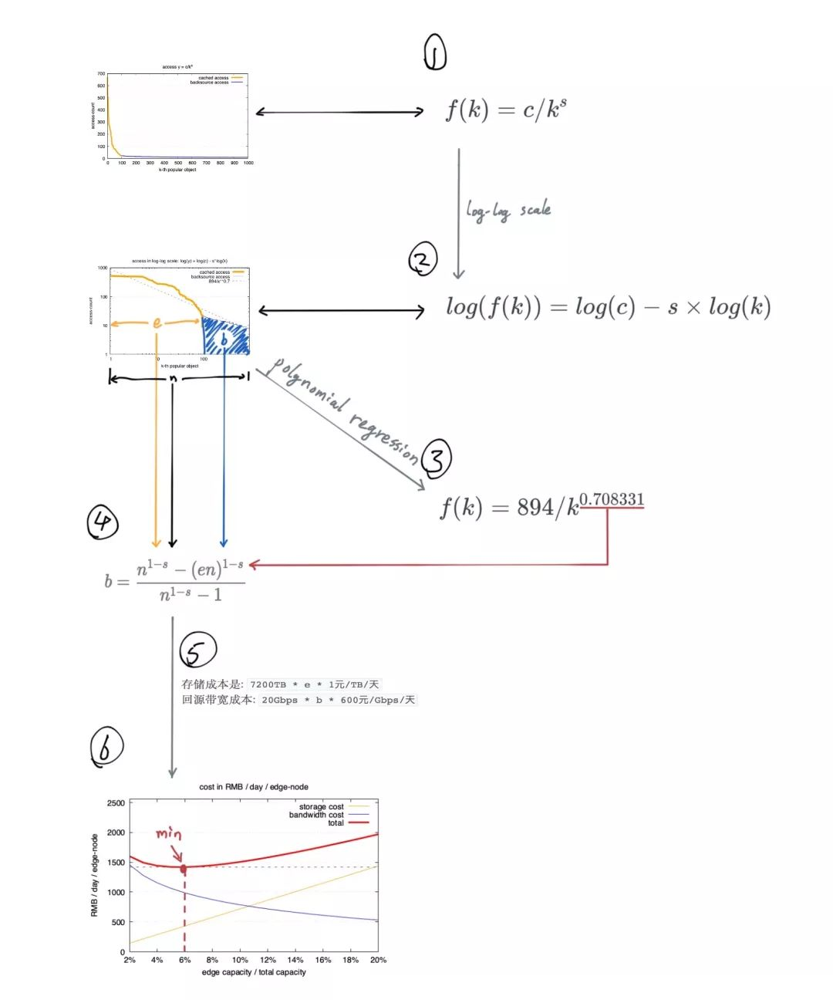
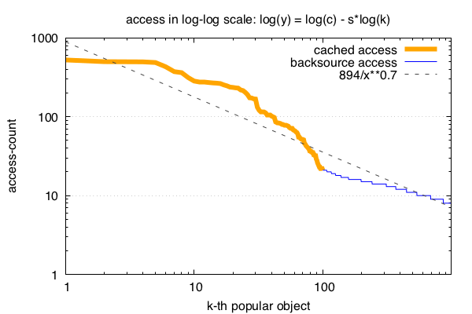
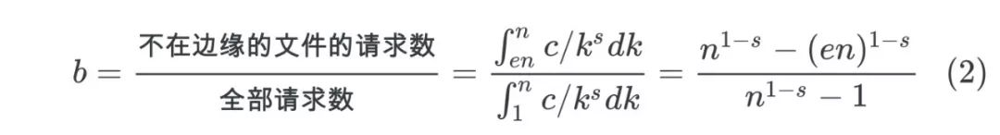
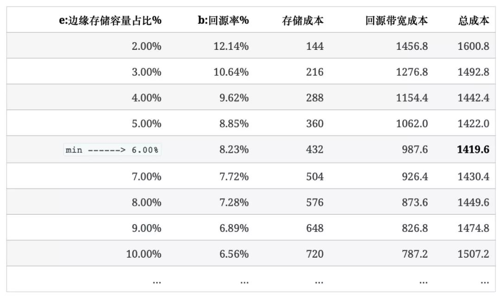

导语：在互联网领域, CDN常用的加速手段之一，也是技术成本之一。怎么在保证用户使用体验的同时，降低CDN的成本是我们经常需要面对的问题。本作作者从理论和实现两方面给出问题答案。


作者张炎泼 (xp)。

在上篇 [互联网中对象访问频率的91分布](http://mp.weixin.qq.com/s?__biz=MzAwMDU1MTE1OQ==&mid=2653551607&idx=1&sn=7f9addbf7852259d73aff3d6132df0bb&chksm=813a6a6fb64de37978a08f05a25e6c2f9af95e28cfb66aa19ba186cded6e256016b6a8441f6b&scene=21#wechat_redirect) 我们通过 90%的流量由10%的内容产生 这句经验描述， 得出了访问频率的zipf模型:


CDN (Content delivery network) 就是一个典型的符合zipf分布的缓存系统: 将缓存服务部署在距离用户最近的上百个地区（CDN边缘机房）， 当用户需要访问热门内容时，只需在边缘机房读取，以此达到性能优化。

因为符合zipf模型， 所以，如果一个边缘机房的容量对全量数据的占比变化1%，会带来每年数十万元的成本变化。一个中等规模的CDN系统，调优前后，可能会有每年几百万的成本差别。

本文从原理到实践跟大家一起分析下CDN的成本构成，以及zipf如何影响成本。

**本文结构:**
---------



=

=

**文件访问频率的分布规律**
===============

按照前文 [互联网中对象访问频率的91分布](http://mp.weixin.qq.com/s?__biz=MzAwMDU1MTE1OQ==&mid=2653551607&idx=1&sn=7f9addbf7852259d73aff3d6132df0bb&chksm=813a6a6fb64de37978a08f05a25e6c2f9af95e28cfb66aa19ba186cded6e256016b6a8441f6b&scene=21#wechat_redirect) 中介绍， 下图是从真实业务中提取的1000个URL访问次数， 按照访问次数从高到低进行排序的zipf曲线:


图1 访问频率分布

基于上图所呈现的访问热度分布，CDN边缘机房会缓存最热的文件 (对应图中橘黄色部分)， 为用户提供更好的访问质量， 而剩下蓝色部分不太频繁被访问的文件， 则按照正常的方式回源站拉取，再返回给用户。

于是就有了由存储/回源构成的CDN的成本:

**CDN成本构成**
===========

构成CDN的成本主要由2部分组成:

* 边缘机房中用于存储热文件(橘黄色)的服务器开销;
* 拉取本地不存在的冷文件(蓝色)时，访问内容源站(存储全量数据)的带宽开销。

显然边缘存储量越大，可缓存的内容就越多， 回源率(回源下载带宽/业务总下载带宽)就会越低，因此:

* 边缘存储成本上升，会带来回源带宽成本下降。
* 反之边缘存储成本下调，则会带来回源成本的上升。

接下来我们通过3个步骤，找到一个合适的边缘容量，让存储和带宽的成本总和达到一个极小值:

* 量化业务参数;
* 确定业务的模型，也就是zipf中的参数;
* 根据单位成本找出业务场景中的最优边缘容量，以及其对应的最低成本。

=

**确定业务参数**
==========

一个假想的业务场景和CDN服务配置如下:

* 每个CDN边缘机房对外提供的日常下载总带宽: 20Gbps，
* 源站中所有文件的总量n: 7200TB，
* 边缘机房的存储容量占源站文件总量的比值: e(edge)，例如(图1)中，e=10%，每个边缘机房能存储1/10的内容。
* 回源率b(backsource) 是边缘机房消耗的回源带宽跟这个边缘机房下载带宽的比值，例如(图1)中，e=10%时，b=6%。


其中下载带宽和文件总量n是业务属性; e和b是CDN的属性，不取决于业务，是由CDN提供商选择，并最终决定成本的因素。

> e，边缘容量 对应(图1)中橘黄色部分的x方向的宽度，图中e的值是10%。
> 
> b 对应(图1)中的蓝色部分， 是需要回源的请求，在(图1)中，b的值是蓝色部分的访问次数之和(不同于e，不是宽度)， 跟所有文件总访问次数之和的比值。

=

**确定业务模型-拟合zipf曲线**
===================

业务场景确定后，找出最佳成本的第一步是为这个热度分布曲线建立模型， 以便后面的计算。根据我们上一篇中介绍过的 转换成对应的zipf分布的公式 的方法，找出zipf曲线的2个参数:

把x，y轴分别取对数后，图像会呈现一个线性关系:

log(f(k))=log(c)−s×log(k)



(图2) 取对数后呈现线性关系

然后通过多项式回归，对(图2)中的点拟合一条直线，就可以得到c和s。

例如我们使用预先准备好的url计数文件 file-access-count.txt[1] 作为例子， 使用这个 find-zipf.py[2] 脚本来拟合可以得到:

* 
* 

```
\> python2 find-zipf.py6.796073 - 0.708331x
```

再分别对两边取指数，就从日志中得到了zipf 曲线的参数: 第k热的对象和它被访问次数的关系:


其中s的值 s=0.708331是我们后面计算需要用到的。

zipf中的c参数在我们的分析中没有被使用到， 因为c只决定了文件被访问频率的分布的绝对值，而不影响分布的相对值。而我们要考察的回源率b，是一个比值，它只跟频率分布的相对值有关。

=

**通过zipf建立CDN边缘容量和回源率的关系**
==========================

**
**

确定了zipf方程后， 我们就可以准确的给出CDN系统中以下3个关键变量的关系:

* 全量文件nTB，
* 边缘机房容量e\*nTB，
* 和回源率b。



因为s 已经通过直线拟合得到了，而e和b可以从边缘机房的具体配置和访问日志得到。 于是我们可以确定n的值， 也就是说(划重点):

**CDN可以根据访问模型估算源站的总文件量。**

> 虽然源站信息一般不会直接透漏给CDN提供商， 但实际上这个信息对CDN来说是可估算的。同样，对于源站来说，他知道自己的全量数据n的值，以及回源率b的值， 通过这个公式也可以知道CDN的 一个边缘机房的存储容量e。

=

**确定IT设施单位成本**
==============

有了b，e的关系，接下来给出基础成本数据，就可以确定最优成本对应的e的值了:

从网上搜一些基础数据(如服务器价格，硬盘价格，各家云大厂提供的带宽单价等)， 折算成单位成本为后面计算时使用:

* 边缘机房的存储的成本是 `1 元/TB/天`，包括服务器和租机房的费用，三年均摊。
* 边缘机房拉取源站内容的带宽成本是 `600 元/Gbps/天`。

> 价格等数值因为是从网上搜来的，可能跟实际运营中的数据相差很多，这里只为用来说明原理， 确定方法，不保证数值上跟真实环境完全吻合。

根据以上设定，我们可以得到一个边缘机房中:

* 存储成本是: `7200TB \* e \* 1元/TB/天`
* 回源带宽成本: `20Gbps \* b \* 600元/Gbps/天`

=

=

**找出最优配置**
==========

现在所有的模型，场景和数据都准备好了， 最后我们把它们放在一起得到最终结论: 成本对边缘容量的变化:

1. 选择不同的边缘容量e的值((图1)橘黄色部分的宽度)，
2. 根据公式(2)计算对应的回源率b((图1)蓝色部分积分/蓝色黄色部分积分)，
3. 再结合单位成本，得出每个e对应的总成本，

最后我们得到如下一个边缘容量e决定回源率b和成本的表格:



我们看到，在这个业务场景中，边缘容量取到6%时，总成本会达到最低: 1419.6 元/天。

把e变化作为x轴，画出边缘存储成本和回源带宽成本随e变化的曲线如下图， 趋势看起来就更清楚了:


我们看到总成本(红色曲线)在这个图上有一个极小值，大概在e=6%的位置。

而如果边缘机房的容量配置不在6%这个位置，譬如达到10%， 一个边缘机房每天就会多花掉1507-1419= 88 元， 如果整个CDN系统有100个边缘机房，一年多花的钱就是320万 (88 \* 100 \* 365)。

当然，在实际运营一个CDN这种庞大的系统的时候，还有很多因素需要考虑:

* 如边缘机房的存储容量带来的性能提升，
* 低回源率带来的整体延迟降低等。

因此我们的结论尚不能作为优化的标准，而只能作为优化的参考:

* 知道理论上限在哪，
* 不做无效的尝试，
* 制定有依据的目标，
* 了解运营策略调整的成本等等。

**
**

**总结**

算完了，休息一下。

互联网的各种服务之间都是相互关联的。虽然目前看来，源站和CDN之间的协作还是单方面的，一方去适应另一方， 或一方服务另一方的模式。其实源站和边缘之间，本应是一个整体，但市场的划分导致了技术和设施层面上的分离， 让这个本应完整的框架分离成了2个或多个部分。

这里我们看到的源站和边缘之间的关系， 还只是开始，这些只不过是数学结论上的互相了解， 源站和边缘之间应该有比这更大的的协作空间。

试想一下，边缘和源站之间如果能在单向数据下载的基础上建立双向数据通讯， 在中心源站数据发生变化要通知边缘缓存的基础上， 如果边缘发生的事情能很快推送到中心， 才是真正的互联网模式。

市场一直在变化， 每次在这些变化背后， 一定是有一个什么新的东西出现，是让用户使用到了更方便或更高效的东西， 才让技术的格局发生了变化(google之于yahoo，微信之于邮箱，twitter之于博客)。

出色的支持和适配可以产生优质的产品，但我相信协作和互通更能带来质的变化。作为一个技术从业人员，发现这些改变的可能，实现这些改变，并把这种改变服务于可受益的人， 也许就是最开心的事情了: Discover, Design, Distribute…

**文中链接：**

**
**

[1] http://openacid.github.io/post-res/cache-hit/file-access-count.txt

[2] http://openacid.github.io/post-res/cache-hit/find-zipf.py

**
**

**参考阅读：**

* [性能优化怎么做？互联网对象访问频率的91分布原则](http://mp.weixin.qq.com/s?__biz=MzAwMDU1MTE1OQ==&mid=2653551607&idx=1&sn=7f9addbf7852259d73aff3d6132df0bb&chksm=813a6a6fb64de37978a08f05a25e6c2f9af95e28cfb66aa19ba186cded6e256016b6a8441f6b&scene=21#wechat_redirect)
* [美国的火币Coinbase如何构建区块链基础设施](http://mp.weixin.qq.com/s?__biz=MzAwMDU1MTE1OQ==&mid=2653551650&idx=1&sn=f945741e862df4d9056b80c58289c975&chksm=813a6dbab64de4ac908a7674b57ea95d87a2eadad6eb8b88feae640952651604e5b9cfdf0821&scene=21#wechat_redirect)
* [十六年老司机笔记：MySQL性能优化之必备技能](http://mp.weixin.qq.com/s?__biz=MzAwMDU1MTE1OQ==&mid=2653551632&idx=1&sn=9005a97873619955cc814dea867abe78&chksm=813a6d88b64de49e87644e4b7eb64d5da997619fc86453004a4876a6f0b22cc8b6bfee32192b&scene=21#wechat_redirect)
* [为什么不应该使用数据库外键（重温旧文）](http://mp.weixin.qq.com/s?__biz=MzAwMDU1MTE1OQ==&mid=2653551627&idx=1&sn=3c3a7ffb4a50c94f1a0eb075291490ea&chksm=813a6d93b64de485b5b9bc2bacb25f12770d75120bd4d422753ec13faddd1d7e3b5aba46a644&scene=21#wechat_redirect)
* [GraalVM LTS版正式发布！可用于生产环境，基于JDK 11](http://mp.weixin.qq.com/s?__biz=MzAwMDU1MTE1OQ==&mid=2653551663&idx=1&sn=12a77a61a5af9be0c323a234228d14fb&chksm=813a6db7b64de4a12f10a89b5320177bf6f4432d7a6f692c4e30e1190a8a6797d727c593a68f&scene=21#wechat_redirect)