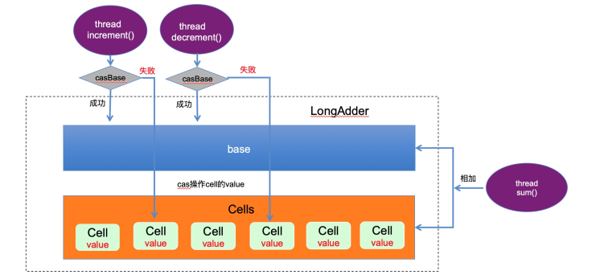

Photo @ zibik

**文 | 楚昭**

**
**

**简介**

---

在计算机行业有一个定律叫"摩尔定律"，在此定律下，计算机的性能突飞猛进，而且价格也随之越来越便宜， CPU 从单核到了多核，缓存性能也得到了很大提升，尤其是多核 CPU 技术的到来，计算机同一时刻可以处理多个任务。在硬件层面的发展带来的效率极大提升中，软件层面的多线程编程已经成为必然趋势，然而多线程编程就会引入数据安全性问题，有矛必有盾，于是发明了“锁”来解决线程安全问题。在这篇文章中，总结了 Java 中几把经典的 JVM 级别的锁。

**synchronized**

---

synchronized 关键字是一把经典的锁，也是我们平时用得最多的。在 JDK1.6 之前， syncronized 是一把重量级的锁，不过随着 JDK 的升级，也在对它进行不断的优化，如今它变得不那么重了，甚至在某些场景下，它的性能反而优于轻量级锁。在加了 syncronized 关键字的方法、代码块中，一次只允许一个线程进入特定代码段，从而避免多线程同时修改同一数据。

synchronized 锁有如下几个特点：

**有锁升级过程**

在 JDK1.5 (含)之前， synchronized 的底层实现是重量级的，所以之前一致称呼它为"重量级锁"，在 JDK1.5 之后，对 synchronized 进行了各种优化，它变得不那么重了，实现原理就是锁升级的过程。我们先聊聊 1.5 之后的 synchronized 实现原理是怎样的。说到 synchronized 加锁原理，就不得不先说 Java 对象在内存中的布局， Java 对象内存布局如下:


如上图所示，在创建一个对象后，在 JVM 虚拟机( HotSpot )中，对象在 Java 内存中的存储布局 可分为三块:

**对象头区域此处存储的信息包括两部分：**

1、对象自身的运行时数据( MarkWord )

存储 hashCode、GC 分代年龄、锁类型标记、偏向锁线程 ID 、 CAS 锁指向线程 LockRecord 的指针等， synconized 锁的机制与这个部分( markwork )密切相关，用 markword 中最低的三位代表锁的状态，其中一位是偏向锁位，另外两位是普通锁位。

2、对象类型指针( Class Pointer )

对象指向它的类元数据的指针、 JVM 就是通过它来确定是哪个 Class 的实例。

**实例数据区域 **

 此处存储的是对象真正有效的信息，比如对象中所有字段的内容

**对齐填充区域**

 JVM 的实现 HostSpot 规定对象的起始地址必须是 8 字节的整数倍，换句话来说，现在 64 位的 OS 往外读取数据的时候一次性读取 64bit 整数倍的数据，也就是 8 个字节，所以 HotSpot 为了高效读取对象，就做了"对齐"，如果一个对象实际占的内存大小不是 8byte 的整数倍时，就"补位"到 8byte 的整数倍。所以对齐填充区域的大小不是固定的。

当线程进入到 synchronized 处尝试获取该锁时， synchronized 锁升级流程如下：


如上图所示， synchronized 锁升级的顺序为：偏向锁-\>轻量级锁-\>重量级锁，每一步触发锁升级的情况如下：

**偏向锁**

在 JDK1.8 中，其实默认是轻量级锁，但如果设定了 -XX:BiasedLockingStartupDelay = 0 ，那在对一个 Object 做 syncronized 的时候，会立即上一把偏向锁。当处于偏向锁状态时， markwork 会记录当前线程 ID 。

**升级到轻量级锁**

当下一个线程参与到偏向锁竞争时，会先判断 markword 中保存的线程 ID 是否与这个线程 ID 相等，如果不相等，会立即撤销偏向锁，升级为轻量级锁。每个线程在自己的线程栈中生成一个 LockRecord ( LR )，然后每个线程通过 CAS (自旋)的操作将锁对象头中的 markwork 设置为指向自己的 LR 的指针，哪个线程设置成功，就意味着获得锁。关于 synchronized 中此时执行的 CAS 操作是通过 native 的调用 HotSpot 中 bytecodeInterpreter.cpp 文件 C++ 代码实现的，有兴趣的可以继续深挖。

**升级到重量级锁**

如果锁竞争加剧(如线程自旋次数或者自旋的线程数超过某阈值， JDK1.6 之后，由 JVM 自己控制该规则)，就会升级为重量级锁。此时就会向操作系统申请资源，线程挂起，进入到操作系统内核态的等待队列中，等待操作系统调度，然后映射回用户态。在重量级锁中，由于需要做内核态到用户态的转换，而这个过程中需要消耗较多时间，也就是"重"的原因之一。

**可重入**

synchronized 拥有强制原子性的内部锁机制，是一把可重入锁。因此，在一个线程使用 synchronized 方法时调用该对象另一个 synchronized 方法，即一个线程得到一个对象锁后再次请求该对象锁，是永远可以拿到锁的。在 Java 中线程获得对象锁的操作是以线程为单位的，而不是以调用为单位的。 synchronized 锁的对象头的 markwork 中会记录该锁的线程持有者和计数器，当一个线程请求成功后， JVM 会记下持有锁的线程，并将计数器计为1。此时其他线程请求该锁，则必须等待。而该持有锁的线程如果再次请求这个锁，就可以再次拿到这个锁，同时计数器会递增。当线程退出一个 synchronized 方法/块时，计数器会递减，如果计数器为 0 则释放该锁锁。

**悲观锁(互斥锁、排他锁)**

 synchronized 是一把悲观锁(独占锁)，当前线程如果获取到锁，会导致其它所有需要锁该的线程等待，一直等待持有锁的线程释放锁才继续进行锁的争抢。

**ReentrantLock**

---

ReentrantLock 从字面可以看出是一把可重入锁，这点和 synchronized 一样，但实现原理也与 syncronized 有很大差别，它是基于经典的 AQS(AbstractQueueSyncronized) 实现的, AQS 是基于 volitale 和 CAS 实现的，其中 AQS 中维护一个 valitale 类型的变量 state 来做一个可重入锁的重入次数，加锁和释放锁也是围绕这个变量来进行的。 ReentrantLock 也提供了一些 synchronized 没有的特点，因此比 synchronized 好用。

**AQS模型如下图：**


ReentrantLock 有如下特点：

**1、可重入**

 ReentrantLock 和 syncronized 关键字一样，都是可重入锁，不过两者实现原理稍有差别， RetrantLock 利用 AQS 的的 state 状态来判断资源是否已锁，同一线程重入加锁， state 的状态 +1 ; 同一线程重入解锁, state 状态 -1 (解锁必须为当前独占线程，否则异常); 当 state 为 0 时解锁成功。

**2、需要手动加锁、解锁**

synchronized 关键字是自动进行加锁、解锁的，而 ReentrantLock 需要 lock() 和 unlock() 方法配合 try/finally 语句块来完成，来手动加锁、解锁。

**3、支持设置锁的超时时间**

 synchronized 关键字无法设置锁的超时时间，如果一个获得锁的线程内部发生死锁，那么其他线程就会一直进入阻塞状态，而 ReentrantLock 提供 tryLock 方法，允许设置线程获取锁的超时时间，如果超时，则跳过，不进行任何操作，避免死锁的发生。

**4、支持公平/非公平锁**

synchronized 关键字是一种非公平锁，先抢到锁的线程先执行。而 ReentrantLock 的构造方法中允许设置 true/false 来实现公平、非公平锁，如果设置为 true ，则线程获取锁要遵循"先来后到"的规则，每次都会构造一个线程 Node ，然后到双向链表的"尾巴"后面排队，等待前面的 Node 释放锁资源。

**5、可中断锁**

 ReentrantLock 中的 lockInterruptibly() 方法使得线程可以在被阻塞时响应中断，比如一个线程 t1 通过 lockInterruptibly() 方法获取到一个可重入锁，并执行一个长时间的任务，另一个线程通过 interrupt() 方法就可以立刻打断 t1 线程的执行，来获取t1持有的那个可重入锁。而通过 ReentrantLock 的 lock() 方法或者 Synchronized 持有锁的线程是不会响应其他线程的 interrupt() 方法的，直到该方法主动释放锁之后才会响应 interrupt() 方法。

**ReentrantReadWriteLock**

---

ReentrantReadWriteLock (读写锁)其实是两把锁，一把是 WriteLock (写锁)，一把是读锁， ReadLock 。读写锁的规则是：读读不互斥、读写互斥、写写互斥。在一些实际的场景中，读操作的频率远远高于写操作，如果直接用一般的锁进行并发控制的话，就会读读互斥、读写互斥、写写互斥，效率低下，读写锁的产生就是为了优化这种场景的操作效率。一般情况下独占锁的效率低来源于高并发下对临界区的激烈竞争导致线程上下文切换。因此当并发不是很高的情况下，读写锁由于需要额外维护读锁的状态，可能还不如独占锁的效率高，因此需要根据实际情况选择使用。 

ReentrantReadWriteLock 的原理也是基于 AQS 进行实现的，与 ReentrantLock 的差别在于 ReentrantReadWriteLock 锁拥有共享锁、排他锁属性。读写锁中的加锁、释放锁也是基于 Sync (继承于 AQS )，并且主要使用 AQS 中的 state 和 node 中的 waitState 变量进行实现的。实现读写锁与实现普通互斥锁的主要区别在于需要分别记录读锁状态及写锁状态，并且等待队列中需要区别处理两种加锁操作。 ReentrantReadWriteLock 中将 AQS 中的 int 类型的 state 分为高 16 位与第 16 位分别记录读锁和写锁的状态，如下图所示：


**WriteLock(写锁)是悲观锁(排他锁、互斥锁)**

通过计算 state&((1\<\<16)-1) ，将 state 的高 16 位全部抹去，因此 state 的低位记录着写锁的重入计数。

获取写锁源码：

* 
* 
* 
* 
* 
* 
* 
* 
* 
* 
* 
* 
* 
* 
* 
* 
* 
* 
* 
* 
* 
* 
* 
* 
* 
* 
* 
* 
* 
* 
* 
* 
* 
* 
* 
* 
* 
* 
* 
* 
* 
* 
* 
* 
* 
* 
* 
* 
* 
* 
* 
* 
* 
* 
* 
* 
* 
* 
* 
* 
* 
* 
* 
* 
* 
* 
* 
* 
* 
* 
* 
* 
* 
* 
* 
* 
* 
* 
* 
* 
* 
* 
* 
* 
* 
* 
* 
* 
* 

```
/\*\* \* 获取写锁 Acquires the write lock. \* 如果此时没有任何线程持有写锁或者读锁，那么当前线程执行CAS操作更新status， \* 若更新成功，则设置读锁重入次数为1，并立即返回 \* \<p\>Acquires the write lock if neither the read nor write lock \* are held by another thread \* and returns immediately, setting the write lock hold count to \* one. \* 如果当前线程已经持有该写锁，那么将写锁持有次数设置为1，并立即返回 \* \<p\>If the current thread already holds the write lock then the \* hold count is incremented by one and the method returns \* immediately. \* 如果该锁已经被另外一个线程持有，那么停止该线程的CPU调度并进入休眠状态， \* 直到该写锁被释放，且成功将写锁持有次数设置为1才表示获取写锁成功 \* \<p\>If the lock is held by another thread then the current \* thread becomes disabled for thread scheduling purposes and \* lies dormant until the write lock has been acquired, at which \* time the write lock hold count is set to one. \*/ public void lock() { sync.acquire(1); }/\*\* \* 该方法为以独占模式获取锁，忽略中断 \* 如果调用一次该“tryAcquire”方法更新status成功，则直接返回，代表抢锁成功 \* 否则，将会进入同步队列等待，不断执行“tryAcquire”方法尝试CAS更新status状态，直到成功抢到锁 \* 其中“tryAcquire”方法在NonfairSync(公平锁)中和FairSync(非公平锁)中都有各自的实现 \* \* Acquires in exclusive mode, ignoring interrupts. Implemented \* by invoking at least once {@link \#tryAcquire}, \* returning on success. Otherwise the thread is queued, possibly \* repeatedly blocking and unblocking, invoking {@link \* \#tryAcquire} until success. This method can be used \* to implement method {@link Lock\#lock}. \* \* @param arg the acquire argument. This value is conveyed to \* {@link \#tryAcquire} but is otherwise uninterpreted and \* can represent anything you like. \*/ public final void acquire(int arg) { if (!tryAcquire(arg) && acquireQueued(addWaiter(Node.EXCLUSIVE), arg)) selfInterrupt(); } protected final boolean tryAcquire(int acquires) { /\* \* Walkthrough: \* 1、如果读写锁的计数不为0，且持有锁的线程不是当前线程，则返回false \* 1\. If read count nonzero or write count nonzero \* and owner is a different thread, fail. \* 2、如果持有锁的计数不为0且计数总数超过限定的最大值，也返回false \* 2\. If count would saturate, fail. (This can only \* happen if count is already nonzero.) \* 3、如果该锁是可重入或该线程在队列中的策略是允许它尝试抢锁，那么该线程就能获取锁 \* 3\. Otherwise, this thread is eligible for lock if \* it is either a reentrant acquire or \* queue policy allows it. If so, update state \* and set owner. \*/ Thread current = Thread.currentThread(); //获取读写锁的状态 int c = getState(); //获取该写锁重入的次数 int w = exclusiveCount(c); //如果读写锁状态不为0，说明已经有其他线程获取了读锁或写锁 if (c != 0) { //如果写锁重入次数为0，说明有线程获取到读锁，根据“读写锁互斥”原则，返回false //或者如果写锁重入次数不为0，且获取写锁的线程不是当前线程，根据"写锁独占"原则，返回false // (Note: if c != 0 and w == 0 then shared count != 0) if (w == 0 || current != getExclusiveOwnerThread()) return false; //如果写锁可重入次数超过最大次数（65535），则抛异常 if (w + exclusiveCount(acquires) \> MAX\_COUNT) throw new Error("Maximum lock count exceeded"); //到这里说明该线程是重入写锁，更新重入写锁的计数(+1)，返回true // Reentrant acquire setState(c + acquires); return true; } //如果读写锁状态为0,说明读锁和写锁都没有被获取，会走下面两个分支： //如果要阻塞或者执行CAS操作更新读写锁的状态失败，则返回false //如果不需要阻塞且CAS操作成功，则当前线程成功拿到锁，设置锁的owner为当前线程，返回true if (writerShouldBlock() || !compareAndSetState(c, c + acquires)) return false; setExclusiveOwnerThread(current); return true; }
```

释放写锁源码：

* 
* 
* 
* 
* 
* 
* 
* 
* 
* 
* 
* 
* 
* 
* 
* 
* 
* 
* 
* 
* 

```
/\* \* Note that tryRelease and tryAcquire can be called by \* Conditions. So it is possible that their arguments contain \* both read and write holds that are all released during a \* condition wait and re-established in tryAcquire. \*/ protected final boolean tryRelease(int releases) { //若锁的持有者不是当前线程，抛出异常 if (!isHeldExclusively()) throw new IllegalMonitorStateException(); //写锁的可重入计数减掉releases个 int nextc = getState() - releases; //如果写锁重入计数为0了，则说明写锁被释放了 boolean free = exclusiveCount(nextc) == 0; if (free) //若写锁被释放，则将锁的持有者设置为null，进行GC setExclusiveOwnerThread(null); //更新写锁的重入计数 setState(nextc); return free; }
```

**ReadLock(读锁)是共享锁(乐观锁)**

通过计算 state\>\>\>16 进行无符号补 0 ，右移 16 位，因此 state 的高位记录着写锁的重入计数.

读锁获取锁的过程比写锁稍微复杂些，首先判断写锁是否为 0 并且当前线程不占有独占锁，直接返回；否则，判断读线程是否需要被阻塞并且读锁数量是否小于最大值并且比较设置状态成功，若当前没有读锁，则设置第一个读线程 firstReader 和 firstReaderHoldCount ；若当前线程线程为第一个读线程，则增加 firstReaderHoldCount ；否则，将设置当前线程对应的 HoldCounter 对象的值，更新成功后会在 firstReaderHoldCount 中 readHolds ( ThreadLocal 类型的)的本线程副本中记录当前线程重入数，这是为了实现 JDK1.6 中加入的 getReadHoldCount ()方法的，这个方法能获取当前线程重入共享锁的次数( state 中记录的是多个线程的总重入次数)，加入了这个方法让代码复杂了不少，但是其原理还是很简单的：如果当前只有一个线程的话，还不需要动用 ThreadLocal ，直接往 firstReaderHoldCount 这个成员变量里存重入数，当有第二个线程来的时候，就要动用 ThreadLocal 变量 readHolds 了，每个线程拥有自己的副本，用来保存自己的重入数。

获取读锁源码： 

* 
* 
* 
* 
* 
* 
* 
* 
* 
* 
* 
* 
* 
* 
* 
* 
* 
* 
* 
* 
* 
* 
* 
* 
* 
* 
* 
* 
* 
* 
* 
* 
* 
* 
* 
* 
* 
* 
* 
* 
* 
* 
* 
* 
* 
* 
* 
* 
* 
* 
* 
* 
* 
* 
* 
* 
* 
* 
* 
* 
* 
* 
* 
* 
* 
* 
* 
* 
* 
* 
* 
* 
* 
* 
* 
* 
* 
* 
* 
* 
* 
* 
* 
* 
* 
* 
* 
* 
* 
* 
* 
* 
* 
* 
* 
* 
* 
* 
* 
* 
* 
* 
* 
* 
* 
* 
* 
* 
* 
* 
* 
* 
* 
* 
* 
* 
* 
* 
* 
* 
* 
* 
* 
* 
* 
* 
* 
* 
* 
* 
* 
* 
* 
* 
* 
* 
* 
* 
* 
* 
* 
* 
* 
* 
* 
* 
* 
* 
* 
* 
* 
* 
* 
* 
* 
* 
* 
* 
* 
* 
* 
* 
* 
* 
* 
* 

```
/\*\* \* 获取读锁 \* Acquires the read lock. \* 如果写锁未被其他线程持有，执行CAS操作更新status值，获取读锁后立即返回 \* \<p\>Acquires the read lock if the write lock is not held by \* another thread and returns immediately. \* \* 如果写锁被其他线程持有，那么停止该线程的CPU调度并进入休眠状态，直到该读锁被释放 \* \<p\>If the write lock is held by another thread then \* the current thread becomes disabled for thread scheduling \* purposes and lies dormant until the read lock has been acquired. \*/ public void lock() { sync.acquireShared(1); } /\*\* \* 该方法为以共享模式获取读锁，忽略中断 \* 如果调用一次该“tryAcquireShared”方法更新status成功，则直接返回，代表抢锁成功 \* 否则，将会进入同步队列等待，不断执行“tryAcquireShared”方法尝试CAS更新status状态，直到成功抢到锁 \* 其中“tryAcquireShared”方法在NonfairSync(公平锁)中和FairSync(非公平锁)中都有各自的实现 \* (看这注释是不是和写锁很对称) \* Acquires in shared mode, ignoring interrupts. Implemented by \* first invoking at least once {@link \#tryAcquireShared}, \* returning on success. Otherwise the thread is queued, possibly \* repeatedly blocking and unblocking, invoking {@link \* \#tryAcquireShared} until success. \* \* @param arg the acquire argument. This value is conveyed to \* {@link \#tryAcquireShared} but is otherwise uninterpreted \* and can represent anything you like. \*/ public final void acquireShared(int arg) { if (tryAcquireShared(arg) \< 0) doAcquireShared(arg); } protected final int tryAcquireShared(int unused) { /\* \* Walkthrough: \* 1、如果已经有其他线程获取到了写锁，根据“读写互斥”原则，抢锁失败，返回-1 \* 1.If write lock held by another thread, fail. \* 2、如果该线程本身持有写锁，那么看一下是否要readerShouldBlock，如果不需要阻塞， \* 则执行CAS操作更新state和重入计数。 \* 这里要注意的是，上面的步骤不检查是否可重入(因为读锁属于共享锁，天生支持可重入) \* 2\. Otherwise, this thread is eligible for \* lock wrt state, so ask if it should block \* because of queue policy. If not, try \* to grant by CASing state and updating count. \* Note that step does not check for reentrant \* acquires, which is postponed to full version \* to avoid having to check hold count in \* the more typical non-reentrant case. \* 3、如果因为CAS更新status失败或者重入计数超过最大值导致步骤2执行失败 \* 那就进入到fullTryAcquireShared方法进行死循环，直到抢锁成功 \* 3\. If step 2 fails either because thread \* apparently not eligible or CAS fails or count \* saturated, chain to version with full retry loop. \*/
 //当前尝试获取读锁的线程 Thread current = Thread.currentThread(); //获取该读写锁状态 int c = getState(); //如果有线程获取到了写锁 ，且获取写锁的不是当前线程则返回失败 if (exclusiveCount(c) != 0 && getExclusiveOwnerThread() != current) return -1; //获取读锁的重入计数 int r = sharedCount(c); //如果读线程不应该被阻塞，且重入计数小于最大值，且CAS执行读锁重入计数+1成功，则执行线程重入的计数加1操作，返回成功 if (!readerShouldBlock() && r \< MAX\_COUNT && compareAndSetState(c, c + SHARED\_UNIT)) { //如果还未有线程获取到读锁，则将firstReader设置为当前线程，firstReaderHoldCount设置为1 if (r == 0) { firstReader = current; firstReaderHoldCount = 1; } else if (firstReader == current) { //如果firstReader是当前线程，则将firstReader的重入计数变量firstReaderHoldCount加1 firstReaderHoldCount++; } else { //否则说明有至少两个线程共享读锁，获取共享锁重入计数器HoldCounter //从HoldCounter中拿到当前线程的线程变量cachedHoldCounter，将此线程的重入计数count加1 HoldCounter rh = cachedHoldCounter; if (rh == null || rh.tid != getThreadId(current)) cachedHoldCounter = rh = readHolds.get(); else if (rh.count == 0) readHolds.set(rh); rh.count++; } return 1; } //如果上面的if条件有一个都不满足，则进入到这个方法里进行死循环重新获取 return fullTryAcquireShared(current); } /\*\* \* 用于处理CAS操作state失败和tryAcquireShared中未执行获取可重入锁动作的full方法(补偿方法？) \* Full version of acquire for reads, that handles CAS misses \* and reentrant reads not dealt with in tryAcquireShared. \*/ final int fullTryAcquireShared(Thread current) { /\* \* 此代码与tryAcquireShared中的代码有部分相似的地方， \* 但总体上更简单，因为不会使tryAcquireShared与重试和延迟读取保持计数之间的复杂判断 \* This code is in part redundant with that in \* tryAcquireShared but is simpler overall by not \* complicating tryAcquireShared with interactions between \* retries and lazily reading hold counts. \*/ HoldCounter rh = null; //死循环 for (;;) { //获取读写锁状态 int c = getState(); //如果有线程获取到了写锁 if (exclusiveCount(c) != 0) { //如果获取写锁的线程不是当前线程，返回失败 if (getExclusiveOwnerThread() != current) return -1; // else we hold the exclusive lock; blocking here // would cause deadlock. } else if (readerShouldBlock()) {//如果没有线程获取到写锁，且读线程要阻塞 // Make sure we're not acquiring read lock reentrantly //如果当前线程为第一个获取到读锁的线程 if (firstReader == current) { // assert firstReaderHoldCount \> 0; } else { //如果当前线程不是第一个获取到读锁的线程(也就是说至少有有一个线程获取到了读锁) // if (rh == null) { rh = cachedHoldCounter; if (rh == null || rh.tid != getThreadId(current)) { rh = readHolds.get(); if (rh.count == 0) readHolds.remove(); } } if (rh.count == 0) return -1; } } /\*\* \*下面是既没有线程获取写锁，当前线程又不需要阻塞的情况 \*/ //重入次数等于最大重入次数，抛异常 if (sharedCount(c) == MAX\_COUNT) throw new Error("Maximum lock count exceeded"); //如果执行CAS操作成功将读写锁的重入计数加1，则对当前持有这个共享读锁的线程的重入计数加1，然后返回成功 if (compareAndSetState(c, c + SHARED\_UNIT)) { if (sharedCount(c) == 0) { firstReader = current; firstReaderHoldCount = 1; } else if (firstReader == current) { firstReaderHoldCount++; } else { if (rh == null) rh = cachedHoldCounter; if (rh == null || rh.tid != getThreadId(current)) rh = readHolds.get(); else if (rh.count == 0) readHolds.set(rh); rh.count++; cachedHoldCounter = rh; // cache for release } return 1; } } }
```

释放读锁源码：

* 
* 
* 
* 
* 
* 
* 
* 
* 
* 
* 
* 
* 
* 
* 
* 
* 
* 
* 
* 
* 
* 
* 
* 
* 
* 
* 
* 
* 
* 
* 
* 
* 
* 
* 
* 
* 
* 
* 
* 
* 
* 
* 
* 
* 
* 
* 
* 
* 
* 
* 
* 
* 
* 
* 
* 
* 
* 
* 
* 
* 
* 
* 
* 
* 
* 
* 
* 
* 
* 
* 
* 
* 
* 
* 
* 
* 
* 
* 
* 
* 
* 
* 
* 
* 
* 
* 
* 
* 
* 
* 
* 
* 
* 
* 
* 
* 
* 
* 
* 

```
/\*\* \* Releases in shared mode. Implemented by unblocking one or more \* threads if {@link \#tryReleaseShared} returns true. \* \* @param arg the release argument. This value is conveyed to \* {@link \#tryReleaseShared} but is otherwise uninterpreted \* and can represent anything you like. \* @return the value returned from {@link \#tryReleaseShared} \*/public final boolean releaseShared(int arg) { if (tryReleaseShared(arg)) {//尝试释放一次共享锁计数 doReleaseShared();//真正释放锁 return true; } return false;}/\*\* \*此方法表示读锁线程释放锁。 \*首先判断当前线程是否为第一个读线程firstReader， \*若是，则判断第一个读线程占有的资源数firstReaderHoldCount是否为1， 若是，则设置第一个读线程firstReader为空，否则，将第一个读线程占有的资源数firstReaderHoldCount减1； 若当前线程不是第一个读线程， 那么首先会获取缓存计数器（上一个读锁线程对应的计数器 ）， 若计数器为空或者tid不等于当前线程的tid值，则获取当前线程的计数器， 如果计数器的计数count小于等于1，则移除当前线程对应的计数器， 如果计数器的计数count小于等于0，则抛出异常，之后再减少计数即可。 无论何种情况，都会进入死循环，该循环可以确保成功设置状态state \*/protected final boolean tryReleaseShared(int unused) { // 获取当前线程 Thread current = Thread.currentThread(); if (firstReader == current) { // 当前线程为第一个读线程 // assert firstReaderHoldCount \> 0; if (firstReaderHoldCount == 1) // 读线程占用的资源数为1 firstReader = null; else // 减少占用的资源 firstReaderHoldCount--; } else { // 当前线程不为第一个读线程 // 获取缓存的计数器 HoldCounter rh = cachedHoldCounter; if (rh == null || rh.tid != getThreadId(current)) // 计数器为空或者计数器的tid不为当前正在运行的线程的tid // 获取当前线程对应的计数器 rh = readHolds.get(); // 获取计数 int count = rh.count; if (count \<= 1) { // 计数小于等于1 // 移除 readHolds.remove(); if (count \<= 0) // 计数小于等于0，抛出异常 throw unmatchedUnlockException(); } // 减少计数 --rh.count; } for (;;) { // 死循环 // 获取状态 int c = getState(); // 获取状态 int nextc = c - SHARED\_UNIT; if (compareAndSetState(c, nextc)) // 比较并进行设置 // Releasing the read lock has no effect on readers, // but it may allow waiting writers to proceed if // both read and write locks are now free. return nextc == 0; } } /\*\*真正释放锁 \* Release action for shared mode -- signals successor and ensures \* propagation. (Note: For exclusive mode, release just amounts \* to calling unparkSuccessor of head if it needs signal.) \*/private void doReleaseShared() { /\* \* Ensure that a release propagates, even if there are other \* in-progress acquires/releases. This proceeds in the usual \* way of trying to unparkSuccessor of head if it needs \* signal. But if it does not, status is set to PROPAGATE to \* ensure that upon release, propagation continues. \* Additionally, we must loop in case a new node is added \* while we are doing this. Also, unlike other uses of \* unparkSuccessor, we need to know if CAS to reset status \* fails, if so rechecking. \*/ for (;;) { Node h = head; if (h != null && h != tail) { int ws = h.waitStatus; if (ws == Node.SIGNAL) { if (!compareAndSetWaitStatus(h, Node.SIGNAL, 0)) continue; // loop to recheck cases unparkSuccessor(h); } else if (ws == 0 && !compareAndSetWaitStatus(h, 0, Node.PROPAGATE)) continue; // loop on failed CAS } if (h == head) // loop if head changed break; } }
```

通过分析可以看出：

在线程持有读锁的情况下，该线程不能取得写锁(因为获取写锁的时候，如果发现当前的读锁被占用，就马上获取失败，不管读锁是不是被当前线程持有)。

在线程持有写锁的情况下，该线程可以继续获取读锁（获取读锁时如果发现写锁被占用，只有写锁没有被当前线程占用的情况才会获取失败）。

**LongAdder**

---

在高并发的情况下，我们对一个 Integer 类型的整数直接进行 i++ 的时候，无法保证操作的原子性，会出现线程安全的问题。为此我们会用 juc 下的 AtomicInteger ，它是一个提供原子操作的 Interger 类，内部也是通过 CAS 实现线程安全的。但当大量线程同时去访问时，就会因为大量线程执行 CAS 操作失败而进行空旋转，导致 CPU 资源消耗过多，而且执行效率也不高。 Doug Lea 大神应该也不满意，于是在 JDK1.8 中对 CAS 进行了优化，提供了 LongAdder ，它是基于了 CAS 分段锁的思想实现的。

线程去读写一个 LongAdder 类型的变量时，流程如下：



 LongAdder 也是基于 Unsafe 提供的 CAS 操作 +valitale 去实现的。在 LongAdder 的父类 Striped64 中维护着一个 base 变量和一个 cell 数组，当多个线程操作一个变量的时候，先会在这个 base 变量上进行 cas 操作，当它发现线程增多的时候，就会使用 cell 数组。比如当 base 将要更新的时候发现线程增多（也就是调用 casBase 方法更新 base 值失败），那么它会自动使用 cell 数组，每一个线程对应于一个 cell ，在每一个线程中对该 cell 进行 cas 操作，这样就可以将单一 value 的更新压力分担到多个 value 中去，降低单个 value 的 “热度”，同时也减少了大量线程的空转，提高并发效率，分散并发压力。这种分段锁需要额外维护一个内存空间 cells ，不过在高并发场景下，这点成本几乎可以忽略。分段锁是一种优秀的优化思想， juc 中提供的的 ConcurrentHashMap 也是基于分段锁保证读写操作的线程安全。

**作者信息：**

夏杰 ，花名楚昭，现就职于阿里巴巴企业智能事业部 BUC&ACL&SSO 团队，面向阿里巴巴经济体提供人员账号的权限管控、应用数据安全访问治理，并通过现有的技术沉淀与领域模型，致力于打造 To B、To G 领域的应用信息化架构的基础设施 SAAS 产品 MOZI 。