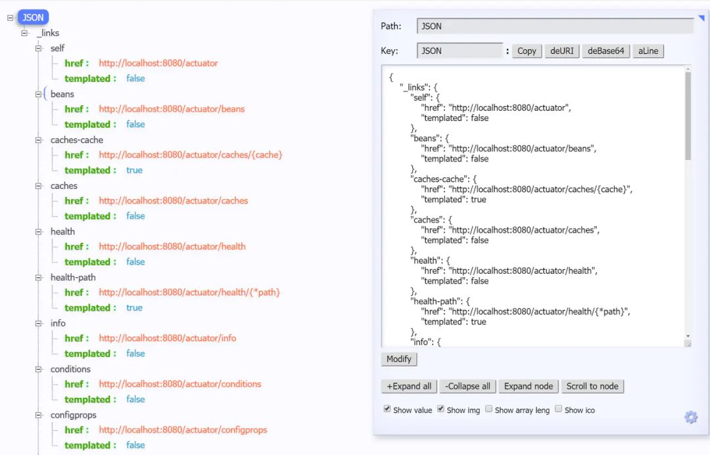
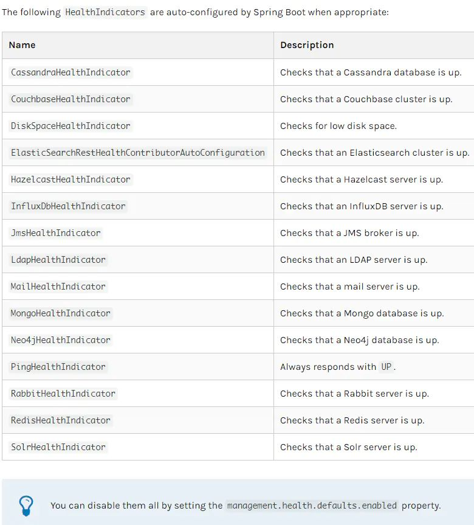
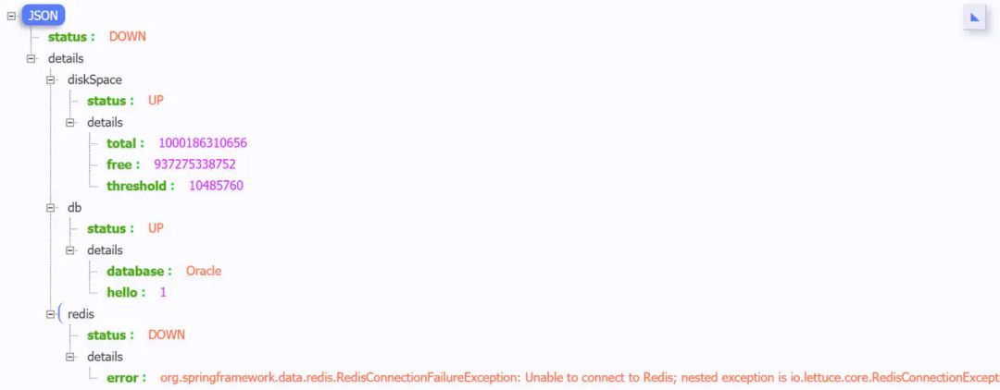
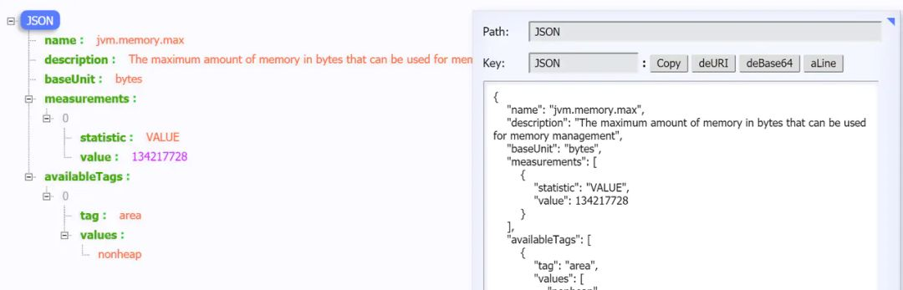
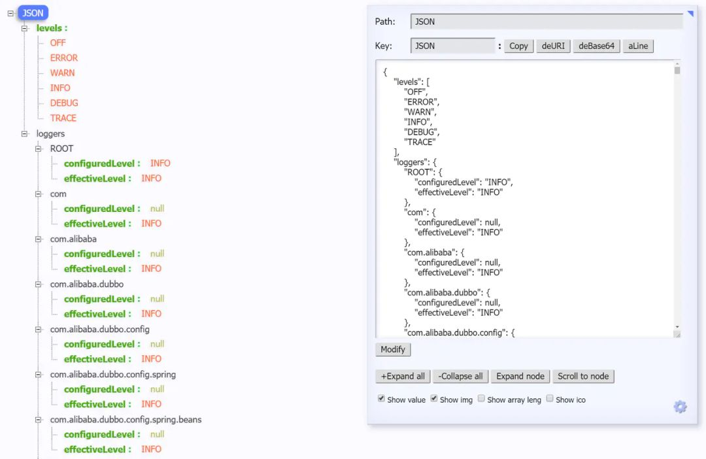
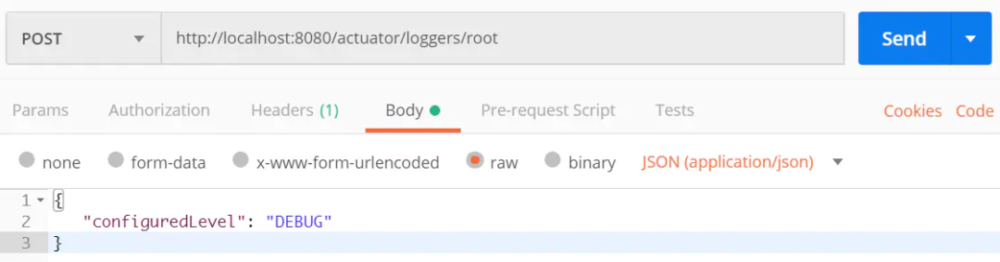
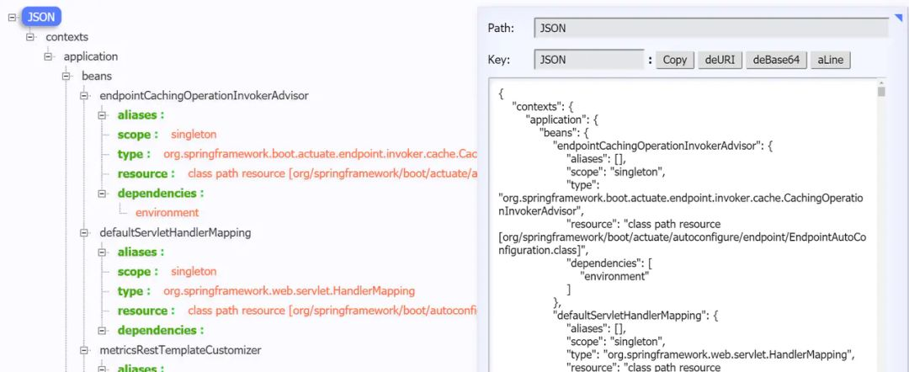
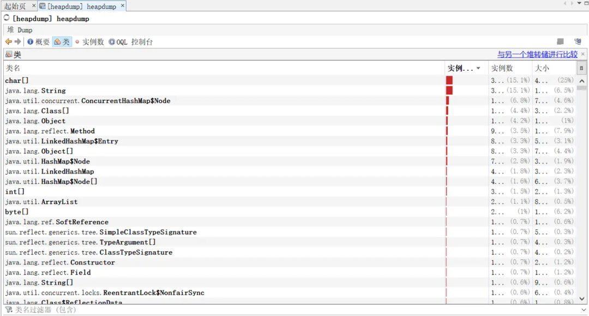

**前言**
------

去年我们项目做了微服务1.0的架构转型，但是服务监控这块却没有跟上。这不，最近我就被分配了要将我们核心的微服务应用全部监控起来的任务。我们的微服务应用都是SpringBoot 应用，因此就自然而然的想到了借助Spring Boot 的Actuator 模块。

本篇是我在完成这个工单之后，对Spring Boot Actuator模块 学习应用的总结。在本篇文章中，你可以学习到：

**1、**Spring Boot Actuator 的快速使用入门
**2、**Spring Boot Actuator 的一些重要的endpoints的介绍
**3、**如何通过Actuator 模块实时查看当前应用的线程 dump信息
**4、**如何通过Actuator 模块实时查看当前应用的堆信息
**5、**如何通过Actuator 模块实时修改当前应用的日志打印等级
**6、**...

之后我还会介绍：

TODO：SpringBoot 微服务应用集成Prometheus + Grafana实现监控告警

**一、什么是 Spring Boot Actuator**
------------------------------

Spring Boot Actuator 模块提供了生产级别的功能，比如健康检查，审计，指标收集，HTTP 跟踪等，帮助我们监控和管理Spring Boot 应用、Bean加载情况、环境变量、日志信息、线程信息，JVM 堆信息等 。这个模块是一个采集应用内部信息暴露给外部的模块，上述的功能都可以通过HTTP 和 JMX 访问。

因为暴露内部信息的特性，Actuator 也可以和一些外部的应用监控系统整合（Prometheus, Graphite, DataDog, Influx, Wavefront, New Relic等）。这些监控系统提供了出色的仪表板，图形，分析和警报，可帮助你通过一个统一友好的界面，监视和管理你的应用程序。

Actuator使用Micrometer与这些外部应用程序监视系统集成。这样一来，只需很少的配置即可轻松集成外部的监控系统。

> Micrometer 为 Java 平台上的性能数据收集提供了一个通用的 API，应用程序只需要使用 Micrometer 的通用 API 来收集性能指标即可。Micrometer 会负责完成与不同监控系统的适配工作。这就使得切换监控系统变得很容易。
> 
> 对比 Slf4j 之于 Java Logger 中的定位。

**二、快速开始，创建一个Spring Boot Actuator Demo**
----------------------------------------

我们先创建一个demo应用。

**你可以通过Spring Boot CLI 创建：**

    1. `spring init -d=web,actuator -n=actuator-demo actuator-demo`

**或者通过Spring Initializr 创建：**

**对应的maven依赖：**

    1. `\<dependencies\>`
    2. ` ...`
    3. `\<dependency\>`
    4. `\<groupId\>org.springframework.boot\</groupId\>`
    5. `\<artifactId\>spring-boot-starter-actuator\</artifactId\>`
    6. `\</dependency\>`
    7. ` ...`
    8. `\</dependencies\>`

**对应的Gradle 依赖：**

    1. `dependencies {`
    2. ` compile("org.springframework.boot:spring-boot-starter-actuator")`
    3. `}`

**三、Endpoints 介绍**
------------------

Spring Boot 提供了所谓的 endpoints （下文翻译为端点）给外部来与应用程序进行访问和交互。

打比方来说， `/health` 端点 提供了关于应用健康情况的一些基础信息。`metrics` 端点提供了一些有用的应用程序指标（JVM 内存使用、系统CPU使用等）。

这些 Actuator 模块本来就有的端点我们称之为原生端点。根据端点的作用的话，我们大概可以分为三大类：

**应用配置类：**获取应用程序中加载的应用配置、环境变量、自动化配置报告等与Spring Boot应用密切相关的配置类信息。

**度量指标类：**获取应用程序运行过程中用于监控的度量指标，比如：内存信息、线程池信息、HTTP请求统计等。

**操作控制类：**提供了对应用的关闭等操作类功能。

> 详细的原生端点介绍，请以官网为准，这里就不赘述徒增篇幅。

需要注意的就是：

**1、**每一个端点都可以通过配置来单独禁用或者启动

**2、**不同于Actuator 1.x，**Actuator 2.x 的大多数端点默认被禁掉**。Actuator 2.x 中的默认端点增加了 `/actuator`前缀。默认暴露的两个端点为 `/actuator/health`和 `/actuator/info`

**四、端点暴露配置**
------------

我们可以通过以下配置，来配置通过JMX 和 HTTP 暴露的端点。

PropertyDefault`management.endpoints.jmx.exposure.exclude`
`management.endpoints.jmx.exposure.include``\*``management.endpoints.web.exposure.exclude`
`management.endpoints.web.exposure.include``info,healt`

可以打开所有的监控点

    1. `management.endpoints.web.exposure.include=\*`

也可以选择打开部分，"\*" 代表暴露所有的端点，如果指定多个端点，用","分开

    1. `management.endpoints.web.exposure.exclude=beans,trace`

Actuator 默认所有的监控点路径都在 `/actuator/\*`，当然如果有需要这个路径也支持定制。

    1. `management.endpoints.web.base-path=/minitor`

设置完重启后，再次访问地址就会变成 `/minitor/\*`。

**现在我们按照如下配置：**

    1. `\# "\*" 代表暴露所有的端点 如果指定多个端点，用","分开`
    2. `management.endpoints.web.exposure.include=\*`
    3. `\# 赋值规则同上`
    4. `management.endpoints.web.exposure.exclude=`

启动DEMO程序，访问 `http://localhost:8080/actuator`，查看暴露出来的端点：

---

> 上面这样显示是因为chrome 浏览器安装了 JSON-handle 插件，实际上就是返回一大段json

下面，我会着重介绍几个比较重要的端点。

**五、重要端点解析**
------------

### 5.1 `/health`端点

`/health`端点会聚合你程序的健康指标，来检查程序的健康情况。端点公开的应用健康信息取决于：

    1. `management.endpoint.health.show-details=always`

该属性可以使用以下值之一进行配置：

NameDescription`never`不展示详细信息，up或者down的状态，默认配置`when-authorized`详细信息将会展示给通过认证的用户。授权的角色可以通过 `management.endpoint.health.roles`配置`always`对所有用户暴露详细信息

按照上述配置，配置成 `always`之后，我们启动项目，访问 `http://localhost:8080/actuator/health`端口，可以看到这样的信息：

是不是感觉好像健康信息有点少？先别急，那是因为我们创建的是一个最基础的Demo项目，没有依赖很多的组件。

`/health`端点有很多自动配置的健康指示器：如redis、rabbitmq、db等组件。当你的项目有依赖对应组件的时候，这些健康指示器就会被自动装配，继而采集对应的信息。如上面的 diskSpace 节点信息就是 `DiskSpaceHealthIndicator` 在起作用。

> 上述截图取自官方文档

这是我另一个项目的 `/health`端点信息。

当如上的组件有一个状态异常，应用服务的整体状态即为down。我们也可以通过配置禁用某个组件的健康监测。

    1. `management.health.mongo.enabled: false`

**或者禁用所有自动配置的健康指示器：**

    1. `management.health.defaults.enabled: false`

#### ⭐自定义 Health Indicator

当然你也可以自定义一个Health Indicator，只需要实现 `HealthIndicator` 接口或者继承 `AbstractHealthIndicator`类。

    1. `/\*\*`
    2. ` \* @author Richard\_yyf`
    3. ` \* @version 1.0 2020/1/16`
    4. ` \*/`
    5. `@Component`
    6. `publicclassCustomHealthIndicatorextendsAbstractHealthIndicator{`
    7. 
    8. `@Override`
    9. `protectedvoid doHealthCheck(Health.Builder builder) throwsException{`
    10. `// 使用 builder 来创建健康状态信息`
    11. `// 如果你throw 了一个 exception，那么status 就会被置为DOWN，异常信息会被记录下来`
    12. ` builder.up()`
    13. `.withDetail("app", "这个项目很健康")`
    14. `.withDetail("error", "Nothing, I'm very good");`
    15. `}`
    16. `}`

**最终效果：**

### 5.2 `/metrics`端点

`/metrics`端点用来返回当前应用的各类重要度量指标，比如：内存信息、线程信息、垃圾回收信息、tomcat、数据库连接池等。

    1. `{`
    2. `"names": [`
    3. `"tomcat.threads.busy",`
    4. `"jvm.threads.states",`
    5. `"jdbc.connections.active",`
    6. `"jvm.gc.memory.promoted",`
    7. `"http.server.requests",`
    8. `"hikaricp.connections.max",`
    9. `"hikaricp.connections.min",`
    10. `"jvm.memory.used",`
    11. `"jvm.gc.max.data.size",`
    12. `"jdbc.connections.max",`
    13. `....`
    14. `]`
    15. `}`

不同于1.x，Actuator在这个界面看不到具体的指标信息，只是展示了一个指标列表。为了获取到某个指标的详细信息，我们可以请求具体的指标信息，像这样：

    1. `http://localhost:8080/actuator/metrics/{MetricName}`

比如我访问 `/actuator/metrics/jvm.memory.max`，返回信息如下：

你也可以用query param的方式查看单独的一块区域。比如你可以访问 `/actuator/metrics/jvm.memory.max?tag=id:Metaspace`。结果就是：

### 5.3 `/loggers`端点

`/loggers` 端点暴露了我们程序内部配置的所有logger的信息。我们访问 `/actuator/loggers`可以看到，

你也可以通过下述方式访问单独一个logger，

    1. `http://localhost:8080/actuator/loggers/{name}`

比如我现在访问 `root` logger， `http://localhost:8080/actuator/loggers/root`

    1. `{`
    2. `"configuredLevel": "INFO",`
    3. `"effectiveLevel": "INFO"`
    4. `}`

#### ⭐改变运行时的日志等级

#### `/loggers`端点我最想提的就是这个功能，能够动态修改你的日志等级。

比如，我们可以通过下述方式来修改 `root` logger的日志等级。我们只需要发起一个URL 为 `http://localhost:8080/actuator/loggers/root`的 `POST`请求，POST报文如下：

    1. `{`
    2. `"configuredLevel": "DEBUG"`
    3. `}`

仔细想想，这个功能是不是非常有用。**如果在生产环境中，你想要你的应用输出一些Debug信息以便于你诊断一些异常情况，你你只需要按照上述方式就可以修改，而不需要重启应用。**

> 如果想重置成默认值，把value 改成 `null`

### 5.4 `/info`端点

`/info`端点可以用来展示你程序的信息。我理解过来就是一些程序的基础信息。并且你可以按照自己的需求在配置文件 `application.properties`中个性化配置（默认情况下，该端点只会返回一个空的json内容。）：

    1. `info.app.name=actuator-test-demo`
    2. `info.app.encoding=UTF-8`
    3. `info.app.java.source=1.8`
    4. `info.app.java.target=1.8`
    5. `\# 在 maven 项目中你可以直接用下列方式引用 maven properties的值`
    6. `\# info.app.encoding=@project.build.sourceEncoding@`
    7. `\# info.app.java.source=@java.version@`
    8. `\# info.app.java.target=@java.version@`

启动项目，访问 `http://localhost:8080/actuator/info`：

    1. `{`
    2. `"app": {`
    3. `"encoding": "UTF-8",`
    4. `"java": {`
    5. `"source": "1.8.0\_131",`
    6. `"target": "1.8.0\_131"`
    7. `},`
    8. `"name": "actuator-test-demo"`
    9. `}`
    10. `}`

### 5.5 `/beans`端点

`/beans`端点会返回Spring 容器中所有bean的别名、类型、是否单例、依赖等信息。

访问 `http://localhost:8080/actuator/beans`，返回如下：

### 5.6 `/heapdump` 端点

访问：`http://localhost:8080/actuator/heapdump`会自动生成一个 Jvm 的堆文件 heapdump。我们可以使用 JDK 自带的 Jvm 监控工具 VisualVM 打开此文件查看内存快照。

### 5.7 `/threaddump` 端点

这个端点我个人觉得特别有用，方便我们在日常定位问题的时候查看线程的情况。主要展示了线程名、线程ID、线程的状态、是否等待锁资源、线程堆栈等信息。就是可能查看起来不太直观。访问 `http://localhost:8080/actuator/threaddump`返回如下：

### 5.8 `/shutdown`端点

这个端点属于操作控制类端点，可以优雅关闭 Spring Boot 应用。要使用这个功能首先需要在配置文件中开启：

    1. `management.endpoint.shutdown.enabled=true`

由于 **shutdown 接口默认只支持 POST 请求**，我们启动Demo项目，向 `http://localhost:8080/actuator/shutdown`发起 `POST`请求。返回信息：

    1. `{`
    2. `"message": "Shutting down, bye..."`
    3. `}`

然后应用程序被关闭。

由于开放关闭应用的操作本身是一件**非常危险**的事，所以真正在线上使用的时候，我们需要对其加入一定的保护机制，比如：**定制Actuator的端点路径、整合Spring Security进行安全校验**等。（不是特别必要的话，这个端点不用开）

**六、整合Spring Security 对端点进行安全校验**
---------------------------------

由于端点的信息和产生的交互都是非常敏感的，必须防止未经授权的外部访问。如果您的应用程序中存在**Spring Security**的依赖，则默认情况下使用**基于表单的HTTP身份验证**来保护端点。

如果没有，只需要增加对应的依赖即可：

    1. `\<dependency\>`
    2. `\<groupId\>org.springframework.boot\</groupId\>`
    3. `\<artifactId\>spring-boot-starter-security\</artifactId\>`
    4. `\</dependency\>`

添加之后，我们需要定义安全校验规则，来覆盖Spring Security 的默认配置。

这里我给出了两个版本的模板配置：

    1. `import org.springframework.boot.actuate.autoconfigure.security.servlet.EndpointRequest;`
    2. `import org.springframework.boot.actuate.context.ShutdownEndpoint;`
    3. `import org.springframework.boot.autoconfigure.security.servlet.PathRequest;`
    4. `import org.springframework.context.annotation.Configuration;`
    5. `import org.springframework.security.config.annotation.web.builders.HttpSecurity;`
    6. `import org.springframework.security.config.annotation.web.configuration.WebSecurityConfigurerAdapter;`
    7. 
    8. `/\*\*`
    9. ` \* @author Richard\_yyf`
    10. ` \*/`
    11. `@Configuration`
    12. `publicclassActuatorSecurityConfigextendsWebSecurityConfigurerAdapter{`
    13. 
    14. `/\*`
    15. ` \* version1:`
    16. ` \* 1\. 限制 '/shutdown'端点的访问，只允许ACTUATOR\_ADMIN访问`
    17. ` \* 2\. 允许外部访问其他的端点`
    18. ` \* 3\. 允许外部访问静态资源`
    19. ` \* 4\. 允许外部访问 '/'`
    20. ` \* 5\. 其他的访问需要被校验`
    21. ` \* version2:`
    22. ` \* 1\. 限制所有端点的访问，只允许ACTUATOR\_ADMIN访问`
    23. ` \* 2\. 允许外部访问静态资源`
    24. ` \* 3\. 允许外部访问 '/'`
    25. ` \* 4\. 其他的访问需要被校验`
    26. ` \*/`
    27. 
    28. `@Override`
    29. `protectedvoid configure(HttpSecurity http) throwsException{`
    30. `// version1`
    31. `// http`
    32. `// .authorizeRequests()`
    33. `// .requestMatchers(EndpointRequest.to(ShutdownEndpoint.class))`
    34. `// .hasRole("ACTUATOR\_ADMIN")`
    35. `// .requestMatchers(EndpointRequest.toAnyEndpoint())`
    36. `// .permitAll()`
    37. `// .requestMatchers(PathRequest.toStaticResources().atCommonLocations())`
    38. `// .permitAll()`
    39. `// .antMatchers("/")`
    40. `// .permitAll()`
    41. `// .antMatchers("/\*\*")`
    42. `// .authenticated()`
    43. `// .and()`
    44. `// .httpBasic();`
    45. 
    46. `// version2`
    47. ` http`
    48. `.authorizeRequests()`
    49. `.requestMatchers(EndpointRequest.toAnyEndpoint())`
    50. `.hasRole("ACTUATOR\_ADMIN")`
    51. `.requestMatchers(PathRequest.toStaticResources().atCommonLocations())`
    52. `.permitAll()`
    53. `.antMatchers("/")`
    54. `.permitAll()`
    55. `.antMatchers("/\*\*")`
    56. `.authenticated()`
    57. `.and()`
    58. `.httpBasic();`
    59. `}`
    60. `}`

`application.properties`的相关配置如下：

    1. `\# Spring Security Default user name and password`
    2. `spring.security.user.name=actuator`
    3. `spring.security.user.password=actuator`
    4. `spring.security.user.roles=ACTUATOR\_ADMIN`

**结语**
------

本篇文章内容就到这里。

对应的源码可以Github上看到。

https://github.com/Richard-yyf/springboot-actuator-prometheus-test

参考
--

https://docs.spring.io/spring-boot/docs/current/reference/html/production-ready-features.html

http://www.ityouknow.com/springboot/2018/02/06/spring-boot-actuator.html