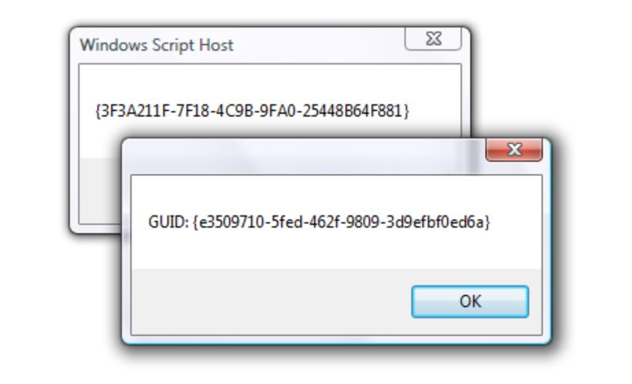

访问欠友好的 UUID

我刚读了一篇有关如何扩展数据库的文章，作者建议将 UUID（类似于 GUID）用作数据库表的主键（PK）。

**使用 UUID 的优点**

与自动递增整数相比，将 UUID 用作主键的优点很多：

* **适合大规模数据。**当你把数据分片（例如一组客户数据）存在多个数据库时，使用 UUID 意味着 ID 在所有数据分片中都是唯一，而不仅仅是当前那个分片所在数据库。这使得跨数据库移动更为安全。在我的环境，所有数据库分片都可以简单合并到 Hadoop 集群中，不会有主键冲突的问题。
* **在插入数据之前就可以知道 PK**，这避免了查询 DB 开销，并简化了事务逻辑，比如在使用该键作为其它表外键（FK）时，需要预先获得这个 PK
* **UUID 不会泄露数据信息**，因此在 URL中暴露会更安全。如果一个用户 ID 是 12345678，很容易猜到还有用户 12345677 和 1234569，这构成了攻击因素。（请参见下面的更好的选择）。

**使用 UUID 的缺点**

**不直观**

很多人直接使用 UUID （类似像70E2E8DE-500E-4630-B3CB-166131D35C21 ）作为字符串，例如 varchar(36) — 请不要这样做！

你可能会说没有人会这么干。

这个问题请三思 — 我曾接手过某些大公司中两个非常大的数据库案例，这恰恰是现实。除了 9 倍大小的开销（int 的大小为 4 字节），字符串的排序速度也不如数值型字段快，因为它们依赖于排序规则。

在一家最初决定使用 Latin-1 字符集的公司中，情况就更麻烦。当我们需要将字符集转换为 UTF-8 时，几个复合键索引就存不下更改后的字符串。

**UUID 的痛苦**

不要低估字段太长无法口头表达及记住的痛苦。

**规划扩展计划**

如果我们的目标是扩展，是真正地扩展，那么首先要承认，int 在许多情况下不够大，4 字节最大值限制在 20 亿左右。我们很多数据库都有超过 20 亿笔交易。

因此在这些情况下需要使用 bigint，它占用 8 个字节。还可以使用一些其他策略，诸如 PostgreSQL 和 SQL Server 等数据库都有本机类型，可以使用 16 个字节存储。

这时候，谁会在乎它的大小是 bigint 两倍或 int 的四倍呢？毕竟也只是几个字节，对不对？

**规范化数据库中主键的问题**

如果你拥有一个规范的数据库（就像我们目前所在的公司一样），每个主键连接的外键都存在逐渐增加开销。

不仅体现在磁盘上，还包括连接查询和排序过程中，这些外键都需要存在于内存中。尽管内存越来越便宜，但无论是磁盘还是 RAM，它们都是有限的资源，也都不是免费的。

我们的数据库有很多中间表，这些中间表是指向其他表外键的容器，尤其是在一对多关系中。帐户具有多个卡号、地址、电话号码，用户名等。对于具有数十亿用户的一组表中的每个列，外键带来额外空间会迅速增加。

**对随机字符串排序真的很麻烦**

另一个问题是碎片化 — 由于 UUID 是随机的，它们没有自然顺序，因此不能用于聚集索引（clustering index）。这就是为什么 SQL Server 实现了newsequentialid()，它适合在聚集索引中使用，并且可能是所有 UUID 主键的一个正确实现。

(见 https://msdn.microsoft.com/en-us/library/ms189786.aspx )

其他数据库 PostgreSQL，MySQL 也可能有类似的解决方案。

**主键不应该公开，即使是 UUID**

根据定义，主键在其范围内是唯一的。因此，用作用户 ID 或在 URL 中当做唯一标识是很自然的事情。

但是别这样做！我认为在任何公共场合暴露主键是一个很不好的做法。

前面提到，简单的使用自动递增 ID 的问题是，它很容易被猜测。攻击爬虫会不断猜测，直到找到一个存在的为止（即使你转向 UUID 爬虫也可能会尝试，但猜中的概率就变得非常的低）。

尝试猜测一个 UUID 可能是愚蠢的事，但是微软也警告过，引入 newsequentialid() 来解决聚集索引问题，它使得它的数字更容易被猜测。

**主键不需要修改（直到有人这样做）**

有令人信服的理由，不在任何公共语境暴露主键：比如你修改了数据表结构定义，所有外部引用被打破，想想遍地的“404 Page Not Found”页面吧。

何时需要更改主键？碰巧的是，我们本周正在进行数据迁移，谁能在 2003 年公司成立之初就能预知现在存在 13 个海量 SQL Server 数据库并且还在迅速增长？

不要说“从不用修改”，我已经经历过好几次。事先规划简单，但当你数据万亿级别时候，很难修复。

我目前公司的环境是一个很好的例子，说明了为什么需要 UUID，以及它的成本高昂，为什么对外暴露主键是一个问题。

**我的内部系统是对外的**

我管理 Hadoop 集群每晚都会从所有数据库中接收数据。Hadoop 系统连接（绑定）到 SQL Server 数据库，这也正常 — 毕竟我们是同一家公司。

尽管如此，为了消除多个数据库中冲突的主键，我们通过连接两个字段：用户 ID（基于我们设计，它在所有库中是唯一的），再加上业务表本身的 ID（存在多库冲突），生成了一个伪主键。

通过这样做，我们在多年的历史用户数据之间建立了紧密而有效的永久绑定。如果 RDBMS 中的一些主键发生了变化，我们数据也得更改这些主键，否则我们会在前后遇到一些可怕的情况。

**两者兼顾：****内部整型，外部 UUID？**

简而言之，可采用两者兼顾的方法，我已经在几种不同场景下使用过这种解决方案。（不过注意：这不是一个好的解决方案，请参阅下面 Chris 评论）。

在内部，数据库使用简短高效的连续数字作为主键（int 或 bigint）。

然后添加一个 UUID 的字段（可以使用插入时的触发器）。在数据库本身的范围内，可以使用常规的主键和外键来管理关系。

当需要将数据的引用公开给外部世界时，即使“外部”对应另外一个内部系统，它们也必须仅依赖 UUID。

这样，如果确实必须更改内部主键，则可以确保它仅作用于一个数据库。（注意：正如 Chris 观察到的那样，这样也有缺陷）

我们在另一家公司使用此策略来存储客户数据，只是为了避免“可猜测的”问题。（注意：避免与防止不同，请参见下文）。

在另一种情况下，我们将生成一小段文本（例如在本文原文的地址中），从而使 URL 更加人性化。如果有重复项，则只需附加一个哈希值。

即使作为“第二主键”，直接以字符串形式使用 UUID 也是错误的：我更希望使用内置的数据库机制，将其存储为 8 字节整型数字。

使用整型是因为它们更高效有效。使用 UUID 的数据库实现用于混淆的外部引用。

克里斯·罗素（Chris Russell）正确回应了本文的原始帖子，指出了两个重要的逻辑错误。

首先，即使公开主键的替代品 UUID 也会暴露信息，这在使用 newsequentialid 函数时尤其如此 — 为了安全，请勿使用 UUID。

其次，如果内部的主键是整型值，仍然存在合并两个数据库的键冲突问题，除非所有键都加倍增大……在这种情况下，只使用 UUID。

因此，正确的做法是：使用 UUID 当做主键，并且永远不要公开它们。内外影射的事情留给诸如友好 URL 处理之类的模块，类似 Medium 那样使用哈希值。

谢谢 Chris！（译者：Chris 评论请参看原文链接中的评论部分）

**参考资料及致谢**

感谢 Ruby 周刊（尽管我已经转到 Scala，我仍然经常阅读），Starr Horne 在 Honeybadger.io 上的博客， 以及 StackOverflow 的联合创始人 Jeff Atwood 的 Coding Horror 博客上有趣而精巧的文章；感谢Stackoverflow 旗下网站 dba.stackexchange.com 上相关提问、MySqlserverTeam 的文章，还包括 theBuild.com 以及前文提到的 MSDN。

**附注：****为什么写这篇博客**

通过写这篇文章，我也学到了很多东西。

某个周日下午正在阅读电子邮件，然后遇到了 Starr 的一篇有趣的帖子，我觉得他的方法可能会产生一些意料外的结果。因此，我通过 Google 搜索和学习了更多有关 UUID 的方法，并且改变了我对 UUID 使用的基本理解和态度。

在撰写本文的一半时，我向公司的技术负责人发送了电子邮件，想知道我们是否考虑过我讨论的这些话题。希望我们用过的方法没有问题，避免计划于本周发布的代码出现什么意外。

请注意，我所做的这些都是出于完全自私的原因 :-)

希望你也喜欢它！

Image Credit：

http://unlockforus.blogspot.com/2008/03/advanced-how-to-creategenerate-new-guid.html

原文链接：

https://tomharrisonjr.com/uuid-or-guid-as-primary-keys-be-careful-7b2aa3dcb439

在你的项目中，是否有更好的 UUID 及主键做法？欢迎留言。