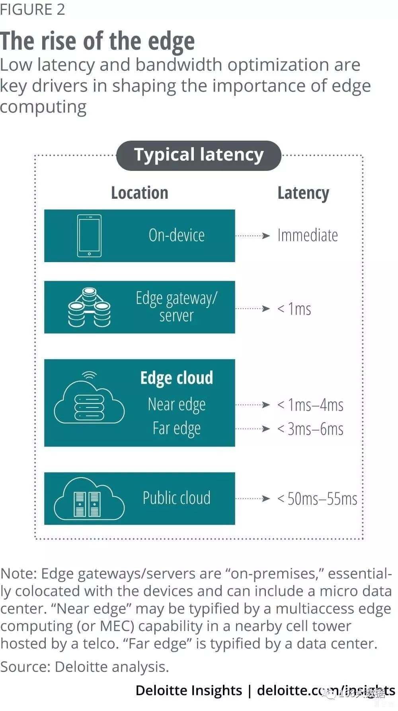
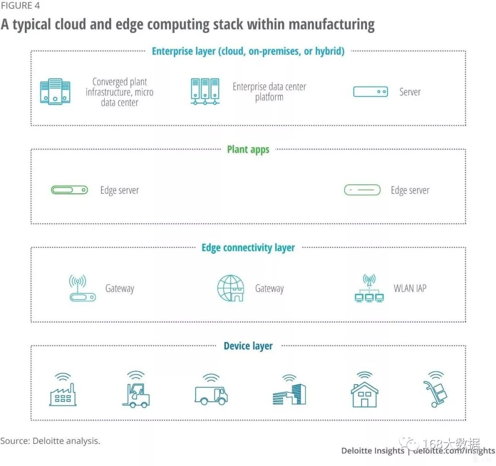
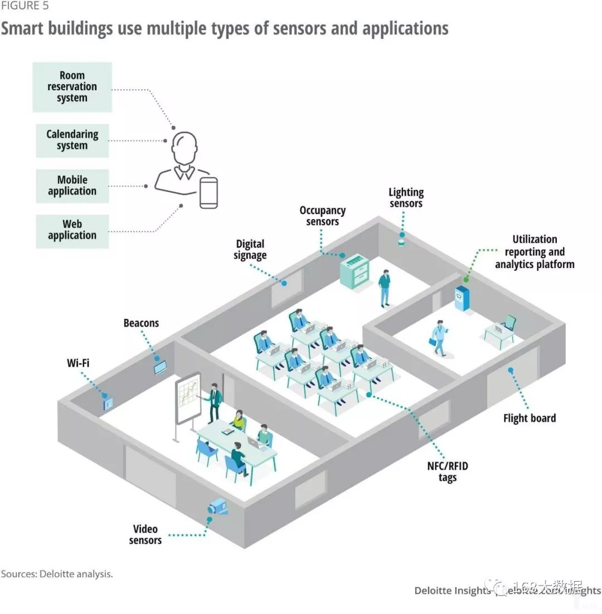

随着物联网等技术的不断发展、数据的不断增加，基于云的物联网解决方案渐渐无法满足人们日益增长的需求，越来越多的企业开始将目光转向边缘计算，并将其作为云的延伸扩展，以加快数据分析的速度，便于企业更快更好的做出决策。

几年前，大多数人都期望将物联网部署至云端——这的确可以给个人用户带来便捷的使用体验，但构建企业级的物联网解决方案，仍然需要采用云计算和边缘计算的结合方案。与纯粹的云端解决方案相比，包含边缘侧的混合方案可以减少延迟、提高可扩展性、增强对信息的访问量，并使业务开发变得更加敏捷。

那么，企业在物联网解决方案中需要如何做才能最佳地利用边缘和云的力量呢？为了阐明这一问题，本文将首先介绍边缘计算与云计算分别所扮演的角色，进而解释为什么企业需要边缘计算以及如何选择边云协同的解决方案，最后再阐述边缘计算的复杂性，并提供一些用例。

### 什么是边缘计算？

边缘计算是一种分布式处理和存储的体系结构，它更接近数据的源头。例如，带有视觉处理功能的摄像头、通过蓝牙向手机发送数据的可穿戴医疗设备等都利用到了边缘计算。与云计算相比，边缘计算更靠近终端，存在诸多优良特性，因此，边缘计算和云计算的混合使用通常被认为是构建企业级物联网解决方案的最佳实践。

图1 边缘计算经常使用的关键组件

### 云爆炸和延迟

经过十多年的发展，现如今，我们已经步入云应用爆炸时代。诚然，云在成本、效益、规模、自动化、互操作性和集中性等方面能为企业带来许多好处，因此大量IT公司的服务完全存在于云上或在很大程度上依赖于云。

与此同时，传感器设备的数量及其生成的数据量也在迅猛增长，预计这一趋势在未来几年还会持续下去。不只是数据来源广、数据量庞大，其采集的数据往往在几毫秒内就会发生重大的变化，因此企业将数据转换为洞察力再转换为执行力的速度就显得尤为关键。

那么，如何在数据从生成到决策再到执行的整个过程中保持尽可能小的延迟？光速是数据传输的速度极限，因此，只有通过缩短数据传输的距离，才能从真正意义上降低延迟。在一个只有“云”的世界中，数据可能要传输数百甚至数千英里，延迟在所难免，而边缘计算可以有效解决这一问题。

据估计，未来55%的物联网数据将在数据源头附近进行处理，包括设备端和边缘侧。由于延迟的减少能够显著提高响应时间、从而节省时间和金钱，因此，不断增长的数据需求下，解决延迟问题将成为重点。

图2 从设备层到公共云不同层级的延迟时间范围

低延迟只是推动物联网解决方案向边缘计算扩展的众多原因之一，在物联网解决方案中，边缘计算的好处还有很多。

### 云和边缘的平衡

物联网解决方案对企业的敏捷式开发具有巨大的推动作用，下面介绍几种基于边缘和云的物联网解决方案的案例。

**智能工厂******

随着物联网等技术的不断发展，企业正迅速向数字化和自动化的业务流程转型。与此同时，许多制造商在世界各地遍布工厂，每个工厂通常都具有各自的特性和功能需求。因此，云计算凭借自身的优势在企业转型智能制造中扮演着重要角色。通过云，企业可以跨地域在全球范围内监视系统和流程，从而能对整个运营状况进行对比分析，确定最佳的投资比例。由此可见，对于企业来讲，云平台或者数据中心是不可或缺的。

尽管优点明显，但企业期望通过云平台或数据中心集中维护所有的数据，却显得过于庞大也不太现实。因此，企业只有结合边缘云架构，才能给智能工厂提供快速且几乎不受阻碍的连接。

图4 边缘和云如何与设备层中的传感器一起工作

设备层（device layer） 表示连接到本地局域网或物联网的单个设备部件，以实现即时交互。这一层的机器学习（ML）是基于云中训练的ML模型完成的。大量的原始设备数据也存储在这一层。

设备层提供对单个设备的可见性和控制，而工厂应用层（ plant apps layer ）提供对工厂中所有连接设备的可见性和控制。边缘层（edge connectivity layer）提供了单个设备和工厂应用层之间必要的连接。

企业层（enterprise layer）是云托管的，主要提供跨多个工厂的可见性和控制。这一层级在企业层面进行分析、预测和决策，根据整个工厂的数据训练ML算法模型，然后将训练和分析的结果“推”向边缘层级，最终下发至每个设备实现智能化操作。

**智能建筑******

随着智能网联技术的兴起，无论是办公室、零售店、工厂还是医院，智能建筑都变的更加高效、更加舒适、更加便捷，为居住者带来独特的体验。据了解，智能建筑将自动化操作与空间管理相结合，可以有效增强用户体验、提高生产力、降低成本以及网络安全风险。此外，智能建筑能更好地控制基础设施和开展业务，使开发商能够节约空间、能源、水源和人力等资源。

图5 在智能建筑中使用的不同类型的物联网设备

另外，建筑物生命周期中75% -80%的成本与其后期运营有关。现在很多商业住宅和办公大楼都有自动化控制或管理系统，例如通暖、中央空调以及嵌入传感器的智能照明系统等，它们都能与云平台或者边缘层级的主系统交互。其中，边缘服务器或网关通常用于发回云平台分析的结果，优化设备的操作或者调度。总之，边缘计算和云计算为建筑物提供了更加智能的资源管理。

### 构建边云解决方案面临的挑战

虽然边缘计算提供了实实在在的好处，但也带来了操作和设计的复杂性。一方面，边缘计算是高度分布式的，分布在办公室、工厂、校园等场所，有些甚至分布在遥远的、难以访问的地方。另一方面，任何一家企业都可能拥有数千台设备和数百个网关，所有这些边缘节点都安装有固件、操作系统、各种形式的虚拟机和软件，其中一些需要由制造商提供，另一些则需要由第三方解决方案提供商提供。因此，所有边缘节点都要由适当的管理员进行管理和维护，例如备份、补丁、更新和监视。

边缘计算潜在的问题还有很多，在高度分布式模型中，排除故障也是非常困难的。一般情况下，外勤技术人员需要到现场处理升级或者维修设备。因此在这种应用场景下，迫切需要类似于“软件定义一切”（software defined everything）的方法，因为软件升级比硬件升级更容易、更方便。

**持续的更新******

尽管面临诸多挑战，但通过提供一定程度的自动化服务和工具，云计算消除了人们对许多IT问题的担忧。与之相对的，边缘计算也要执行数据采集、程序更新、设备管理和监控、机器学习模型更新等高级功能，而且这些功能需要复制到所有边缘节点和集群。这是一项艰巨的任务，甚至在一定程度上超过业务本身的需求。

**管理策略******

传统数据中心使用的管理策略和实践通常不适用于边缘部署，边缘部署分布在多个位置，比传统数据中心更具动态性。承担这样一个系统的业务管理是一项复杂的任务。

**成本******

虽然云提供了随需应变的可扩展性，并且易于配置，具有自动化和弹性，但是在边缘提供这些功能是相当昂贵和复杂的。为了适应现有边缘部署的扩展，除了增加设备和边缘节点的数量，可能还需要在额外的硬件和软件上进行大量的投资，并进行许多复杂的工作。

**网络安全******

通过多个节点和设备将云和数据中心扩展到边缘，可能会成倍地增加网络攻击的表面积。不安全的设备和边缘节点，有可能成为企业网络中有价值资产的非法侵入点，或被用于其他邪恶的目的，如分布式拒绝服务攻击。因此，维护边缘层所有资产的实体和网络安全是一项复杂而关键的任务。

### 如何确定物联网对边缘计算的需求？

相对来讲，边缘计算是非常复杂和昂贵的、有一定风险的和浪费资源的，因此要做好风险/回报评估，谨慎决定是否在物联网解决方案中扩展边缘计算。

在许多物联网用例中，考虑与现有操作技术的匹配，为物联网解决方案添加云托管组件需要一定程度的边缘计算能力（主要是网关）。同样，要实现智能建筑、智能工厂管理系统，也需要使用一些边缘处理功能。

**仅使用边缘或云面临可扩展性问题******

对于一个大型物联网系统来说，先不考虑做其他任何处理，只是将所有数据发送到云端计算，就会在带宽使用上面临可扩展性的问题，可能需要不断升级网络基础设施。此外，随着实际应用中业务的扩展，私有云的使用还需要重新配置，可能需要手动干预才能实现负载平衡。

不仅是云计算，完全基于边缘的分布式体系结构的复杂程度不亚于此，且随着设备规模的增加而增加。边缘系统和应用程序管理也是非常复杂的，而且成熟的自动化工具还没有实现。在许多情况下，边缘部署也没有充分考虑可扩展性，导致设备部署的更复杂。

### 如何去做？

第一步是评估是否需要边缘计算。倘若不需要边缘计算，企业即可安排纯云解决方案。但如果需要边缘处理，下一步则需要确定边缘所需的功能，然后确定最合适的部署模型，因为边缘处理可以在设备、网关、边缘服务器上进行，而不同的模型在计算能力、响应能力和位置方面可能有很大的差异。

在某些情况下，将用户配置的需求打包成单独的功能包可以简单方便的使用，但可能会牺牲灵活性。而为用户提供灵活的自构建的功能组件很有吸引力，但这会延长交付时间，并带来一些固有的风险。

另一个值得注意的是边缘计算供应商的发展变化。大多数物联网基础设施或平台供应商都认识到，边缘计算是许多物联网解决方案成功交付的重要组成部分，如网关或服务器都需要具有一些数据处理、数据分析和本地存储功能。除此之外，硬件供应商还倾向于依赖其他厂商进行设备管理、协议处理和转换。随着供应商越来越积极的寻求“端到端”的解决方案，这一领域可能会出现重大整合。

物联网设备及其提供的数据正在改变着世界，改变着我们的生活和工作方式。目前基于云的物联网解决方案已经得到成熟的运用，未来在大多数情况下，物联网解决方案将包括边缘和云的混合。因此，在物联网解决方案中要正确的平衡边缘和云的功能，不同配置的边缘计算有不同的优势和劣势。企业在设计和构建任何一个物联网解决方案时，都应该考虑到各种因素。

相对而言，即使实际业务需要复杂的设计，物联网解决方案也应该尽可能的简单。这看起来简单做起来却很难，边缘模式的选择可能会对解决方案的成功与否产生影响。

显然，在物联网解决方案中，云计算和边缘计算孰好孰坏没有统一的定论。具体问题具体分析，不同的情况需要不同的解决方案。然而从发展方向来看，云计算和边缘计算之间的协同很可能构成未来的物联网架构。

来源：Deloitte