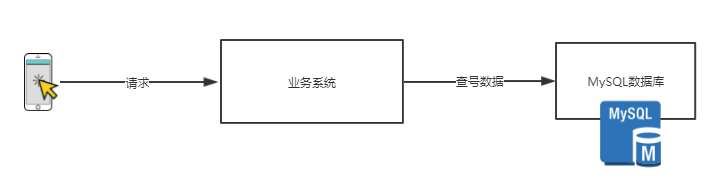
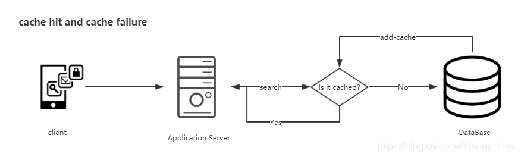
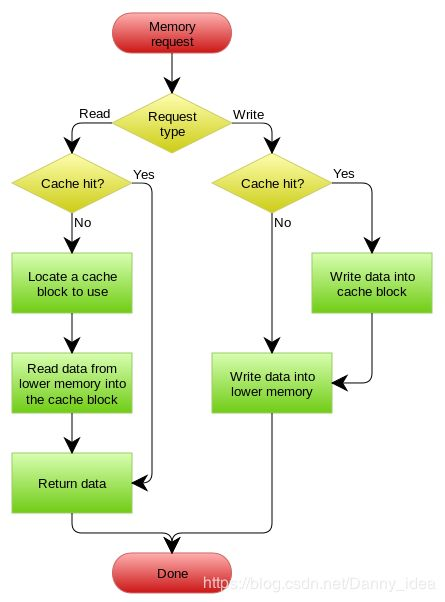
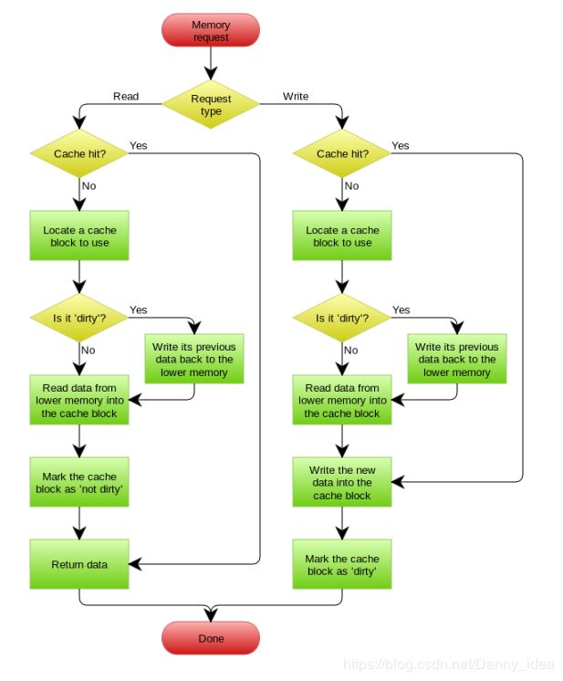
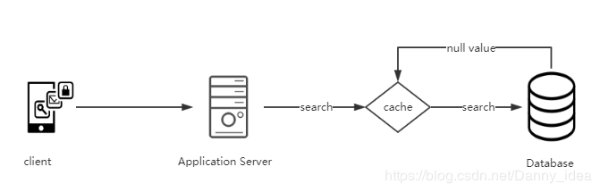

在实际的开发当中，我们经常需要进行磁盘数据的读取和搜索，因此经常会有出现从数据库读取数据的场景出现。

但是当数据访问量次数增大的时候，过多的磁盘读取可能会最终成为整个系统的性能瓶颈，甚至是压垮整个数据库，导致系统卡死等严重问题。

常规的应用系统中，我们通常会在需要的时候对数据库进行查找，因此系统的大致结构如下所示：

当数据量较高的时候，需要减少对于数据库里面的磁盘读写操作，因此通常都会选择在业务系统和MySQL数据库之间加入一层缓存从而减少对数据库方面的访问压力。

但是很多时候，缓存在实际项目中的应用并非这么简单。下边我们来通过几个比较经典的缓存应用场景来列举一些问题：

1.缓存和数据库之间数据一致性问题
-----------------

常用于缓存处理的机制我总结为了以下几种：

* Cache Aside
* Read Through
* Write Through
* Write Behind Caching

首先来简单说说Cache aside的这种方式：

**Cache Aside模式**

这种模式处理缓存通常都是先从数据库缓存查询，如果缓存没有命中则从数据库中进行查找。

这里面会发生的三种情况如下：

**缓存命中：**

当查询的时候发现缓存存在，那么直接从缓存中提取。

**缓存失效：**

当缓存没有数据的时候，则从database里面读取源数据，再加入到cache里面去。

**缓存更新：**

当有新的写操作去修改database里面的数据时，需要在写操作完成之后，让cache里面对应的数据失效。

这种Cache aside模式通常是我们在实际应用开发中最为常用到的模式。但是并非说这种模式的缓存处理就一定能做到完美。

关于这种模式下依然会存在缺陷。

比如，一个是读操作，但是没有命中缓存，然后就到数据库中取数据，此时来了一个写操作，写完数据库后，让缓存失效，然后，之前的那个读操作再把老的数据放进去，所以，会造成脏数据。

Facebook的大牛们也曾经就缓存处理这个问题发表过相关的论文，链接如下:

> https://www.usenix.org/system/files/conference/nsdi13/nsdi13-final170\_update.pdf

分布式环境中要想完全的保证数据一致性是一件极为困难的事情，我们只能够尽可能的减低这种数据不一致性问题产生的情况。

**Read Through模式**

Read Through模式是指应用程序始终从缓存中请求数据。如果缓存没有数据，则它负责使用底层提供程序插件从数据库中检索数据。检索数据后，缓存会自行更新并将数据返回给调用应用程序。使用Read Through 有一个好处。

我们总是使用key从缓存中检索数据, 调用的应用程序不知道数据库， 由存储方来负责自己的缓存处理，这使代码更具可读性， 代码更清晰。

但是这也有相应的缺陷，开发人员需要给编写相关的程序插件，增加了开发的难度性。

**Write Through模式**

Write Through模式和Read Through模式类似，当数据发生更新的时候，先去Cache里面进行更新，如果命中了，则先更新缓存再由Cache方来更新database。如果没有命中的话，就直接更新Cache里面的数据。

**Write Behind Caching模式**

Write Behind Caching 这种模式通常是先将数据写入到缓存里面，然后再异步的写入到database中进行数据同步

这样的设计既可以直接的减少我们对于数据的database里面的直接访问，降低压力，同时对于database的多次修改可以进行合并操作，极大的提升了系统的承载能力。

但是这种模式处理缓存数据具有一定的风险性，例如说当cache机器出现宕机的时候，数据会有丢失的可能。

2.缓存穿透问题
--------

在高并发的场景中，缓存穿透是一个经常都会遇到的问题。

**什么是缓存穿透？**

大量的请求在缓存中没有查询到指定的数据，因此需要从数据库中进行查询，造成缓存穿透。

**会造成什么后果？**

大量的请求短时间内涌入到database中进行查询会增加database的压力，最终导致database无法承载客户单请求的压力，出现宕机卡死等现象。

**常用的解决方案通常有以下几类：**

**1.空值缓存**

在某些特定的业务场景中，对于数据的查询可能会是空的，没有实际的存在，并且这类数据信息在短时间进行多次的反复查询也不会有变化，那么整个过程中，多次的请求数据库操作会显得有些多余。

不妨可以将这些空值（没有查询结果的数据）对应的key存储在缓存中，那么第二次查找的时候就不需要再次请求到database那么麻烦，只需要通过内存查询即可。这样的做法能够大大减少对于database的访问压力。

**2.布隆过滤器**

通常对于database里面的数据的key值可以预先存储在布隆过滤器里面去，然后先在布隆过滤器里面进行过滤

如果发现布隆过滤器中没有的话，就再去redis里面进行查询，如果redis中也没有数据的话，再去database查询。这样可以避免不存在的数据信息也去往存储库中进行查询情况。

关于布隆过滤器的学习可以参考下我的这篇笔记：

> https://blog.csdn.net/Danny\_idea/article/details/88946673

3.缓存雪崩场景
--------

**什么是缓存雪崩？**

当缓存服务器重启或者大量缓存集中在某一个时间段失效，这样在失效的时候，也会给后端系统(比如DB)带来很大压力。

**如何避免缓存雪崩问题？**

**1.**使用加锁队列来应付这种问题。当有多个请求涌入的时候，当缓存失效的时候加入一把分布式锁，只允许抢锁成功的请求去库里面读取数据然后将其存入缓存中，再释放锁，让后续的读请求从缓存中取数据。

但是这种做法有一定的弊端，过多的读请求线程堵塞，将机器内存占满，依然没有能够从根本上解决问题。

**2.**在并发场景发生前，先手动触发请求，将缓存都存储起来，以减少后期请求对database的第一次查询的压力。

数据过期时间设置尽量分散开来，不要让数据出现同一时间段出现缓存过期的情况。

**3.**从缓存可用性的角度来思考，避免缓存出现单点故障的问题，可以结合使用 主从+哨兵的模式来搭建缓存架构

但是这种模式搭建的缓存架构有个弊端，就是无法进行缓存分片，存储缓存的数据量有限制，因此可以升级为Redis Cluster架构来进行优化处理

（需要结合企业实际的经济实力，毕竟Redis Cluster的搭建需要更多的机器）

**4.**Ehcache本地缓存 + Hystrix限流&降级,避免MySQL被打死。

使用 Ehcache本地缓存的目的也是考虑在 Redis Cluster 完全不可用的时候，Ehcache本地缓存还能够支撑一阵。

使用 Hystrix进行限流 & 降级 ，比如一秒来了5000个请求，我们可以设置假设只能有一秒 2000个请求能通过这个组件，那么其他剩余的 3000 请求就会走限流逻辑。

然后去调用我们自己开发的降级组件（降级），比如设置的一些默认值呀之类的。以此来保护最后的 MySQL 不会被大量的请求给打死。