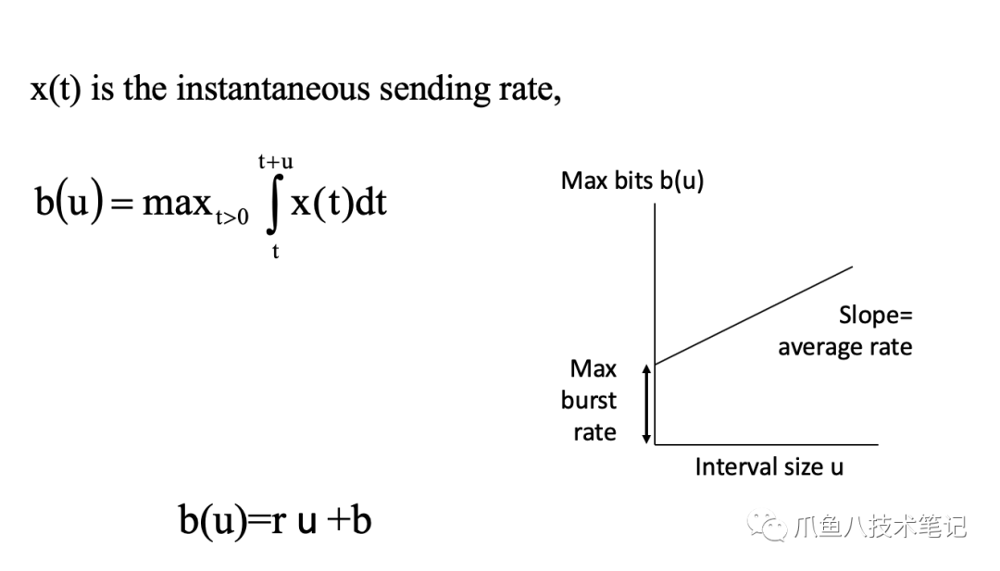
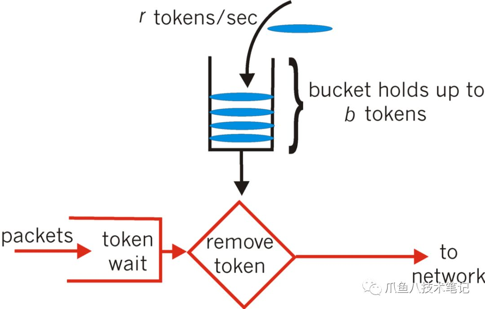
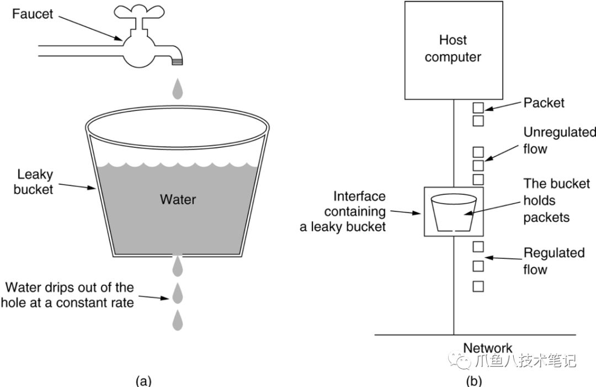
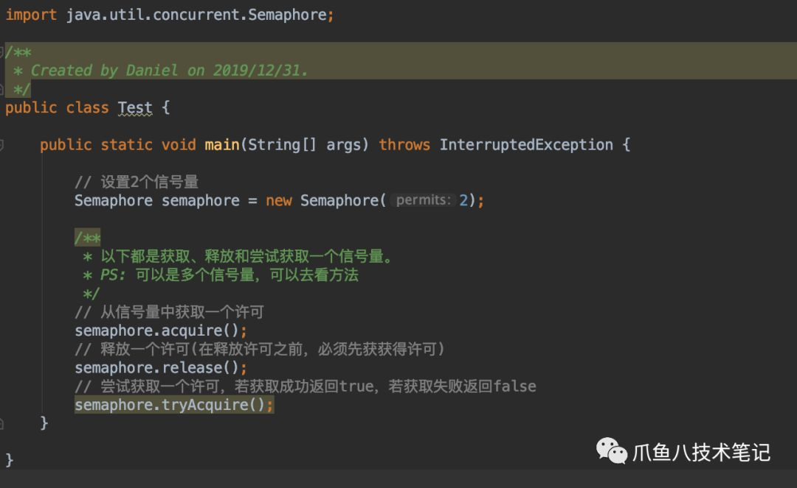
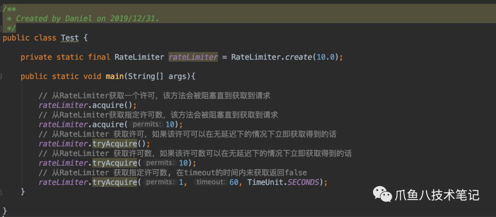
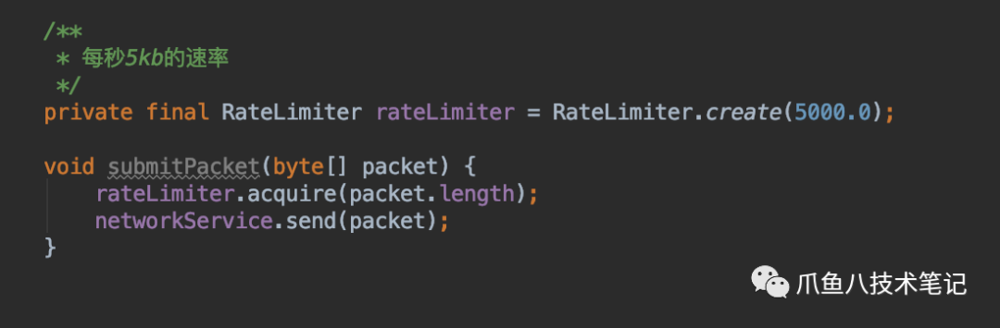

熔断、限流、降级是系统的守护者，这几个关键词也受到越来越多的关注。说到这些关键词我们最先想到的就是Sentinel和Hystrix，两者算是现在的主流。如果不是微服务，那么限流就可以独自承担起保护服务的职责。目前限流使用最多的主要有2种算法令牌和漏桶。

---

**令牌算法（Token Bucket）**

在网络中传输数据时，为了防止网络拥塞，需限制流出网络的流量，使流量以比较均匀的速度向外发送。令牌桶算法就实现了这个功能，可控制发送到网络上数据的数目，并允许突发数据的发送。

上图看懂的都是高人😁。下面我大白话理解一下。有一个框这个框可以装一定数量的🌽，那么我们按一定的速率往这个框内扔🌽，这个框装满了就不在装了。有一只🐻去偷🌽，这个🐻刚开始一点一点拿，它发现框内一直有，这个时候它叫来小伙伴一起过来偷🌽，结果一口气都拿光了，还有的小伙伴没有第一时间拿到玉米，这样就实现了限流，并且可以应对突发的流量。

**漏桶算法（LeakyBucket）**

漏桶算法思路很简单，水（请求）先进入到漏桶里，漏桶以固定的速度出水（响应），当水加的过快，则会直接溢出（拒绝请求）。

(a) a leaky bucket with water. 

(b) a leaky bucket with packet.

漏桶算法可以很好的控制流量的访问速度，一旦超过该速度就拒绝服务。

**区别**

这两种算法的主要区别在于【漏桶算法】能够强行限制网络的流量，而【令牌桶算法】能够限制网络流量的平均传输速率外，还允许一定量的突发流量。在【令牌桶算法】中，只要令牌桶中存在令牌，那么就允许突发流量直到达到用户配置的限额，因此它适合于具有突发特性的流量。

注：以上图片来自网络

---

**限流实现**

现在有现成的两个轮子供大家使用：

* Java Semaphore：从线程个数进行限流。
* Guava RateLimiter：从速率进行限流。

**Semaphore**

两种构造方式（公平和非公平）

使用方式

**常使用场景**

加锁、控制并发。

**RateLimiter**

RateLimiter使用的是一种叫令牌桶的流控算法，RateLimiter会按照一定的频率往桶里扔令牌，线程拿到令牌才能执行，比如你希望自己的应用程序QPS不要超过1000，那么RateLimiter设置1000的速率后，就会每秒往桶里扔1000个令牌。

使用方式：

创建RateLimiter

下面是主要实现的方法。

两个例子

1\. 每秒QPS不能超过1000个

2\. 数据包每秒不能超过5kb

注：以上RateLimiter大部分来自官网

---

**总结**

这两种算法是最常见的，当然还存在其他的算法，本文只是抛砖引玉，网上还有.很多丰富的文章供大家了解。

现实中没有最好的算法，只有最适合的。

PS：如果需要交流实际使用场景和补充，欢迎👏留言～～～～～～～
